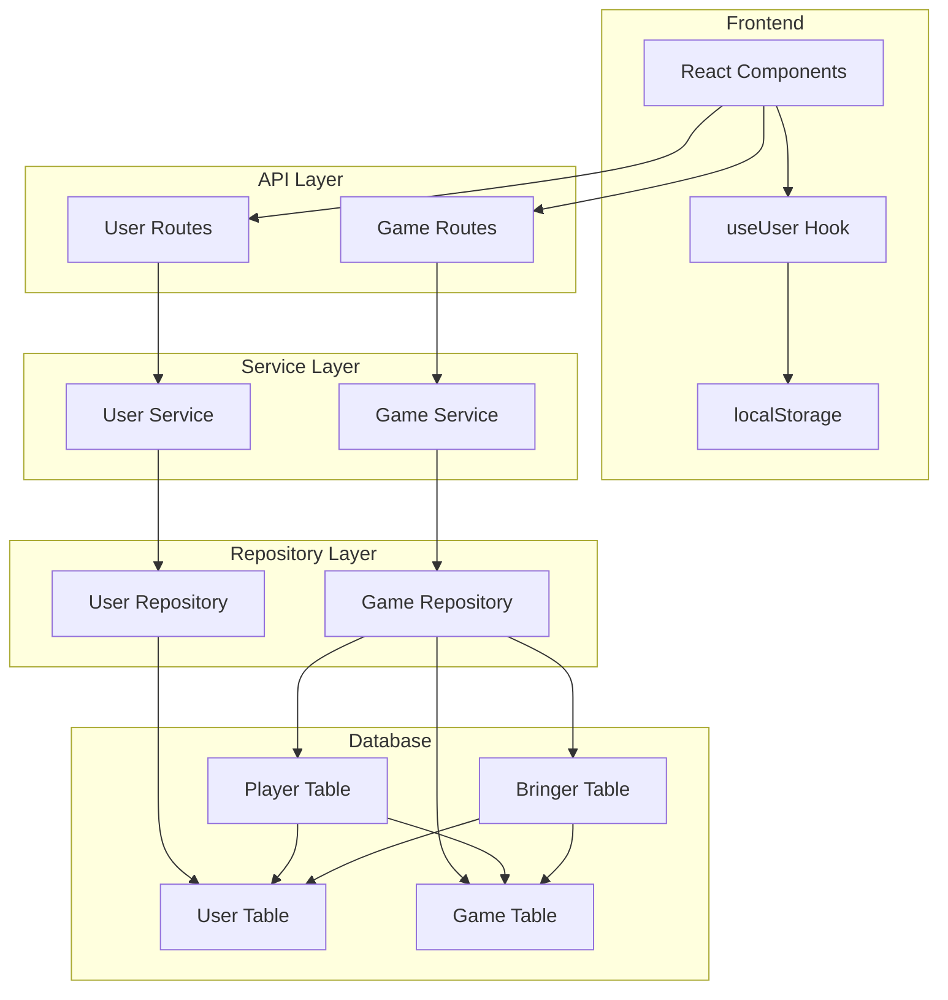
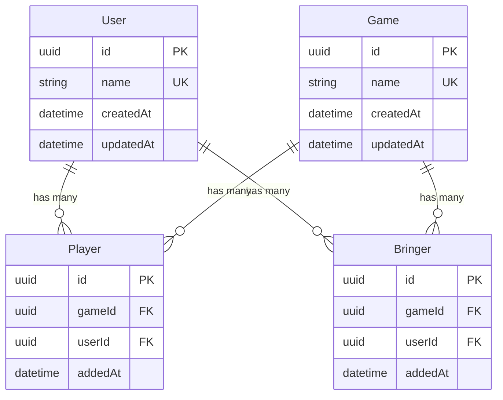

# Design Document: User Management

## Overview

This design introduces a centralized User management system for the board game event application. The current implementation stores player and bringer names as plain text strings directly in the Player and Bringer tables. This design normalizes the data model by creating a dedicated User table, with Player and Bringer records referencing users via foreign keys.

Key benefits:
- **Data normalization**: User data stored once, referenced everywhere
- **Name propagation**: Changing a user's name automatically reflects in all game lists
- **Data integrity**: Foreign key constraints ensure referential integrity
- **Consistent identity**: Users identified by stable UUID rather than mutable name

This is a **breaking change** that will drop all existing data.

## Architecture



### Request Flow

1. **User Selection Flow**:
   - Frontend checks localStorage for stored userId
   - If found, validates user exists via GET /api/users/:id
   - If not found or invalid, shows user selection modal
   - User selects existing user or creates new one
   - userId stored in localStorage

2. **Game Operations Flow**:
   - All game operations (create, add player/bringer) use userId
   - API returns full user objects (id + name) in responses
   - Frontend displays user names from response data

## Components and Interfaces

### Database Schema Changes

```prisma
model User {
  id        String   @id @default(uuid())
  name      String   @unique
  createdAt DateTime @default(now()) @map("created_at")
  updatedAt DateTime @updatedAt @map("updated_at")
  players   Player[]
  bringers  Bringer[]

  @@map("users")
}

model Player {
  id       String   @id @default(uuid())
  gameId   String   @map("game_id")
  userId   String   @map("user_id")
  addedAt  DateTime @default(now()) @map("added_at")
  game     Game     @relation(fields: [gameId], references: [id], onDelete: Cascade)
  user     User     @relation(fields: [userId], references: [id], onDelete: Cascade)

  @@unique([gameId, userId])
  @@index([gameId])
  @@index([userId])
  @@map("players")
}

model Bringer {
  id       String   @id @default(uuid())
  gameId   String   @map("game_id")
  userId   String   @map("user_id")
  addedAt  DateTime @default(now()) @map("added_at")
  game     Game     @relation(fields: [gameId], references: [id], onDelete: Cascade)
  user     User     @relation(fields: [userId], references: [id], onDelete: Cascade)

  @@unique([gameId, userId])
  @@index([gameId])
  @@index([userId])
  @@map("bringers")
}
```

### API Endpoints

#### User Routes (`/api/users`)

| Method | Endpoint | Request Body | Response | Description |
|--------|----------|--------------|----------|-------------|
| GET | /api/users | - | `{ users: User[] }` | List all users sorted by name |
| GET | /api/users/:id | - | `{ user: User }` | Get user by ID |
| POST | /api/users | `{ name: string }` | `{ user: User }` | Create new user |
| PATCH | /api/users/:id | `{ name: string }` | `{ user: User }` | Update user name |
| DELETE | /api/users/:id | - | `{ success: true }` | Delete user (cascades) |

#### Updated Game Routes

| Method | Endpoint | Request Body Change |
|--------|----------|---------------------|
| POST | /api/games | `{ name, userId, isBringing }` (was userName) |
| POST | /api/games/:id/players | `{ userId }` (was userName) |
| DELETE | /api/games/:id/players/:userId | userId in path (was userName) |
| POST | /api/games/:id/bringers | `{ userId }` (was userName) |
| DELETE | /api/games/:id/bringers/:userId | userId in path (was userName) |

### Backend Components

#### User Repository (`api/src/repositories/user.repository.ts`)

```typescript
interface UserRepository {
  findAll(): Promise<UserEntity[]>;
  findById(id: string): Promise<UserEntity | null>;
  findByName(name: string): Promise<UserEntity | null>;
  create(name: string): Promise<UserEntity>;
  update(id: string, name: string): Promise<UserEntity>;
  delete(id: string): Promise<void>;
}
```

#### User Service (`api/src/services/user.service.ts`)

```typescript
interface UserService {
  getAllUsers(): Promise<User[]>;
  getUserById(id: string): Promise<User>;
  createUser(name: string): Promise<User>;
  updateUser(id: string, name: string): Promise<User>;
  deleteUser(id: string): Promise<void>;
}
```

### Frontend Components

#### useUser Hook (`frontend/src/hooks/useUser.ts`)

Replaces `useUserName` hook. Manages current user state with localStorage persistence.

```typescript
interface UseUserReturn {
  user: User | null;
  isLoading: boolean;
  error: string | null;
  setUser: (user: User) => void;
  clearUser: () => void;
  refreshUser: () => Promise<void>;
}
```

#### UserSelectionModal Component

Modal displayed when no user is selected. Allows:
- Selecting from existing users (dropdown/list)
- Creating a new user (name input)

#### UserNameEditor Component

Inline editor or modal for changing current user's name.

### Type Definitions

#### Backend Types (`api/src/types/index.ts`)

```typescript
// Entity types
interface UserEntity {
  id: string;
  name: string;
  createdAt: Date;
  updatedAt: Date;
}

// Updated Player/Bringer entities
interface PlayerEntity {
  id: string;
  gameId: string;
  userId: string;
  addedAt: Date;
  user: UserEntity;
}

interface BringerEntity {
  id: string;
  gameId: string;
  userId: string;
  addedAt: Date;
  user: UserEntity;
}

// API response types
interface User {
  id: string;
  name: string;
}

interface Player {
  id: string;
  user: User;
  addedAt: Date;
}

interface Bringer {
  id: string;
  user: User;
  addedAt: Date;
}
```

#### Frontend Types (`frontend/src/types/index.ts`)

```typescript
interface User {
  id: string;
  name: string;
}

interface Player {
  id: string;
  user: User;
  addedAt: Date;
}

interface Bringer {
  id: string;
  user: User;
  addedAt: Date;
}

// API request types
interface CreateUserRequest {
  name: string;
}

interface UpdateUserRequest {
  name: string;
}

interface CreateGameRequest {
  name: string;
  userId: string;  // Changed from userName
  isBringing: boolean;
}

interface AddPlayerRequest {
  userId: string;  // Changed from userName
}

interface AddBringerRequest {
  userId: string;  // Changed from userName
}
```

## Data Models

### User Entity

| Field | Type | Constraints | Description |
|-------|------|-------------|-------------|
| id | UUID | Primary Key, Auto-generated | Unique identifier |
| name | String | Unique, Not null | Display name |
| createdAt | DateTime | Auto-generated | Creation timestamp |
| updatedAt | DateTime | Auto-updated | Last update timestamp |

### Player Entity (Updated)

| Field | Type | Constraints | Description |
|-------|------|-------------|-------------|
| id | UUID | Primary Key | Unique identifier |
| gameId | UUID | Foreign Key → Game | Reference to game |
| userId | UUID | Foreign Key → User | Reference to user |
| addedAt | DateTime | Auto-generated | When player was added |

### Bringer Entity (Updated)

| Field | Type | Constraints | Description |
|-------|------|-------------|-------------|
| id | UUID | Primary Key | Unique identifier |
| gameId | UUID | Foreign Key → Game | Reference to game |
| userId | UUID | Foreign Key → User | Reference to user |
| addedAt | DateTime | Auto-generated | When bringer was added |

### Entity Relationships




## Correctness Properties

*A property is a characteristic or behavior that should hold true across all valid executions of a system—essentially, a formal statement about what the system should do. Properties serve as the bridge between human-readable specifications and machine-verifiable correctness guarantees.*

Based on the prework analysis, the following properties have been identified. Note that many acceptance criteria are better suited for example-based tests (CRUD operations, specific error cases) rather than property-based tests, following the project's property testing guidelines.

### Property 1: User Creation Generates Valid UUID

*For any* valid user name, when a user is created, the returned user object SHALL have a valid UUID v4 identifier that is non-empty and follows the UUID format.

**Validates: Requirements 1.1, 1.5**

### Property 2: Whitespace-Only Names Are Rejected

*For any* string composed entirely of whitespace characters (spaces, tabs, newlines), attempting to create or update a user with that name SHALL be rejected with a 400 validation error.

**Validates: Requirements 1.2, 3.5, 3.8**

### Property 3: User List Is Sorted Alphabetically

*For any* set of users in the database, when GET /api/users is called, the returned list SHALL be sorted in ascending alphabetical order by name (case-insensitive).

**Validates: Requirements 3.1**

### Property 4: Game Responses Include Complete User Objects

*For any* game with players or bringers, when the game data is returned from the API, each player and bringer entry SHALL include a complete user object with both `id` (valid UUID) and `name` (non-empty string) fields.

**Validates: Requirements 4.6**

## Error Handling

### User Service Errors

| Error Condition | HTTP Status | Error Code | German Message |
|-----------------|-------------|------------|----------------|
| Empty/whitespace name | 400 | VALIDATION_ERROR | Bitte einen Namen eingeben. |
| Duplicate name (create) | 409 | DUPLICATE_USER | Ein Benutzer mit diesem Namen existiert bereits. |
| Duplicate name (update) | 409 | DUPLICATE_USER | Ein Benutzer mit diesem Namen existiert bereits. |
| User not found | 404 | USER_NOT_FOUND | Benutzer nicht gefunden. |
| Internal error | 500 | INTERNAL_ERROR | Ein Fehler ist aufgetreten. |

### Game Service Errors (Updated)

| Error Condition | HTTP Status | Error Code | German Message |
|-----------------|-------------|------------|----------------|
| User not found (create game) | 404 | USER_NOT_FOUND | Benutzer nicht gefunden. |
| User not found (add player) | 404 | USER_NOT_FOUND | Benutzer nicht gefunden. |
| User not found (add bringer) | 404 | USER_NOT_FOUND | Benutzer nicht gefunden. |
| Already a player | 409 | ALREADY_PLAYER | Du bist bereits als Mitspieler eingetragen. |
| Already a bringer | 409 | ALREADY_BRINGER | Du bringst dieses Spiel bereits mit. |

### Frontend Error Handling

- Display API error messages directly (already in German)
- On user validation failure (stored userId invalid), clear localStorage and show user selection modal
- Network errors: "Verbindung zum Server fehlgeschlagen. Bitte erneut versuchen."

## Testing Strategy

### Dual Testing Approach

This feature uses both unit tests and property-based tests as complementary approaches:

- **Unit tests**: Verify specific examples, edge cases, error conditions, and CRUD operations
- **Property tests**: Verify universal properties that should hold across all valid inputs

### Property-Based Testing Configuration

- Library: `fast-check` (already used in the project)
- Iterations: `{ numRuns: 3-5 }` for DB operations (per project guidelines)
- Each property test references its design document property
- Tag format: `Feature: 002-user-management, Property N: {property_text}`

### Test Categories

#### Backend Unit Tests

1. **User Repository Tests**
   - Create user with valid name
   - Create user with duplicate name (expect error)
   - Find user by ID (exists and not exists)
   - Update user name
   - Delete user with cascade verification

2. **User Service Tests**
   - Validation: empty name, whitespace name
   - Duplicate name handling
   - Transform entity to API response

3. **User Routes Tests**
   - All CRUD endpoints with valid inputs
   - Error responses for invalid inputs
   - HTTP status codes

4. **Game Service Tests (Updated)**
   - Create game with userId
   - Add player with userId
   - Add bringer with userId
   - Response includes user objects

#### Backend Property Tests

1. **Property 1**: UUID generation validity
2. **Property 2**: Whitespace rejection
3. **Property 3**: Alphabetical sorting
4. **Property 4**: User object completeness in game responses

#### Frontend Unit Tests

1. **useUser Hook Tests**
   - Initial state with no stored user
   - Load user from localStorage
   - Store user to localStorage
   - Clear user from localStorage
   - Handle invalid stored userId

2. **UserSelectionModal Tests**
   - Render user list
   - Select existing user
   - Create new user flow
   - Validation errors

3. **Component Tests**
   - GameTable displays user names correctly
   - GameRow shows player/bringer names
   - Header shows current user name

### Test File Locations

```
api/src/
├── repositories/__tests__/
│   └── user.repository.test.ts
├── services/__tests__/
│   ├── user.service.test.ts
│   └── game.service.test.ts (update existing)
└── routes/__tests__/
    └── user.routes.test.ts

frontend/src/
├── hooks/__tests__/
│   └── useUser.test.ts
├── components/__tests__/
│   ├── UserSelectionModal.test.tsx
│   └── GameTable.test.tsx (update existing)
└── api/__tests__/
    └── client.test.ts (update existing)
```
