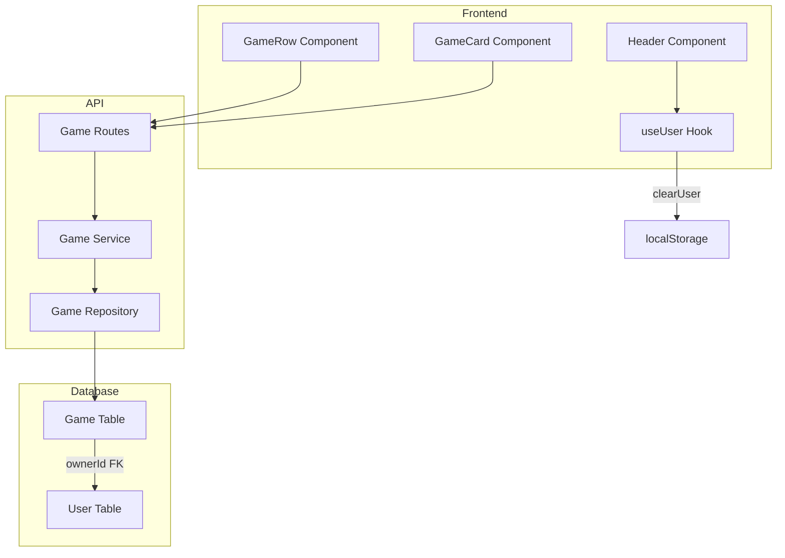

# Design Document: Logout and Game Ownership

## Overview

This design adds logout functionality and game ownership to the board game event application. The implementation involves:
1. Adding a logout button to the header that clears localStorage and shows the user selection modal
2. Adding an `ownerId` field to the Game table with SetNull on user deletion
3. Adding a delete game endpoint with ownership and empty-game validation
4. Updating the frontend to display owner information and delete buttons

## Architecture

The feature follows the existing layered architecture:
- **Frontend**: React components with hooks for state management
- **API**: Express routes with service layer for business logic
- **Database**: PostgreSQL with Prisma ORM



## Components and Interfaces

### Database Schema Changes

Add `ownerId` field to the Game model:

```prisma
model Game {
  id        String   @id @default(uuid())
  name      String   @unique
  ownerId   String?  @map("owner_id")
  createdAt DateTime @default(now()) @map("created_at")
  updatedAt DateTime @updatedAt @map("updated_at")
  owner     User?    @relation(fields: [ownerId], references: [id], onDelete: SetNull)
  players   Player[]
  bringers  Bringer[]

  @@index([ownerId])
  @@map("games")
}

model User {
  id         String   @id @default(uuid())
  name       String   @unique
  createdAt  DateTime @default(now()) @map("created_at")
  updatedAt  DateTime @updatedAt @map("updated_at")
  players    Player[]
  bringers   Bringer[]
  ownedGames Game[]   // New relation

  @@map("users")
}
```

### API Endpoints

#### DELETE /api/games/:id

Delete a game by ID. Only the owner can delete, and only if the game has no players or bringers.

**Request Headers:**
- `x-user-id`: The ID of the requesting user (for ownership verification)

**Response:**
- `200 OK`: `{ success: true }`
- `400 Bad Request`: Game has players or bringers
- `403 Forbidden`: User is not the owner
- `404 Not Found`: Game not found

### Frontend Components

#### Header Component Updates

Add a logout button that:
1. Calls `clearUser()` from useUser hook
2. This clears localStorage and sets user state to null
3. App.tsx already shows UserSelectionModal when user is null

```typescript
// Logout button in Header
<button onClick={onLogout} className="...">
  Abmelden
</button>
```

#### GameRow/GameCard Component Updates

Add owner display and delete button:

```typescript
interface GameRowProps {
  game: Game;
  currentUserId: string;
  onDeleteGame?: (gameId: string) => void;
  // ... existing props
}

// Show owner name
<span>{game.owner?.name ?? 'Kein Besitzer'}</span>

// Delete button (only for owner, only when empty)
{isOwner && (
  <button 
    onClick={() => onDeleteGame?.(game.id)}
    disabled={hasPlayersOrBringers}
    title={hasPlayersOrBringers ? 'Entferne zuerst alle Mitspieler und Bringer' : 'Spiel löschen'}
  >
    Löschen
  </button>
)}
```

### Type Updates

```typescript
// Update Game type to include owner
interface Game {
  id: string;
  name: string;
  owner: { id: string; name: string } | null;
  players: Player[];
  bringers: Bringer[];
  status: 'wunsch' | 'verfuegbar';
  createdAt: Date;
}
```

## Data Models

### Game Entity (Database)

| Field | Type | Constraints | Description |
|-------|------|-------------|-------------|
| id | UUID | PK | Unique identifier |
| name | String | Unique, Not Null | Game name |
| ownerId | UUID | FK to User, Nullable | Owner's user ID |
| createdAt | DateTime | Not Null | Creation timestamp |
| updatedAt | DateTime | Not Null | Last update timestamp |

### Game API Response

```typescript
{
  id: string;
  name: string;
  owner: { id: string; name: string } | null;
  players: Player[];
  bringers: Bringer[];
  status: 'wunsch' | 'verfuegbar';
  createdAt: string;
}
```


## Correctness Properties

*A property is a characteristic or behavior that should hold true across all valid executions of a system—essentially, a formal statement about what the system should do. Properties serve as the bridge between human-readable specifications and machine-verifiable correctness guarantees.*

Based on the prework analysis, the following properties have been identified:

### Property 1: Game Creation Ownership

*For any* user creating a game, the resulting game's ownerId SHALL equal the creating user's ID.

**Validates: Requirements 2.2**

### Property 2: Game Deletion Authorization and Validation

*For any* game and user attempting deletion:
- If the user is not the owner, the API SHALL return 403 Forbidden
- If the game has players or bringers, the API SHALL return 400 Bad Request
- If the user is the owner AND the game has no players AND no bringers, the deletion SHALL succeed and the game SHALL no longer exist

**Validates: Requirements 3.2, 3.5, 3.6, 3.7**

### Property 3: User Deletion Cascade Behavior

*For any* user with owned games and Player/Bringer associations:
- After user deletion, all games previously owned by that user SHALL have ownerId set to null
- After user deletion, all Player records referencing that user SHALL be deleted
- After user deletion, all Bringer records referencing that user SHALL be deleted

**Validates: Requirements 4.1, 4.4**

## Error Handling

### API Error Responses

| Scenario | HTTP Status | Error Code | Message (German) |
|----------|-------------|------------|------------------|
| Game not found | 404 | GAME_NOT_FOUND | Spiel nicht gefunden. |
| User not owner | 403 | FORBIDDEN | Du bist nicht berechtigt, dieses Spiel zu löschen. |
| Game has players/bringers | 400 | GAME_NOT_EMPTY | Das Spiel kann nicht gelöscht werden, solange noch Mitspieler oder Bringer eingetragen sind. |
| Missing user ID header | 400 | VALIDATION_ERROR | Benutzer-ID erforderlich. |

### Frontend Error Handling

- Display toast notifications for API errors
- Disable delete button with tooltip when game is not empty
- Hide delete button for non-owners (no error needed)

## Testing Strategy

### Unit Tests

Unit tests should cover specific examples and edge cases:

1. **Logout functionality**
   - Verify logout button appears when user is logged in
   - Verify localStorage is cleared on logout
   - Verify user selection modal appears after logout

2. **Owner display**
   - Verify owner name is displayed for games with owners
   - Verify "Kein Besitzer" is displayed for orphaned games

3. **Delete button visibility**
   - Verify delete button appears for owner
   - Verify delete button is hidden for non-owners
   - Verify delete button is disabled when game has players/bringers
   - Verify delete button is hidden for orphaned games

4. **Confirmation dialog**
   - Verify confirmation dialog appears on delete click
   - Verify game is deleted on confirmation
   - Verify game is not deleted on cancel

### Property-Based Tests

Following the workspace guidelines, property tests should be used sparingly for this feature since most operations are CRUD with deterministic code paths. However, the following properties benefit from property testing:

**Property 2: Game Deletion Authorization** (numRuns: 3)
- Generate random game states (with/without players, with/without bringers)
- Generate random user IDs (owner vs non-owner)
- Verify correct HTTP status codes are returned

**Property 3: User Deletion Cascade** (numRuns: 3)
- Generate random users with owned games and associations
- Delete user and verify cascade behavior

### Test Configuration

- Backend tests: Jest with `--runInBand` flag
- Frontend tests: Vitest
- Property tests: fast-check with `{ numRuns: 3 }` for DB operations
- Each property test tagged with: **Feature: 003-logout-and-game-ownership, Property N: [property_text]**
