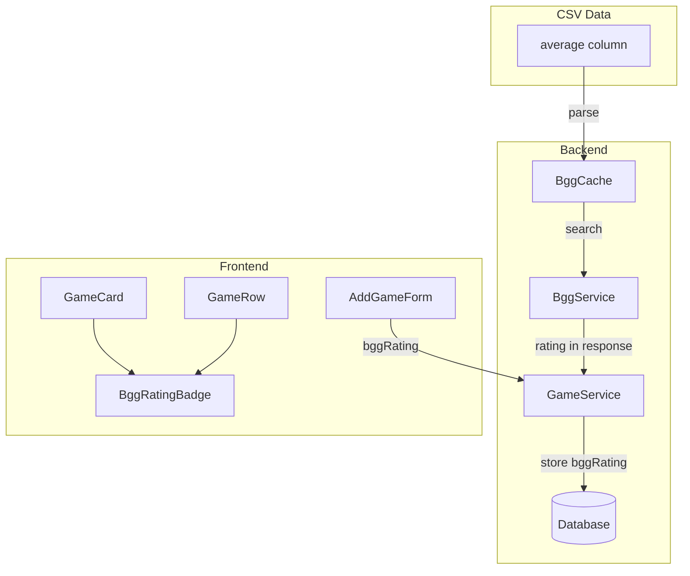

# Design Document: BGG Rating Badge

## Overview

This feature extends the BGG Static Data Integration to display BoardGameGeek ratings as colored hexagon badges. The rating is extracted from the CSV "average" column during cache initialization, stored in the database when games are created, and displayed in a visually distinctive badge next to the BGG button.

### Key Design Decisions

1. **Rating extraction at CSV parse time**: The rating is extracted once during cache initialization, avoiding repeated parsing.

2. **One decimal place precision**: Ratings are rounded to one decimal place for clean display (e.g., 7.5 instead of 7.4832).

3. **BGG-aligned color scheme**: Colors match BGG's official rating breakdown chart for user familiarity.

4. **Hexagon badge shape**: A distinctive hexagon standing on its tip provides visual interest and differentiates from other badges.

## Architecture



## Components and Interfaces

### Backend Components

#### Extended BggGame Interface (api/src/services/bggCache.ts)

```typescript
export interface BggGame {
  id: number;
  name: string;
  yearPublished: number | null;
  rank: number;
  rating: number | null;  // NEW: BGG average rating
}
```

#### Extended BggSearchResult (api/src/services/bggService.ts)

```typescript
export interface BggSearchResult {
  id: number;
  name: string;
  yearPublished: number | null;
  rating: number | null;  // NEW: BGG average rating
}
```

#### CSV Parsing Enhancement

The CSV parser extracts the "average" column and rounds to one decimal:

```typescript
const rating = row.average ? parseFloat(row.average) : null;
// Round to one decimal place
const roundedRating = rating && !isNaN(rating) ? Math.round(rating * 10) / 10 : null;
```

### Frontend Components

#### BggRatingBadge (frontend/src/components/BggRatingBadge.tsx)

New component displaying the rating in a colored hexagon.

```typescript
interface BggRatingBadgeProps {
  rating: number;
}

function getRatingColor(rating: number): string;
function BggRatingBadge({ rating }: BggRatingBadgeProps): JSX.Element;
```

#### Color Mapping Function

```typescript
function getRatingColor(rating: number): string {
  const roundedRating = Math.floor(rating);
  
  switch (roundedRating) {
    case 1: case 2: case 3: case 4:
      return '#d32f2f'; // Red
    case 5: case 6:
      return '#3f51b5'; // Dark blue
    case 7:
      return '#2196f3'; // Light blue
    case 8:
      return '#4caf50'; // Green
    case 9:
      return '#2e7d32'; // Dark green
    case 10:
      return '#1b5e20'; // Darker green
    default:
      return '#9e9e9e'; // Gray for invalid
  }
}
```

#### Updated GameCard and GameRow

Both components conditionally render the BggRatingBadge when `game.bggRating` exists:

```tsx
{game.bggRating && (
  <BggRatingBadge rating={game.bggRating} />
)}
```

### API Client Extensions

```typescript
// Updated BggSearchResult type
export interface BggSearchResult {
  id: number;
  name: string;
  yearPublished: number | null;
  rating: number | null;  // NEW
}

// Updated Game type
export interface Game {
  // ... existing fields
  bggRating: number | null;  // NEW
}

// Updated CreateGameRequest
export interface CreateGameRequest {
  // ... existing fields
  bggRating?: number;  // NEW
}
```

## Data Models

### Database Schema Changes (Prisma)

```prisma
model Game {
  id            String   @id @default(uuid())
  name          String   @unique
  ownerId       String?  @map("owner_id")
  bggId         Int?     @map("bgg_id")
  yearPublished Int?     @map("year_published")
  bggRating     Float?   @map("bgg_rating")  // NEW: BGG average rating
  createdAt     DateTime @default(now()) @map("created_at")
  updatedAt     DateTime @updatedAt @map("updated_at")
  // ... relations
}
```

### Rating Color Mapping

| Rating Range | Color Name | Hex Code |
|--------------|------------|----------|
| 1-4 | Red | #d32f2f |
| 5-6 | Dark Blue | #3f51b5 |
| 7 | Light Blue | #2196f3 |
| 8 | Green | #4caf50 |
| 9 | Dark Green | #2e7d32 |
| 10 | Darker Green | #1b5e20 |
| Invalid | Gray | #9e9e9e |

## Correctness Properties

*A property is a characteristic or behavior that should hold true across all valid executions of a system—essentially, a formal statement about what the system should do. Properties serve as the bridge between human-readable specifications and machine-verifiable correctness guarantees.*

### Property 1: Rating Extraction from CSV

*For any* valid CSV row containing a game with an "average" column value, parsing that row SHALL produce a BggGame object with a rating field equal to the original value rounded to one decimal place.

**Validates: Requirements 1.1, 1.2**

### Property 2: Search Results Include Rating

*For any* search query that returns results, each BggSearchResult object SHALL include a rating field (number or null) matching the cached game's rating.

**Validates: Requirements 1.5**

### Property 3: Game Creation Persists Rating

*For any* game created with a BGG selection containing a rating, the stored game SHALL have a bggRating value equal to the selected game's rating.

**Validates: Requirements 2.2**

### Property 4: Game API Response Includes Rating

*For any* game retrieved via the API, the response SHALL include a bggRating field (number or null).

**Validates: Requirements 2.4**

### Property 5: Badge Visibility Based on Rating Presence

*For any* game, the Rating_Badge SHALL be rendered if and only if bggRating is not null.

**Validates: Requirements 3.1, 3.2**

### Property 6: Rating Display Formatting

*For any* rating value passed to BggRatingBadge, the displayed text SHALL be the rating formatted to exactly one decimal place.

**Validates: Requirements 3.3**

### Property 7: Rating Color Mapping

*For any* rating value from 1 to 10, the getRatingColor function SHALL return the correct hex color according to the BGG color scheme: red (#d32f2f) for 1-4, dark blue (#3f51b5) for 5-6, light blue (#2196f3) for 7, green (#4caf50) for 8, dark green (#2e7d32) for 9, darker green (#1b5e20) for 10.

**Validates: Requirements 4.1, 4.2, 4.3, 4.4, 4.5, 4.6**

### Property 8: German Tooltip Text

*For any* rating value, the Rating_Badge title attribute SHALL contain "BGG Bewertung: {rating}" where {rating} is the formatted rating value.

**Validates: Requirements 6.1**

## Error Handling

### Backend Error Handling

| Error Scenario | Handling | Result |
|----------------|----------|--------|
| Missing "average" column | Store null for rating | Game still cached without rating |
| Invalid rating value (NaN) | Store null for rating | Game still cached without rating |
| Rating outside 1-10 range | Store as-is | Badge displays with gray color |

### Frontend Error Handling

| Error Scenario | Handling | Result |
|----------------|----------|--------|
| bggRating is null | Don't render badge | No badge shown |
| bggRating is undefined | Don't render badge | No badge shown |

## Testing Strategy

### Unit Tests

Unit tests focus on specific examples and edge cases:

**Backend:**
- CSV parsing extracts rating from "average" column
- Rating is rounded to one decimal place (e.g., 7.4832 → 7.5)
- Missing rating value results in null
- Invalid rating value (non-numeric) results in null
- Search results include rating field

**Frontend:**
- BggRatingBadge renders with correct rating text
- BggRatingBadge applies correct color for each rating range
- BggRatingBadge has correct German tooltip
- GameCard renders badge when bggRating exists
- GameCard does not render badge when bggRating is null
- GameRow renders badge when bggRating exists
- GameRow does not render badge when bggRating is null

### Property-Based Tests

Property-based tests verify universal properties across many generated inputs.

**Library:** fast-check (TypeScript)

**Backend Properties:**

1. **Property 1: Rating Extraction from CSV**
   - Generate random rating values (floats between 1-10)
   - Verify parsed rating equals input rounded to one decimal
   - Tag: `Feature: bgg-rating-badge, Property 1: Rating Extraction from CSV`

2. **Property 2: Search Results Include Rating**
   - Generate random search queries and cache data with ratings
   - Verify all results include rating field
   - Tag: `Feature: bgg-rating-badge, Property 2: Search Results Include Rating`

**Frontend Properties:**

3. **Property 6: Rating Display Formatting**
   - Generate random rating values
   - Verify displayed text is formatted to one decimal place
   - Tag: `Feature: bgg-rating-badge, Property 6: Rating Display Formatting`

4. **Property 7: Rating Color Mapping**
   - Generate random rating values from 1-10
   - Verify correct color is returned for each rating range
   - Tag: `Feature: bgg-rating-badge, Property 7: Rating Color Mapping`

### Integration Tests

- End-to-end flow: select game with rating → submit → verify badge displays with correct color
- Verify rating persists after page reload
- Verify badge displays consistently in GameCard and GameRow
