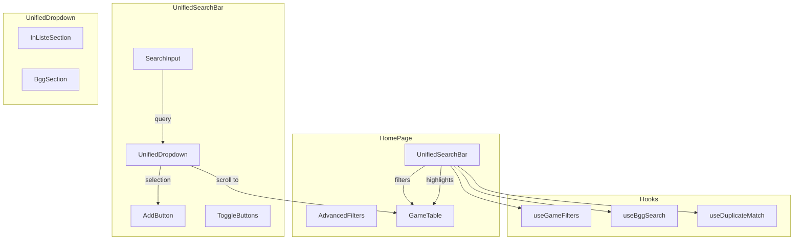
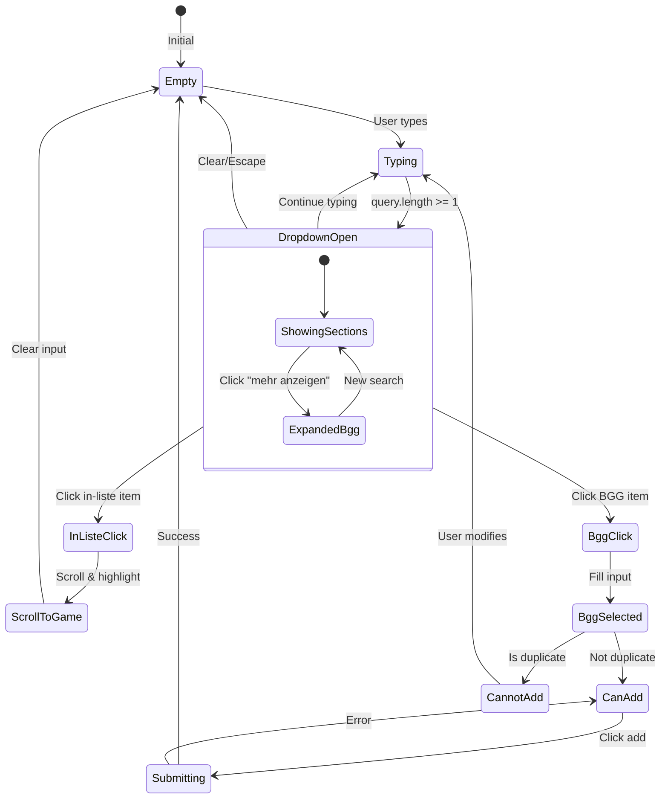

# Design Document: Unified Search and Add Game

## Overview

This design describes the implementation of a unified search bar that combines game list filtering with BGG search and game addition functionality. The solution replaces the separate `AddGameForm` and `SearchFilters` components with a single `UnifiedSearchBar` component that provides a streamlined user experience.

The key architectural decision is to create a new composite component that orchestrates:
1. Real-time filtering of the existing game list
2. BGG API search with debouncing
3. A dual-section dropdown showing both local matches and BGG results
4. Duplicate detection and prevention
5. Game addition with Mitspielen/Mitbringen toggles

## Architecture



### Component Hierarchy

```
HomePage
├── Statistics
├── UnifiedSearchBar
│   ├── SearchInput (with BGG indicator)
│   ├── UnifiedDropdown
│   │   ├── InListeSection (max 3 items)
│   │   └── BggSection (3 items + progressive loading)
│   ├── ToggleButtons (Mitspielen, Mitbringen)
│   └── AddButton
├── FilterToggles (Wunsch, Meine Spiele)
├── AdvancedFilters (collapsible)
│   ├── PlayerSearch
│   └── BringerSearch
└── GameTable
    ├── GameRow (with highlight prop)
    └── GameCard (with highlight prop)
```

## Components and Interfaces

### UnifiedSearchBar Component

The main component that orchestrates the unified search experience.

```typescript
interface UnifiedSearchBarProps {
  /** All games in the list for filtering and duplicate detection */
  games: Game[];
  /** Current user's ID for game creation */
  currentUserId: string;
  /** Callback when a game is successfully added */
  onGameAdded: (game: Game) => void;
  /** Callback when search query changes (for list filtering) */
  onSearchQueryChange: (query: string) => void;
  /** Callback when user clicks an in-list game (for scrolling) */
  onScrollToGame: (gameId: string) => void;
}

interface UnifiedSearchBarState {
  query: string;
  isDropdownOpen: boolean;
  selectedBggItem: BggSearchResult | null;
  selectedIndex: number;
  isBringing: boolean;
  isPlaying: boolean;
  isSubmitting: boolean;
  expandedBggCount: number; // 3, 8, 13, etc.
}
```

### UnifiedDropdown Component

Displays the dual-section dropdown with local matches and BGG results.

```typescript
interface UnifiedDropdownProps {
  /** Current search query */
  query: string;
  /** Whether dropdown is open */
  isOpen: boolean;
  /** Games from user's list that match the query */
  matchingGames: GameWithBringerInfo[];
  /** BGG search results */
  bggResults: BggSearchResult[];
  /** Whether BGG search is loading */
  isBggLoading: boolean;
  /** Total BGG results available */
  totalBggResults: number;
  /** Number of BGG items currently shown */
  expandedBggCount: number;
  /** Currently selected index for keyboard navigation */
  selectedIndex: number;
  /** Set of bggIds that already exist in the list */
  existingBggIds: Set<number>;
  /** Set of normalized names that already exist in the list */
  existingNormalizedNames: Set<string>;
  /** Callback when in-list game is clicked */
  onInListeClick: (gameId: string) => void;
  /** Callback when BGG item is clicked */
  onBggClick: (result: BggSearchResult) => void;
  /** Callback when "show more" is clicked */
  onShowMore: () => void;
  /** Callback to close dropdown */
  onClose: () => void;
}

interface GameWithBringerInfo {
  id: string;
  name: string;
  bringerNames: string[]; // e.g., ["Thorsten", "Daniel"]
}
```

### AdvancedFilters Component

Collapsible section for player and bringer search.

```typescript
interface AdvancedFiltersProps {
  /** Callback when player search changes */
  onPlayerSearch: (query: string) => void;
  /** Callback when bringer search changes */
  onBringerSearch: (query: string) => void;
  /** Initial values */
  initialValues?: {
    playerQuery?: string;
    bringerQuery?: string;
  };
}
```

### Updated GameRow/GameCard Props

```typescript
interface GameRowProps {
  // ... existing props
  /** Whether this game should be highlighted (matches search) */
  isHighlighted?: boolean;
}

interface GameCardProps {
  // ... existing props
  /** Whether this game should be highlighted (matches search) */
  isHighlighted?: boolean;
}
```

## Data Models

### Duplicate Detection

```typescript
/**
 * Normalizes a game name for comparison.
 * Converts to lowercase, trims, and collapses multiple spaces.
 */
function normalizeName(name: string): string {
  return name.toLowerCase().trim().replace(/\s+/g, ' ');
}

/**
 * Checks if a game already exists in the list.
 * First checks by bggId, then by normalized name.
 */
interface DuplicateCheckResult {
  isDuplicate: boolean;
  matchedBy: 'bggId' | 'name' | null;
  existingGame: Game | null;
}

function checkDuplicate(
  bggId: number | null,
  name: string,
  games: Game[]
): DuplicateCheckResult {
  // First check by bggId
  if (bggId !== null) {
    const bggMatch = games.find(g => g.bggId === bggId);
    if (bggMatch) {
      return { isDuplicate: true, matchedBy: 'bggId', existingGame: bggMatch };
    }
  }
  
  // Then check by normalized name
  const normalizedInput = normalizeName(name);
  const nameMatch = games.find(g => normalizeName(g.name) === normalizedInput);
  if (nameMatch) {
    return { isDuplicate: true, matchedBy: 'name', existingGame: nameMatch };
  }
  
  return { isDuplicate: false, matchedBy: null, existingGame: null };
}
```

### Matching Games with Bringer Info

```typescript
/**
 * Filters games that match the search query and extracts bringer names.
 */
function getMatchingGamesWithBringers(
  games: Game[],
  query: string,
  maxItems: number = 3
): GameWithBringerInfo[] {
  const normalizedQuery = normalizeName(query);
  
  return games
    .filter(game => normalizeName(game.name).includes(normalizedQuery))
    .slice(0, maxItems)
    .map(game => ({
      id: game.id,
      name: game.name,
      bringerNames: game.bringers.map(b => b.user.name),
    }));
}
```

### Keyboard Navigation State

```typescript
/**
 * Calculates total navigable items for keyboard navigation.
 * Items are ordered: In-Liste items first, then BGG items.
 */
function getTotalNavigableItems(
  matchingGamesCount: number,
  visibleBggCount: number
): number {
  return matchingGamesCount + visibleBggCount;
}

/**
 * Determines which section and index within that section
 * based on the global selected index.
 */
function getSelectionInfo(
  selectedIndex: number,
  matchingGamesCount: number
): { section: 'inListe' | 'bgg'; localIndex: number } {
  if (selectedIndex < matchingGamesCount) {
    return { section: 'inListe', localIndex: selectedIndex };
  }
  return { section: 'bgg', localIndex: selectedIndex - matchingGamesCount };
}
```

## State Flow Diagram



## Dropdown Layout

```
┌─────────────────────────────────────────┐
│ 🔍 [Search input...              ] [BGG]│
├─────────────────────────────────────────┤
│ In deiner Liste                         │
│ ├─ Catan          📦 Thorsten, Daniel   │
│ ├─ Catan Junior   📦 Maria              │
│ └─ Catan Städte                         │
├─────────────────────────────────────────┤
│ Von BGG                                 │
│ ├─ Catan (1995)                         │
│ ├─ Catan: Seafarers (1997)              │
│ ├─ Catan: Cities & Knights (1998)       │
│ └─ 12 weitere Treffer anzeigen...       │
└─────────────────────────────────────────┘

After clicking "weitere Treffer":
┌─────────────────────────────────────────┐
│ Von BGG                                 │
│ ├─ Catan (1995)                         │
│ ├─ Catan: Seafarers (1997)              │
│ ├─ Catan: Cities & Knights (1998)       │
│ ├─ Catan: Traders & Barbarians (2007)   │
│ ├─ Catan: Explorers & Pirates (2013)    │
│ ├─ Catan: Starfarers (1999)             │
│ ├─ Catan: The Duel (2010)               │
│ ├─ Catan Histories: Settlers of America │
│ └─ 7 weitere - Suchbegriff verfeinern   │
└─────────────────────────────────────────┘
```

## Add Button State Logic

```typescript
type AddButtonState = 'hidden' | 'enabled' | 'disabled';

function getAddButtonState(
  query: string,
  selectedBggItem: BggSearchResult | null,
  duplicateCheck: DuplicateCheckResult
): { state: AddButtonState; message?: string } {
  // Empty query = hidden
  if (!query.trim()) {
    return { state: 'hidden' };
  }
  
  // BGG item selected
  if (selectedBggItem) {
    if (duplicateCheck.isDuplicate) {
      return { 
        state: 'disabled', 
        message: 'Spiel bereits in der Liste' 
      };
    }
    return { state: 'enabled' };
  }
  
  // Custom name typed
  if (duplicateCheck.isDuplicate) {
    return { state: 'hidden' }; // Hide when typing matches existing
  }
  
  return { state: 'enabled' };
}
```

## Highlight Logic

```typescript
/**
 * Determines if a game should be highlighted based on search query.
 */
function shouldHighlightGame(game: Game, searchQuery: string): boolean {
  if (!searchQuery.trim()) {
    return false;
  }
  const normalizedQuery = normalizeName(searchQuery);
  const normalizedName = normalizeName(game.name);
  return normalizedName.includes(normalizedQuery);
}
```


## Correctness Properties

*A property is a characteristic or behavior that should hold true across all valid executions of a system—essentially, a formal statement about what the system should do. Properties serve as the bridge between human-readable specifications and machine-verifiable correctness guarantees.*

### Property 1: Game List Filtering

*For any* search query and any list of games, the filtered result SHALL only contain games whose normalized names include the normalized query string.

**Validates: Requirements 1.2**

### Property 2: In-Liste Section Item Limit

*For any* list of matching games with count N, the In_Liste_Section SHALL display exactly min(N, 3) items.

**Validates: Requirements 2.3**

### Property 3: BGG Section Initial Item Limit

*For any* list of BGG search results with count N, the BGG_Section SHALL initially display exactly min(N, 3) items.

**Validates: Requirements 2.4**

### Property 4: In-Liste Item Content

*For any* game displayed in the In_Liste_Section, the rendered item SHALL contain the game name, and if the game has bringers, the rendered item SHALL contain all bringer names formatted with the 📦 prefix.

**Validates: Requirements 3.1, 3.2**

### Property 5: BGG Item Content

*For any* BGG search result displayed in the BGG_Section, the rendered item SHALL contain the game name, and if yearPublished is available, the rendered item SHALL contain the year in parentheses.

**Validates: Requirements 4.5**

### Property 6: Duplicate Detection Priority

*For any* game name and bggId being checked against an existing game list:
- If a game with matching bggId exists, the check SHALL return duplicate with matchedBy='bggId'
- If no bggId match exists but a game with matching normalized name exists, the check SHALL return duplicate with matchedBy='name'
- If neither match exists, the check SHALL return not duplicate

**Validates: Requirements 5.1, 5.2**

### Property 7: Name Normalization Idempotence

*For any* string input, normalizing it twice SHALL produce the same result as normalizing it once (idempotence). Additionally, the normalized result SHALL be lowercase and contain no leading/trailing whitespace and no consecutive spaces.

**Validates: Requirements 5.6**

### Property 8: Game Highlighting Consistency

*For any* search query and any list of games, a game SHALL be highlighted if and only if its normalized name includes the normalized query string. When the query is empty, no games SHALL be highlighted.

**Validates: Requirements 7.1**

### Property 9: Keyboard Navigation Cross-Section

*For any* dropdown state with M matching games and N visible BGG results, keyboard navigation SHALL traverse all M + N items in order, with indices 0 to M-1 selecting In_Liste items and indices M to M+N-1 selecting BGG items.

**Validates: Requirements 10.5**

## Error Handling

### Input Validation Errors

| Error Condition | Handling | User Message |
|-----------------|----------|--------------|
| Empty game name on submit | Prevent submission | "Bitte einen Spielnamen eingeben." |
| Duplicate game (by bggId) | Disable add button | "Spiel bereits in der Liste" |
| Duplicate game (by name) | Hide add button | (no message, button hidden) |

### API Errors

| Error Condition | Handling | User Message |
|-----------------|----------|--------------|
| BGG search fails | Show empty results | (silent, no error shown) |
| Game creation fails | Show error message | API error message or "Netzwerkfehler. Bitte Verbindung prüfen." |
| Network timeout | Show error message | "Netzwerkfehler. Bitte Verbindung prüfen." |

### Edge Cases

| Edge Case | Handling |
|-----------|----------|
| Very long game names | Truncate with ellipsis in dropdown |
| Special characters in search | Pass through to BGG API, normalize for local matching |
| Rapid typing | Debounce BGG search (300ms), immediate local filtering |
| Click outside dropdown | Close dropdown, preserve input |
| Mobile keyboard dismiss | Keep dropdown open if input has focus |

## Testing Strategy

### Unit Tests

Unit tests should cover specific examples and edge cases:

1. **Name Normalization**
   - Empty string → empty string
   - "  Catan  " → "catan"
   - "CATAN" → "catan"
   - "Catan   Junior" → "catan junior"

2. **Duplicate Detection**
   - Game with matching bggId found
   - Game with matching name found (no bggId)
   - No duplicate found
   - Case-insensitive name matching

3. **Add Button State**
   - Empty input → hidden
   - BGG item selected, not duplicate → enabled
   - BGG item selected, is duplicate → disabled
   - Custom name, not duplicate → enabled
   - Custom name, matches existing → hidden

4. **Dropdown Section Visibility**
   - No matching games → hide In_Liste section
   - No BGG results → hide BGG section
   - Both empty → show "Keine Treffer" message

### Property-Based Tests

Property-based tests should verify universal properties across many generated inputs:

1. **Filtering Property** (Property 1)
   - Generate random game lists and queries
   - Verify filtered results only contain matching games
   - Verify no matching games are excluded

2. **Item Limit Properties** (Properties 2, 3)
   - Generate lists of various sizes
   - Verify displayed count never exceeds limit
   - Verify all items shown when under limit

3. **Duplicate Detection Property** (Property 6)
   - Generate games with various bggId/name combinations
   - Verify bggId takes precedence
   - Verify name matching works as fallback

4. **Normalization Property** (Property 7)
   - Generate random strings with various whitespace/case
   - Verify idempotence: normalize(normalize(x)) === normalize(x)
   - Verify lowercase and whitespace rules

5. **Highlighting Property** (Property 8)
   - Generate random queries and game lists
   - Verify highlight ↔ name match equivalence

6. **Keyboard Navigation Property** (Property 9)
   - Generate various section sizes
   - Verify index mapping to correct section/item

### Integration Tests

1. **Full Search Flow**
   - Type query → see dropdown → select BGG item → add game
   - Verify game appears in list with correct data

2. **Scroll-to-Game Flow**
   - Type query → click In_Liste item → verify scroll
   - Verify dropdown closes and input clears

3. **Duplicate Prevention Flow**
   - Add game → search same name → verify cannot add again

### Test Configuration

- Property-based tests: minimum 100 iterations using fast-check
- Tag format: **Feature: unified-search-add, Property {number}: {property_text}**
