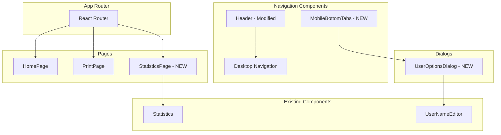
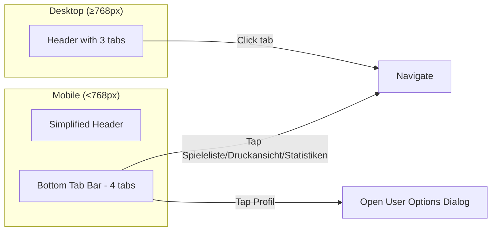

# Design Document: Navigation Statistics Page

## Overview

This design describes the implementation of a dedicated Statistics page and a redesigned navigation system. The key changes include:

1. **Statistics Page**: A new route `/statistics` displaying the existing Statistics component
2. **Desktop Navigation**: Adding "Statistiken" as a third tab in the header
3. **Mobile Bottom Tab Bar**: A fixed bottom navigation replacing the burger menu with 4 tabs
4. **User Options Dialog**: A modal for profile management (name change, logout) triggered from the Profil tab

The design leverages existing components (Statistics, UserNameEditor) and follows established patterns in the codebase.

## Architecture



### Navigation Flow



## Components and Interfaces

### 1. StatisticsPage Component (NEW)

A new page component that wraps the existing Statistics component.

```typescript
// frontend/src/pages/StatisticsPage.tsx

interface StatisticsPageProps {
  // No props needed - Statistics fetches its own data
}

export function StatisticsPage(): JSX.Element {
  // Renders page title and Statistics component
  // Handles loading/error states (delegated to Statistics)
}
```

### 2. MobileBottomTabs Component (NEW)

A fixed bottom navigation bar for mobile devices.

```typescript
// frontend/src/components/MobileBottomTabs.tsx

interface TabItem {
  path: string | null;  // null for dialog-triggering tabs
  label: string;
  icon: React.ReactNode;
  action?: 'dialog';    // Special action type
}

interface MobileBottomTabsProps {
  user: User | null;
  onUserUpdated: (user: User) => void;
  onLogout: () => void;
}

export function MobileBottomTabs({ 
  user, 
  onUserUpdated, 
  onLogout 
}: MobileBottomTabsProps): JSX.Element {
  // State for dialog visibility
  const [isDialogOpen, setIsDialogOpen] = useState(false);
  
  // Uses useLocation() to determine active tab
  // Renders 4 tabs with icons and labels
  // Hidden on md: breakpoint and above
}
```

### 3. UserOptionsDialog Component (NEW)

A modal dialog for user profile management.

```typescript
// frontend/src/components/UserOptionsDialog.tsx

interface UserOptionsDialogProps {
  isOpen: boolean;
  onClose: () => void;
  user: User | null;
  onUserUpdated: (user: User) => void;
  onLogout: () => void;
}

export function UserOptionsDialog({
  isOpen,
  onClose,
  user,
  onUserUpdated,
  onLogout
}: UserOptionsDialogProps): JSX.Element | null {
  // Uses createPortal for proper modal rendering
  // Displays UserNameEditor for name changes
  // Displays logout button
  // Shows "not logged in" message if no user
}
```

### 4. Header Component (MODIFIED)

Update existing Header to:
- Add "Statistiken" tab to desktop navigation
- Remove burger menu and mobile menu entirely
- Simplify mobile header (just title and user info)

```typescript
// Changes to frontend/src/components/Header.tsx

// Desktop navigation tabs (add Statistiken)
const desktopTabs = [
  { path: '/', label: 'Spieleliste' },
  { path: '/print', label: 'Druckansicht' },
  { path: '/statistics', label: 'Statistiken' },  // NEW
];

// Remove: isMobileMenuOpen state
// Remove: toggleMobileMenu function
// Remove: Mobile menu button
// Remove: Mobile menu dropdown
```

### 5. App Component (MODIFIED)

Update App.tsx to:
- Add route for StatisticsPage
- Include MobileBottomTabs component

```typescript
// Changes to frontend/src/App.tsx

// Add import
import { StatisticsPage } from './pages/StatisticsPage';
import { MobileBottomTabs } from './components/MobileBottomTabs';

// Add route
<Route path="/statistics" element={<StatisticsPage />} />

// Add MobileBottomTabs after main content
<MobileBottomTabs 
  user={user} 
  onUserUpdated={handleUserUpdated} 
  onLogout={handleLogout} 
/>
```

### 6. HomePage Component (MODIFIED)

Remove Statistics component from HomePage.

```typescript
// Changes to frontend/src/pages/HomePage.tsx

// Remove: import { Statistics } from '../components/Statistics';
// Remove: statsRefreshTrigger state
// Remove: refreshStats callback
// Remove: <Statistics refreshTrigger={statsRefreshTrigger} /> from render
```

## Data Models

No new data models are required. The feature uses existing types:

```typescript
// Existing types from frontend/src/types/index.ts

interface User {
  id: string;
  name: string;
}

interface StatisticsData {
  totalGames: number;
  totalParticipants: number;
  availableGames: number;
  requestedGames: number;
  popularGames: PopularGame[];
}

interface PopularGame {
  id: string;
  name: string;
  playerCount: number;
}
```

### Tab Configuration

```typescript
// Tab configuration for MobileBottomTabs

interface TabConfig {
  id: string;
  path: string | null;
  label: string;
  icon: JSX.Element;
  action?: 'navigate' | 'dialog';
}

const MOBILE_TABS: TabConfig[] = [
  { id: 'games', path: '/', label: 'Spieleliste', icon: <DiceIcon />, action: 'navigate' },
  { id: 'print', path: '/print', label: 'Druckansicht', icon: <PrinterIcon />, action: 'navigate' },
  { id: 'stats', path: '/statistics', label: 'Statistiken', icon: <ChartIcon />, action: 'navigate' },
  { id: 'profile', path: null, label: 'Profil', icon: <UserIcon />, action: 'dialog' },
];
```

## SVG Icons

The following SVG icons will be used (inline, not external files):

### Dice Icon (Spieleliste)
```tsx
function DiceIcon({ className }: { className?: string }) {
  return (
    <svg className={className} fill="none" stroke="currentColor" viewBox="0 0 24 24">
      <path strokeLinecap="round" strokeLinejoin="round" strokeWidth={2} 
        d="M19 11H5m14 0a2 2 0 012 2v6a2 2 0 01-2 2H5a2 2 0 01-2-2v-6a2 2 0 012-2m14 0V9a2 2 0 00-2-2M5 11V9a2 2 0 012-2m0 0V5a2 2 0 012-2h6a2 2 0 012 2v2M7 7h10" />
    </svg>
  );
}
```

### Printer Icon (Druckansicht)
```tsx
function PrinterIcon({ className }: { className?: string }) {
  return (
    <svg className={className} fill="none" stroke="currentColor" viewBox="0 0 24 24">
      <path strokeLinecap="round" strokeLinejoin="round" strokeWidth={2}
        d="M17 17h2a2 2 0 002-2v-4a2 2 0 00-2-2H5a2 2 0 00-2 2v4a2 2 0 002 2h2m2 4h6a2 2 0 002-2v-4a2 2 0 00-2-2H9a2 2 0 00-2 2v4a2 2 0 002 2zm8-12V5a2 2 0 00-2-2H9a2 2 0 00-2 2v4h10z" />
    </svg>
  );
}
```

### Chart Icon (Statistiken)
```tsx
function ChartIcon({ className }: { className?: string }) {
  return (
    <svg className={className} fill="none" stroke="currentColor" viewBox="0 0 24 24">
      <path strokeLinecap="round" strokeLinejoin="round" strokeWidth={2}
        d="M9 19v-6a2 2 0 00-2-2H5a2 2 0 00-2 2v6a2 2 0 002 2h2a2 2 0 002-2zm0 0V9a2 2 0 012-2h2a2 2 0 012 2v10m-6 0a2 2 0 002 2h2a2 2 0 002-2m0 0V5a2 2 0 012-2h2a2 2 0 012 2v14a2 2 0 01-2 2h-2a2 2 0 01-2-2z" />
    </svg>
  );
}
```

### User Icon (Profil)
```tsx
function UserIcon({ className }: { className?: string }) {
  return (
    <svg className={className} fill="none" stroke="currentColor" viewBox="0 0 24 24">
      <path strokeLinecap="round" strokeLinejoin="round" strokeWidth={2}
        d="M16 7a4 4 0 11-8 0 4 4 0 018 0zM12 14a7 7 0 00-7 7h14a7 7 0 00-7-7z" />
    </svg>
  );
}
```


## Correctness Properties

*A property is a characteristic or behavior that should hold true across all valid executions of a system—essentially, a formal statement about what the system should do. Properties serve as the bridge between human-readable specifications and machine-verifiable correctness guarantees.*

Based on the prework analysis, the following properties are testable across all valid inputs:

### Property 1: Navigation Tab Click Routes Correctly

*For any* navigation tab (Spieleliste, Druckansicht, Statistiken) in either desktop or mobile navigation, clicking/tapping the tab SHALL navigate to the corresponding route ('/', '/print', '/statistics' respectively).

**Validates: Requirements 2.2, 3.3**

### Property 2: Active Route Highlights Correct Tab

*For any* route in the application ('/', '/print', '/statistics'), the corresponding navigation tab SHALL be visually highlighted as active in both desktop and mobile navigation.

**Validates: Requirements 2.3, 5.1, 5.4**

### Property 3: All Tabs Have Icon and Label

*For any* tab in the mobile bottom tab bar, the tab SHALL display both an SVG icon element and a text label element.

**Validates: Requirements 4.1**

### Property 4: Active Tab Icon Styling

*For any* active tab in the navigation, the tab's icon and text SHALL have a visually distinct color (blue) compared to inactive tabs (gray).

**Validates: Requirements 4.6, 5.3**

## Error Handling

### Statistics Page Errors

| Error Scenario | Handling |
|----------------|----------|
| API fetch fails | Display German error message "Statistiken konnten nicht geladen werden." with retry button |
| Network timeout | Same as API fetch failure |
| Empty statistics data | Display zeros for counts, empty popular games list |

### Navigation Errors

| Error Scenario | Handling |
|----------------|----------|
| Invalid route | React Router handles with 404 or redirect to home |
| User not logged in (Profil tab) | Dialog shows "Kein Benutzer angemeldet" message |

### User Options Dialog Errors

| Error Scenario | Handling |
|----------------|----------|
| Name update fails | Display error message, keep dialog open |
| Logout fails | Display error message, allow retry |

## Testing Strategy

### Unit Tests (Example-Based)

Unit tests will cover specific examples and edge cases:

1. **StatisticsPage rendering**
   - Renders page title "Statistiken"
   - Renders Statistics component
   - Shows loading state during fetch
   - Shows error state on API failure

2. **MobileBottomTabs rendering**
   - Renders all 4 tabs with correct labels
   - Each tab has correct icon
   - Hidden on desktop (md: breakpoint)
   - Fixed positioning at bottom

3. **UserOptionsDialog behavior**
   - Opens when Profil tab clicked
   - Displays user name editor
   - Displays logout button
   - Closes on close button click
   - Shows "not logged in" when no user

4. **Header modifications**
   - Desktop nav has 3 tabs
   - No burger menu on mobile
   - Statistiken tab links to /statistics

5. **HomePage modifications**
   - Statistics component not rendered
   - All other functionality intact

### Property-Based Tests

Property tests will validate universal properties using fast-check:

1. **Navigation routing property** (Property 1)
   - Generate random tab selections
   - Verify correct route navigation
   - Tag: Feature: 007-navigation-statistics-page, Property 1: Navigation Tab Click Routes Correctly

2. **Active tab highlighting property** (Property 2)
   - Generate random routes
   - Verify correct tab is highlighted
   - Tag: Feature: 007-navigation-statistics-page, Property 2: Active Route Highlights Correct Tab

3. **Tab structure property** (Property 3)
   - For all tabs, verify icon and label presence
   - Tag: Feature: 007-navigation-statistics-page, Property 3: All Tabs Have Icon and Label

4. **Active styling property** (Property 4)
   - Generate random active/inactive states
   - Verify color differentiation
   - Tag: Feature: 007-navigation-statistics-page, Property 4: Active Tab Icon Styling

### Test Configuration

- Property-based tests: minimum 5 iterations (UI tests with limited input space)
- Use `@testing-library/react` for component testing
- Use `fast-check` for property-based testing
- Mock API calls for Statistics tests
- Use `MemoryRouter` for navigation tests
