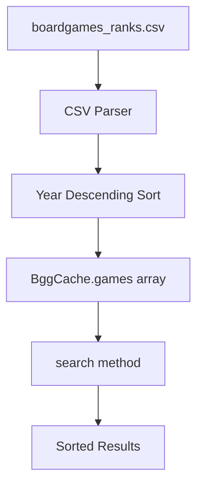

# Design Document

## Overview

This feature modifies the BGG cache sorting logic to prioritize newer games over higher-ranked games. The change is localized to the `BggCache` class in `api/src/services/bggCache.ts`, specifically the sorting comparator used during cache initialization and the `loadGames` method.

### Key Design Decisions

1. **Single Sort Location**: Sorting happens once during cache initialization, not during each search. This maintains O(1) search performance.
2. **Null Year Handling**: Games with null `yearPublished` are sorted to the end, ensuring they don't pollute the top results but remain searchable.
3. **Stable Secondary Sort**: When years are equal, maintain original order (or use BGG rank as tiebreaker) for predictable results.

## Architecture

The change is minimal and contained within the existing architecture:



## Components and Interfaces

### Modified Component: BggCache

**File**: `api/src/services/bggCache.ts`

**Changes**:
1. Modify the sort comparator in `initialize()` method
2. Modify the sort comparator in `loadGames()` method (for testing)

```typescript
// Current sorting (by rank ascending):
this.games = games.sort((a, b) => a.rank - b.rank);

// New sorting (by yearPublished descending, nulls last):
this.games = games.sort((a, b) => {
  // Null years go to the end
  if (a.yearPublished === null && b.yearPublished === null) return 0;
  if (a.yearPublished === null) return 1;
  if (b.yearPublished === null) return -1;
  // Descending order (newest first)
  return b.yearPublished - a.yearPublished;
});
```

### Unchanged Interfaces

The `BggGame`, `BggSearchResult`, and `BggSearchResponse` interfaces remain unchanged. The API contract is preserved - only the order of results changes.

## Data Models

No changes to data models. The existing `BggGame` interface already includes `yearPublished`:

```typescript
interface BggGame {
  id: number;
  name: string;
  yearPublished: number | null;
  rank: number;
  rating: number | null;
}
```

## Correctness Properties

*A property is a characteristic or behavior that should hold true across all valid executions of a system - essentially, a formal statement about what the system should do. Properties serve as the bridge between human-readable specifications and machine-verifiable correctness guarantees.*

Based on the prework analysis, the following properties were identified. After reflection, properties were consolidated to eliminate redundancy (1.1/2.1 combined, 1.2/3.1 combined).

### Property 1: Year Descending Order

*For any* list of BGG games loaded into the cache, after sorting, each game with a valid yearPublished should have a year greater than or equal to the next game's year (when both have valid years).

**Validates: Requirements 1.1, 2.1**

### Property 2: Null Years Placed Last

*For any* sorted list of BGG games, all games with valid yearPublished values should appear before any games with null yearPublished values. Once a null year is encountered, all subsequent games should also have null years.

**Validates: Requirements 1.2, 3.1**

## Error Handling

This feature has minimal error handling requirements since it only modifies sorting logic:

| Scenario | Handling |
|----------|----------|
| All games have null years | Games remain in original order |
| All games have same year | Games remain in stable order |
| Empty game list | No-op, empty array returned |

## Testing Strategy

### Unit Tests

- Test sorting with mixed valid/null years
- Test sorting with all same years
- Test sorting with all null years
- Test edge case: empty array
- Test edge case: single game

### Property-Based Tests

Property tests are appropriate here because:
- Sorting is a pure function with mathematical properties (ordering invariants)
- Random game data with various year distributions benefits from variety
- The properties (ordering, null placement) are true invariants

**Configuration**: Use `{ numRuns: 10-20 }` since these are pure functions with no I/O.

Each property test should be tagged with:
- **Feature: bgg-search-release-year-sorting, Property 1: Year Descending Order**
- **Feature: bgg-search-release-year-sorting, Property 2: Null Years Placed Last**

