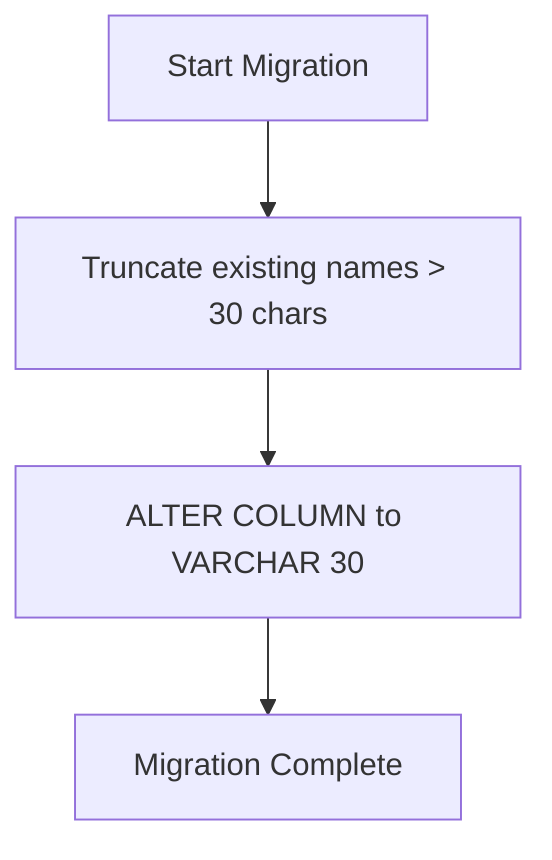

# Design Document: Username Length Limit

## Overview

This feature adds a 30-character maximum length constraint to usernames. The implementation follows a defense-in-depth approach with validation at both frontend (for UX) and backend (for data integrity). The design leverages existing validation patterns in the codebase while adding the new length constraint.

## Architecture

The validation follows the existing layered architecture:

```
┌─────────────────────────────────────────────────────────────┐
│                      Frontend                                │
│  ┌─────────────────────────────────────────────────────┐    │
│  │  NamePrompt Component                                │    │
│  │  - Character counter display                         │    │
│  │  - Real-time validation feedback                     │    │
│  │  - Submit button state management                    │    │
│  └─────────────────────────────────────────────────────┘    │
└─────────────────────────────────────────────────────────────┘
                              │
                              ▼
┌─────────────────────────────────────────────────────────────┐
│                      Backend API                             │
│  ┌─────────────────────────────────────────────────────┐    │
│  │  UserService                                         │    │
│  │  - validateName() method (enhanced)                  │    │
│  │  - createUser() / updateUser() validation            │    │
│  └─────────────────────────────────────────────────────┘    │
└─────────────────────────────────────────────────────────────┘
```

## Components and Interfaces

### Frontend Components

#### NamePrompt Component Enhancement

The existing `NamePrompt` component will be enhanced with:

1. **Character Counter**: Display current/max character count
2. **Length Validation**: Check trimmed input length against limit
3. **Error State**: Show German error message when limit exceeded
4. **Button State**: Disable submit when validation fails

```typescript
// Constants (shared or duplicated for simplicity)
const MAX_USERNAME_LENGTH = 30;

// Validation helper
function validateUsernameLength(name: string): { isValid: boolean; error: string | null } {
  const trimmedLength = name.trim().length;
  if (trimmedLength > MAX_USERNAME_LENGTH) {
    return {
      isValid: false,
      error: 'Der Name darf maximal 30 Zeichen lang sein.'
    };
  }
  return { isValid: true, error: null };
}
```

### Backend Components

#### UserService Enhancement

The existing `validateName` method will be extended to include length validation:

```typescript
// Constants
const MAX_USERNAME_LENGTH = 30;

// Enhanced validateName method
private validateName(name: string): string {
  const trimmedName = name.trim();
  
  // Existing: Check for empty/whitespace-only
  if (!trimmedName) {
    throw new Error('Bitte einen Namen eingeben.');
  }
  
  // New: Check length limit
  if (trimmedName.length > MAX_USERNAME_LENGTH) {
    throw new Error('Der Name darf maximal 30 Zeichen lang sein.');
  }
  
  return trimmedName;
}
```

## Data Models

The database schema will be updated to enforce the 30-character limit at the database level:

```prisma
model User {
  id         String   @id @default(uuid())
  name       String   @unique @db.VarChar(30)
  createdAt  DateTime @default(now()) @map("created_at")
  updatedAt  DateTime @updatedAt @map("updated_at")
}
```

### Migration Strategy

The migration will use a two-step approach to safely add the constraint without data loss:



**Migration SQL:**
```sql
-- Step 1: Truncate existing long names (preserves all records)
UPDATE users SET name = LEFT(name, 30) WHERE LENGTH(name) > 30;

-- Step 2: Add VARCHAR(30) constraint
ALTER TABLE users ALTER COLUMN name TYPE VARCHAR(30);
```

This approach:
- Preserves all existing user records
- Truncates any names exceeding 30 characters
- Enforces the limit at the database level for defense-in-depth

## Correctness Properties

*A property is a characteristic or behavior that should hold true across all valid executions of a system—essentially, a formal statement about what the system should do. Properties serve as the bridge between human-readable specifications and machine-verifiable correctness guarantees.*

### Property 1: Frontend Validation State Consistency

*For any* input string in the NamePrompt component, the validation state (error displayed, submit button disabled) SHALL be determined by whether the trimmed string length exceeds 30 characters.

**Validates: Requirements 1.2, 1.3, 1.4**

### Property 2: Character Counter Accuracy

*For any* input string in the NamePrompt component, the displayed character count SHALL equal the actual length of the input string.

**Validates: Requirements 1.1**

### Property 3: Backend Rejects Oversized Names

*For any* string with trimmed length greater than 30 characters, both `createUser` and `updateUser` SHALL reject the request with the German error message "Der Name darf maximal 30 Zeichen lang sein."

**Validates: Requirements 2.1, 2.2**

### Property 4: Trimmed Length Validation

*For any* string with leading or trailing whitespace, the length validation SHALL be applied to the trimmed version of the string, not the original.

**Validates: Requirements 2.3, 3.2**

## Error Handling

### Frontend Errors

| Condition | Error Message (German) | UI Behavior |
|-----------|------------------------|-------------|
| Name > 30 chars (trimmed) | "Der Name darf maximal 30 Zeichen lang sein." | Red error text, disabled submit button |
| Empty name | "Bitte geben Sie Ihren Namen ein." | Red error text, disabled submit button |

### Backend Errors

| Condition | HTTP Status | Error Message (German) |
|-----------|-------------|------------------------|
| Name > 30 chars (trimmed) | 400 | "Der Name darf maximal 30 Zeichen lang sein." |
| Empty/whitespace name | 400 | "Bitte einen Namen eingeben." |
| Duplicate name | 400 | "Ein Benutzer mit diesem Namen existiert bereits." |

## Testing Strategy

### Unit Tests

- Test NamePrompt component renders character counter correctly
- Test NamePrompt shows error for names > 30 characters
- Test NamePrompt disables submit button for invalid names
- Test UserService.validateName rejects names > 30 characters
- Test boundary conditions (exactly 30 chars, 31 chars)
- Test whitespace handling (spaces before/after valid name)

### Property-Based Tests

Property-based tests will use `fast-check` (already used in the codebase) with minimum 100 iterations per property.

**Backend Property Tests:**
- Generate random strings > 30 characters, verify rejection
- Generate random strings with whitespace padding, verify trimmed validation
- Generate random valid strings (1-30 chars), verify acceptance

**Frontend Property Tests:**
- Generate random strings, verify character counter accuracy
- Generate random strings, verify validation state matches length check

Each property test will be tagged with:
- **Feature: 009-username-length-limit, Property {N}: {property_text}**
