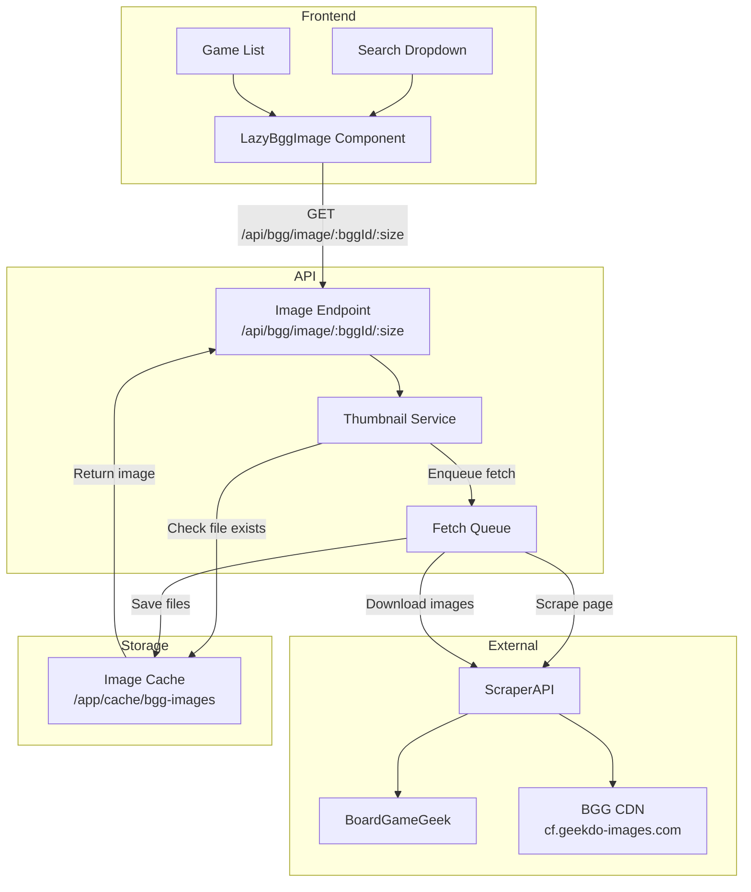
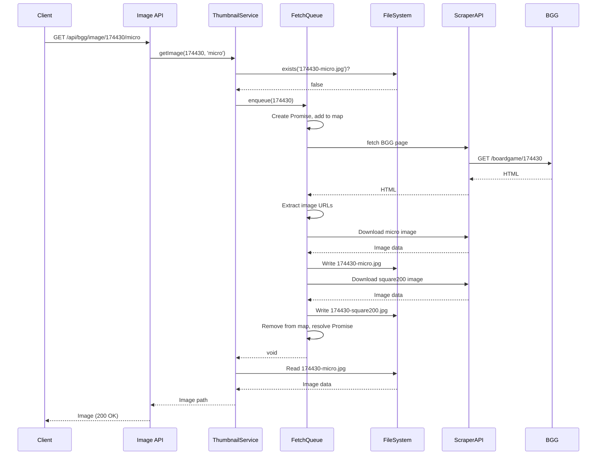
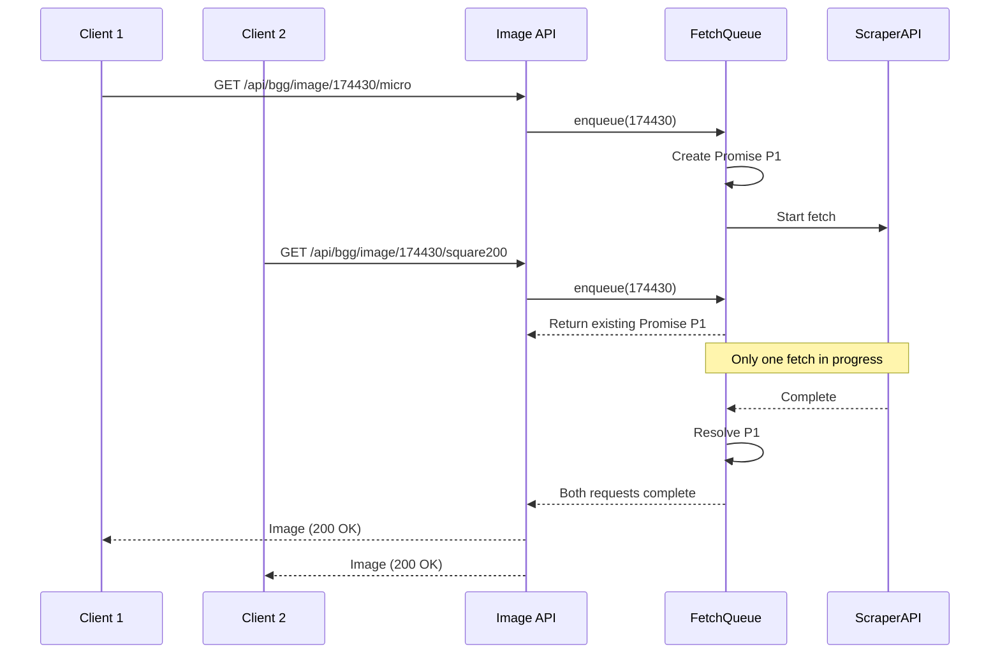

 # Design Document: BGG Game Thumbnails

## Overview

This feature adds BoardGameGeek (BGG) game thumbnails to the search dropdown and game list views. The system fetches images from BGG pages using ScraperAPI, stores them locally in a persistent file cache, and serves them through a dedicated API endpoint. A reusable React component handles lazy loading with animated placeholders and supports press-to-zoom functionality.

### Key Design Decisions

1. **File-based caching** - Images stored as files (`{bggId}-{size}.jpg`) rather than in database, enabling simple existence checks and direct file serving
2. **ScraperAPI for all fetches** - Both page scraping and image downloads go through ScraperAPI to avoid IP blocking
3. **Promise-based deduplication** - In-flight requests tracked via `Map<number, Promise>` to prevent duplicate fetches
4. **No timeouts** - API waits for fetch completion; client shows shimmer animation until ready
5. **Dual image sizes** - Always fetch both `micro` (64x64) and `square200` (200x200) regardless of which is requested

## Architecture



## Components and Interfaces

### Backend Components

#### 1. BggImageService (`api/src/services/bggImageService.ts`)

Core service responsible for image fetching, caching, and deduplication.

```typescript
interface BggImageService {
  /**
   * Get image for a BGG game. Returns cached image or fetches from BGG.
   * @param bggId - BoardGameGeek game ID
   * @param size - Image size: 'micro' (64x64) or 'square200' (200x200)
   * @returns Path to cached image file, or null if unavailable
   */
  getImage(bggId: number, size: 'micro' | 'square200'): Promise<string | null>;
  
  /**
   * Check if images are cached for a BGG game
   */
  isCached(bggId: number): boolean;
}
```

#### 2. BggFetchQueue (`api/src/services/bggFetchQueue.ts`)

Manages in-flight requests to prevent duplicate fetches.

```typescript
interface BggFetchQueue {
  /**
   * Enqueue a fetch request. Returns existing promise if already in-flight.
   * @param bggId - BoardGameGeek game ID
   * @returns Promise that resolves when images are cached
   */
  enqueue(bggId: number): Promise<void>;
  
  /**
   * Check if a fetch is currently in progress for a BGG ID
   */
  isInFlight(bggId: number): boolean;
}
```

#### 3. Image API Endpoint (`api/src/routes/bgg.routes.ts`)

New endpoint added to existing BGG routes.

```typescript
// GET /api/bgg/image/:bggId/:size
// Returns: Image file (JPEG) or 404 with placeholder
interface ImageEndpointParams {
  bggId: string;  // Parsed to number
  size: 'micro' | 'square200';
}
```

### Frontend Components

#### 1. LazyBggImage (`frontend/src/components/LazyBggImage.tsx`)

Reusable component for displaying BGG thumbnails with loading states and zoom.

```typescript
interface LazyBggImageProps {
  /** BoardGameGeek game ID */
  bggId: number;
  /** Image size to display */
  size: 'micro' | 'square200';
  /** Alt text for accessibility */
  alt: string;
  /** Additional CSS classes */
  className?: string;
  /** Whether to enable press-to-zoom (default: true) */
  enableZoom?: boolean;
}
```

#### 2. ImageZoomOverlay (`frontend/src/components/ImageZoomOverlay.tsx`)

Portal-rendered overlay for zoomed image display.

```typescript
interface ImageZoomOverlayProps {
  /** BGG ID for loading square200 image */
  bggId: number;
  /** Alt text */
  alt: string;
  /** Callback when overlay should close */
  onClose: () => void;
}
```

## Data Models

### File Cache Structure

```
/app/cache/bgg-images/
├── 174430-micro.jpg      # Gloomhaven micro
├── 174430-square200.jpg  # Gloomhaven square200
├── 167791-micro.jpg      # Terraforming Mars micro
├── 167791-square200.jpg  # Terraforming Mars square200
├── 12345-noimage         # Marker file for games without images
└── ...
```

### In-Memory State

```typescript
// Fetch queue state (in BggFetchQueue)
type InFlightMap = Map<number, Promise<void>>;

// Example state:
// Map {
//   174430 => Promise<void>,  // Gloomhaven fetch in progress
//   167791 => Promise<void>,  // Terraforming Mars fetch in progress
// }
```

### Environment Configuration

```typescript
// Added to api/src/config/index.ts
interface BggImageConfig {
  scraperApiKey: string;      // SCRAPER_API_KEY
  scrapeEnabled: boolean;     // BGG_SCRAPE_ENABLED (default: true)
  cacheDir: string;           // BGG_IMAGE_CACHE_DIR (default: /app/cache/bgg-images)
}
```

## Correctness Properties

*A property is a characteristic or behavior that should hold true across all valid executions of a system—essentially, a formal statement about what the system should do. Properties serve as the bridge between human-readable specifications and machine-verifiable correctness guarantees.*


Based on the prework analysis, the following properties have been identified as testable:

**Property 1: Cache Hit Returns Immediately**
*For any* BGG ID where both image files exist in the cache, the service should return the requested image without making any ScraperAPI calls.
**Validates: Requirements 1.1, 1.2**

**Property 2: File Naming Convention**
*For any* successfully fetched BGG image, the cached file name should match the pattern `{bggId}-{size}.jpg` where size is either `micro` or `square200`.
**Validates: Requirements 1.6**

**Property 3: Dual-Size Fetch**
*For any* fetch operation triggered by a cache miss, both `micro` and `square200` images should be downloaded and cached, regardless of which size was originally requested.
**Validates: Requirements 1.5, 3.5**

**Property 4: Request Deduplication**
*For any* set of concurrent requests for the same uncached BGG ID, only one ScraperAPI fetch should occur, and all requests should receive the same Promise.
**Validates: Requirements 2.3, 2.4**

**Property 5: Subscriber Notification**
*For any* in-flight fetch request with multiple subscribers, when the fetch completes (success or failure), all subscribers should receive the same result.
**Validates: Requirements 2.5, 2.6**

**Property 6: Queue Cleanup**
*For any* completed fetch operation (success or failure), the BGG ID should be removed from the in-flight map, allowing future requests to trigger new fetches.
**Validates: Requirements 2.7**

**Property 7: Retry After Failure**
*For any* BGG ID where a previous fetch failed, a subsequent request should trigger a new fetch attempt (no permanent failure caching).
**Validates: Requirements 9.4**

**Property 8: No-Image Marker**
*For any* BGG game that has no images available, a marker file should be created to prevent repeated fetch attempts on subsequent requests.
**Validates: Requirements 9.5**

**Property 9: Cache Immutability**
*For any* cached image file, subsequent fetch operations for the same BGG ID should not overwrite or modify the existing file.
**Validates: Requirements 10.5**

## Error Handling

### Backend Error Scenarios

| Scenario | Handling | User Impact |
|----------|----------|-------------|
| ScraperAPI unavailable | Log error, return 503 | Placeholder shown |
| BGG page not found | Log error, return 404 | Placeholder shown |
| BGG page has no images | Create marker file, return 404 | Placeholder shown |
| Image download fails | Log error, return 503 | Placeholder shown |
| Invalid BGG ID format | Return 400 | Placeholder shown |
| Cache directory not writable | Log error, return 503 | Placeholder shown |

### Frontend Error Scenarios

| Scenario | Handling | User Experience |
|----------|----------|-----------------|
| Image API returns error | Show placeholder icon | Static board game icon |
| Image load timeout | N/A (no timeout) | Shimmer continues |
| Network error | Show placeholder icon | Static board game icon |
| Invalid bggId prop | Show placeholder icon | Static board game icon |

### Error Response Format

```typescript
// 4xx/5xx responses from image endpoint
interface ImageErrorResponse {
  error: {
    code: 'INVALID_BGG_ID' | 'IMAGE_NOT_FOUND' | 'FETCH_FAILED' | 'SERVICE_UNAVAILABLE';
    message: string;
  };
}
```

## Testing Strategy

### Unit Tests

Unit tests focus on specific examples and edge cases:

1. **BggImageService**
   - Returns cached image path when file exists
   - Triggers fetch when file doesn't exist
   - Extracts image URLs from BGG HTML correctly
   - Handles malformed HTML gracefully
   - Creates marker file for games without images

2. **BggFetchQueue**
   - Returns existing promise for in-flight requests
   - Creates new promise for new requests
   - Removes BGG ID from map after completion
   - Handles concurrent enqueue calls correctly

3. **LazyBggImage Component**
   - Renders shimmer placeholder while loading
   - Shows image after successful load
   - Shows error placeholder on failure
   - Triggers zoom on mousedown/touchstart
   - Hides zoom on mouseup/touchend

4. **Image API Endpoint**
   - Returns image with correct content-type
   - Sets appropriate cache headers
   - Returns 400 for invalid BGG ID
   - Returns 404 for missing images

### Property-Based Tests

Property tests validate universal properties across many inputs. Using `fast-check` for the API (Jest) and frontend (Vitest).

**Configuration**: Each property test runs minimum 100 iterations.

**Tag format**: `Feature: bgg-game-thumbnails, Property N: {property_text}`

| Property | Test Description | numRuns |
|----------|------------------|---------|
| Property 1 | Cache hit returns immediately | 5 (I/O bound) |
| Property 2 | File naming convention | 10 |
| Property 3 | Dual-size fetch | 5 (I/O bound) |
| Property 4 | Request deduplication | 5 (async) |
| Property 5 | Subscriber notification | 5 (async) |
| Property 6 | Queue cleanup | 5 (async) |
| Property 7 | Retry after failure | 5 (I/O bound) |
| Property 8 | No-image marker | 5 (I/O bound) |
| Property 9 | Cache immutability | 5 (I/O bound) |

### Integration Tests

1. **End-to-end image flow**
   - Request uncached image → fetch → cache → return
   - Request cached image → return immediately
   - Concurrent requests → single fetch

2. **Frontend integration**
   - Search dropdown shows thumbnails
   - Game list shows thumbnails (desktop/mobile)
   - Zoom overlay appears on press

## Sequence Diagrams

### Cache Miss Flow



### Concurrent Request Deduplication



## Docker Configuration

### Volume Mount

Add to `docker-compose.yml`:

```yaml
services:
  api:
    # ... existing config ...
    volumes:
      - bgg_image_cache:/app/cache/bgg-images
    environment:
      - SCRAPER_API_KEY=${SCRAPER_API_KEY}
      - BGG_SCRAPE_ENABLED=${BGG_SCRAPE_ENABLED:-true}
      - BGG_IMAGE_CACHE_DIR=/app/cache/bgg-images

volumes:
  postgres_data:
  bgg_image_cache:  # New volume for image cache
```

### Environment Variables

Add to `.env` / `example.env`:

```bash
# BGG Image Thumbnails
SCRAPER_API_KEY=your-scraper-api-key
BGG_SCRAPE_ENABLED=true
BGG_IMAGE_CACHE_DIR=/app/cache/bgg-images
```
