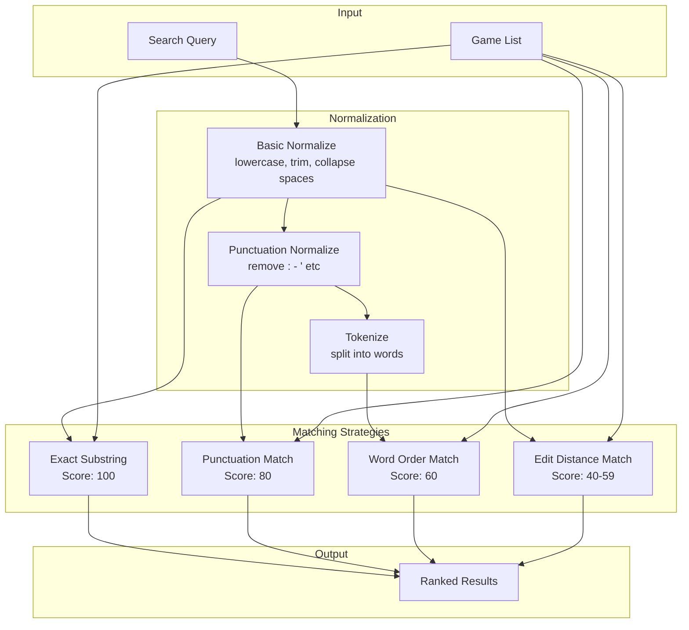

# Design Document: Fuzzy Search

## Overview

This design implements a multi-strategy fuzzy search system for board game names. The system uses a layered matching approach where each strategy is tried in order of precision, and results are ranked by match quality. The implementation covers both:

1. **Frontend (client-side)** - Filtering the local game list in memory
2. **Backend (server-side)** - Searching the BGG game database via API

The matching strategies, in order of priority:
1. **Exact substring match** - Current behavior, highest confidence
2. **Punctuation-normalized match** - Removes punctuation before comparison
3. **Word-order-independent match** - All query words must appear in game name
4. **Edit distance match** - Tolerates minor typos using Levenshtein distance (frontend only)

## Architecture



## Components and Interfaces

### 1. String Normalization Module

**File:** `frontend/src/utils/nameNormalization.ts`

```typescript
/**
 * Basic normalization - lowercase, trim, collapse whitespace
 * (existing function, unchanged)
 */
export function normalizeName(name: string): string;

/**
 * Punctuation-aware normalization - removes common punctuation
 * in addition to basic normalization
 */
export function normalizePunctuation(name: string): string;

/**
 * Tokenizes a normalized string into words for word-order matching
 */
export function tokenize(normalizedName: string): string[];
```

### 2. Fuzzy Matching Module

**File:** `frontend/src/utils/fuzzyMatch.ts`

```typescript
/**
 * Match result with score for ranking
 */
export interface FuzzyMatchResult {
  matched: boolean;
  score: number;  // 0-100, higher is better
  matchType: 'exact' | 'punctuation' | 'word-order' | 'edit-distance' | 'none';
}

/**
 * Configuration for fuzzy matching behavior
 */
export interface FuzzyMatchConfig {
  enableEditDistance: boolean;
  maxEditDistance: number;  // Maximum allowed edit distance
  minQueryLength: number;   // Minimum query length for edit distance
}

/**
 * Default configuration
 */
export const DEFAULT_FUZZY_CONFIG: FuzzyMatchConfig;

/**
 * Calculates Levenshtein edit distance between two strings
 */
export function editDistance(a: string, b: string): number;

/**
 * Determines if query matches game name using multi-strategy approach
 */
export function fuzzyMatch(
  query: string,
  gameName: string,
  config?: Partial<FuzzyMatchConfig>
): FuzzyMatchResult;
```

### 3. Game Filtering Module (Updated)

**File:** `frontend/src/utils/gameFiltering.ts`

```typescript
/**
 * Game with match score for sorted results
 */
export interface ScoredGame {
  game: Game;
  score: number;
  matchType: FuzzyMatchResult['matchType'];
}

/**
 * Filters games using fuzzy matching and returns sorted by relevance
 * Maintains backward compatibility - returns Game[] not ScoredGame[]
 */
export function filterGamesByName(
  games: Game[],
  query: string,
  config?: Partial<FuzzyMatchConfig>
): Game[];

/**
 * Filters games and returns with scores (for advanced use cases)
 */
export function filterGamesByNameWithScores(
  games: Game[],
  query: string,
  config?: Partial<FuzzyMatchConfig>
): ScoredGame[];
```

## Data Models

### FuzzyMatchResult

| Field | Type | Description |
|-------|------|-------------|
| matched | boolean | Whether the query matches the game name |
| score | number | Match quality score (0-100) |
| matchType | string | Which strategy produced the match |

### FuzzyMatchConfig

| Field | Type | Default | Description |
|-------|------|---------|-------------|
| enableEditDistance | boolean | true | Whether to use typo tolerance |
| maxEditDistance | number | 2 | Maximum edit distance allowed |
| minQueryLength | number | 4 | Minimum query length for edit distance |

### Score Values

| Match Type | Score | Description |
|------------|-------|-------------|
| exact | 100 | Query is substring of game name |
| punctuation | 80 | Match after removing punctuation |
| word-order | 60 | All query words found in game name |
| edit-distance | 40-59 | Based on edit distance (lower distance = higher score) |
| none | 0 | No match |

## Correctness Properties

*A property is a characteristic or behavior that should hold true across all valid executions of a system—essentially, a formal statement about what the system should do. Properties serve as the bridge between human-readable specifications and machine-verifiable correctness guarantees.*

### Property 1: Punctuation Normalization Completeness

*For any* string containing punctuation characters (colons, hyphens, apostrophes, periods, commas), the `normalizePunctuation` function SHALL return a string with all those punctuation characters removed.

**Validates: Requirements 1.2**

### Property 2: Punctuation-Normalized Matching Symmetry

*For any* game name with punctuation and a query that is the same name without punctuation, the fuzzy matcher SHALL return a match with matchType 'punctuation' or better.

**Validates: Requirements 1.1**

### Property 3: Word-Order Independence

*For any* multi-word game name and a query containing the same words in any permuted order, the fuzzy matcher SHALL return a match with matchType 'word-order' or better.

**Validates: Requirements 2.1**

### Property 4: Word-Order No False Positives

*For any* game name and a query containing a word that does not appear in the game name (even as a substring), the fuzzy matcher SHALL NOT return a 'word-order' match for that game.

**Validates: Requirements 2.4**

### Property 5: Edit Distance Threshold Behavior

*For any* two strings where the edit distance is within the configured threshold, the fuzzy matcher SHALL return a match. *For any* two strings where the edit distance exceeds the threshold, the fuzzy matcher SHALL NOT return an edit-distance match.

**Validates: Requirements 3.2, 3.4**

### Property 6: Score Hierarchy Invariant

*For any* game that matches via multiple strategies, the scores SHALL follow the hierarchy: exact (100) > punctuation (80) > word-order (60) > edit-distance (40-59).

**Validates: Requirements 4.2, 4.3, 4.4**

### Property 7: Result Ordering

*For any* list of games and search query, the returned results SHALL be sorted by score in descending order (highest score first).

**Validates: Requirements 4.5**

### Property 8: Empty Query Identity

*For any* list of games, when the search query is empty or whitespace-only, the fuzzy matcher SHALL return all games in their original order.

**Validates: Requirements 5.3**

## Error Handling

| Scenario | Handling |
|----------|----------|
| Empty query | Return all games unchanged |
| Whitespace-only query | Treat as empty query |
| Null/undefined game name | Skip game, do not crash |
| Very long query (>100 chars) | Truncate before processing |
| Special regex characters in query | Escape before any regex operations |

## Backend BGG Search Integration

### 4. Backend Fuzzy Matching Module

**File:** `api/src/services/fuzzyMatch.ts`

```typescript
/**
 * Normalizes a string for comparison (lowercase, trim, collapse spaces)
 */
export function normalizeName(name: string): string;

/**
 * Normalizes a string by removing common punctuation marks
 */
export function normalizePunctuation(name: string): string;

/**
 * Tokenizes a normalized string into words
 */
export function tokenize(normalizedName: string): string[];

/**
 * Match result with score
 */
export interface FuzzyMatchResult {
  matched: boolean;
  score: number;  // 0-100
}

/**
 * Determines if query matches game name using multi-strategy approach
 * (excludes edit-distance to avoid false positives in large BGG database)
 */
export function fuzzyMatch(query: string, gameName: string): FuzzyMatchResult;
```

### 5. Updated BGG Cache Search

**File:** `api/src/services/bggCache.ts`

The `search` method is updated to use fuzzy matching:

```typescript
/**
 * Search games by name with fuzzy matching
 * - Uses punctuation-normalized matching
 * - Uses word-order independent matching
 * - Results sorted by match score (best first), then by year (newest first)
 */
search(query: string, maxResults: number = 10): BggGame[];
```

### Backend Score Values

| Match Type | Score | Description |
|------------|-------|-------------|
| exact | 100 | Query is substring of game name |
| punctuation | 80 | Match after removing punctuation |
| word-order | 60 | All query words found in game name |

Note: Edit-distance matching is intentionally excluded from the backend to prevent excessive false positives when searching the large BGG database (~20k+ games).

## Testing Strategy

### Unit Tests

Unit tests will cover specific examples and edge cases:

1. **Punctuation examples**: "Brass Birmingham" → "Brass: Birmingham", "Catan Seafarers" → "Catan: Seafarers"
2. **Word order examples**: "Birmingham Brass" → "Brass: Birmingham"
3. **Typo examples**: "Cataan" → "Catan", "Katan" → "Catan"
4. **Edge cases**: Empty strings, single characters, very long strings
5. **Score verification**: Verify exact scores for each match type

### Property-Based Tests

Property tests will use `fast-check` library with the following configuration:
- **numRuns**: 10-20 for pure string functions (fast, benefits from variety)
- Each test tagged with: `Feature: 011-fuzzy-search, Property N: {property_text}`

Properties to implement:
1. Punctuation normalization completeness (Property 1)
2. Word-order matching independence (Property 3)
3. Edit distance threshold behavior (Property 5)
4. Score hierarchy invariant (Property 6)
5. Result ordering (Property 7)
6. Empty query identity (Property 8)

### Test File Structure

```
frontend/src/utils/__tests__/
├── nameNormalization.test.ts    # Unit + property tests for normalization
├── fuzzyMatch.test.ts           # Unit + property tests for matching logic
└── gameFiltering.test.ts        # Integration tests for filtering
```
