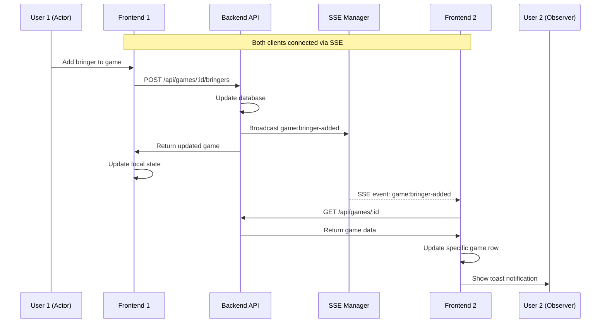

# Design Document: SSE Real-Time Updates

## Overview

This design describes the implementation of Server-Sent Events (SSE) for real-time updates in the board game event application. The system enables all connected clients to receive instant notifications when game data changes, providing a seamless collaborative experience without manual page refreshes.

The architecture follows a publish-subscribe pattern where:
1. The backend maintains persistent SSE connections with all clients
2. Game-related actions trigger event broadcasts to all connected clients
3. Clients selectively refresh affected game data and display toast notifications

## Architecture

```mermaid
flowchart TB
    subgraph Frontend
        HP[HomePage]
        SSE[useSSE Hook]
        Toast[ToastProvider]
        GR[GameRow Components]
    end
    
    subgraph Backend
        GR_API[Game Routes]
        GS[GameService]
        SSE_MGR[SSEManager]
        SSE_EP[/api/events Endpoint]
    end
    
    HP --> SSE
    SSE -->|EventSource| SSE_EP
    SSE -->|game updates| HP
    SSE -->|toast events| Toast
    HP --> GR
    
    GR_API --> GS
    GS -->|broadcast| SSE_MGR
    SSE_MGR --> SSE_EP
```

### Data Flow



## Components and Interfaces

### Backend Components

#### SSEManager (New)

A singleton service that manages SSE client connections and broadcasts events.

```typescript
// api/src/services/sse.service.ts

interface SSEClient {
  id: string;
  response: Response;
}

interface GameEvent {
  type: 'game:created' | 'game:bringer-added' | 'game:bringer-removed' | 
        'game:player-added' | 'game:player-removed' | 'game:deleted';
  gameId: string;
  userId: string;
  userName?: string;
  gameName?: string;
  isBringing?: boolean;
}

class SSEManager {
  private clients: Map<string, SSEClient>;
  
  // Add a new client connection
  addClient(id: string, response: Response): void;
  
  // Remove a client connection
  removeClient(id: string): void;
  
  // Broadcast an event to all connected clients
  broadcast(event: GameEvent): void;
  
  // Get count of connected clients (for monitoring)
  getClientCount(): number;
}
```

#### SSE Routes (New)

```typescript
// api/src/routes/sse.routes.ts

// GET /api/events
// Establishes SSE connection with client
// Response headers: Content-Type: text/event-stream, Cache-Control: no-cache, Connection: keep-alive
// Sends heartbeat every 30 seconds to keep connection alive
```

#### GameService Updates

The existing GameService methods will be updated to broadcast events after successful operations:

```typescript
// Updated methods in api/src/services/game.service.ts

async createGame(...): Promise<Game> {
  // ... existing logic ...
  sseManager.broadcast({
    type: 'game:created',
    gameId: game.id,
    userId,
    userName: user.name,
    gameName: game.name,
    isBringing
  });
  return game;
}

async addBringer(gameId: string, userId: string): Promise<Game> {
  // ... existing logic ...
  sseManager.broadcast({
    type: 'game:bringer-added',
    gameId,
    userId,
    userName: user.name,
    gameName: game.name
  });
  return game;
}

// Similar updates for removeBringer, addPlayer, removePlayer, deleteGame
```

### Frontend Components

#### useSSE Hook (New)

Custom React hook for managing SSE connection lifecycle and event handling.

```typescript
// frontend/src/hooks/useSSE.ts

interface SSEEventHandlers {
  onGameCreated?: (event: GameCreatedEvent) => void;
  onGameUpdated?: (event: GameUpdatedEvent) => void;
  onGameDeleted?: (event: GameDeletedEvent) => void;
  onToast?: (message: string) => void;
}

interface UseSSEOptions {
  currentUserId: string;
  handlers: SSEEventHandlers;
}

function useSSE(options: UseSSEOptions): {
  isConnected: boolean;
  connectionError: Error | null;
};
```

#### ToastProvider and useToast (New)

Context provider and hook for managing toast notifications.

```typescript
// frontend/src/components/ToastProvider.tsx

interface Toast {
  id: string;
  message: string;
  createdAt: number;
}

interface ToastContextValue {
  showToast: (message: string) => void;
}

// ToastProvider wraps the app and renders toast container
// Toasts auto-dismiss after 4 seconds
// Stacked vertically in bottom-right corner
```

#### Updated HomePage

The HomePage component will integrate the useSSE hook and handle game data updates:

```typescript
// Updates to frontend/src/pages/HomePage.tsx

function HomePage({ user }: HomePageProps) {
  const { showToast } = useToast();
  
  // Handler for game created events
  const handleGameCreated = useCallback(async (event: GameCreatedEvent) => {
    const response = await gamesApi.getById(event.gameId);
    setGames(prev => [...prev, response.game]);
  }, []);
  
  // Handler for game updated events
  const handleGameUpdated = useCallback(async (event: GameUpdatedEvent) => {
    const response = await gamesApi.getById(event.gameId);
    setGames(prev => prev.map(g => g.id === event.gameId ? response.game : g));
  }, []);
  
  // Handler for game deleted events
  const handleGameDeleted = useCallback((event: GameDeletedEvent) => {
    setGames(prev => prev.filter(g => g.id !== event.gameId));
  }, []);
  
  // SSE connection
  useSSE({
    currentUserId: user?.id || '',
    handlers: {
      onGameCreated: handleGameCreated,
      onGameUpdated: handleGameUpdated,
      onGameDeleted: handleGameDeleted,
      onToast: showToast,
    },
  });
  
  // ... rest of component
}
```

## Data Models

### SSE Event Types

```typescript
// frontend/src/types/sse.ts

// Base event structure
interface BaseSSEEvent {
  type: string;
  gameId: string;
  userId: string;
}

// Event for game creation
interface GameCreatedEvent extends BaseSSEEvent {
  type: 'game:created';
  userName: string;
  gameName: string;
  isBringing: boolean;
}

// Event for bringer added
interface BringerAddedEvent extends BaseSSEEvent {
  type: 'game:bringer-added';
  userName: string;
  gameName: string;
}

// Event for bringer removed
interface BringerRemovedEvent extends BaseSSEEvent {
  type: 'game:bringer-removed';
}

// Event for player added
interface PlayerAddedEvent extends BaseSSEEvent {
  type: 'game:player-added';
}

// Event for player removed
interface PlayerRemovedEvent extends BaseSSEEvent {
  type: 'game:player-removed';
}

// Event for game deleted
interface GameDeletedEvent extends BaseSSEEvent {
  type: 'game:deleted';
}

// Union type for all SSE events
type SSEEvent = 
  | GameCreatedEvent 
  | BringerAddedEvent 
  | BringerRemovedEvent 
  | PlayerAddedEvent 
  | PlayerRemovedEvent 
  | GameDeletedEvent;
```

### Toast State

```typescript
// frontend/src/types/toast.ts

interface Toast {
  id: string;
  message: string;
  createdAt: number;
}

interface ToastState {
  toasts: Toast[];
}
```

### API Extension

```typescript
// Addition to frontend/src/api/client.ts

export const gamesApi = {
  // ... existing methods ...
  
  // Get a single game by ID (new method for selective refresh)
  getById: (gameId: string): Promise<GameResponse> => {
    return fetchApi<GameResponse>(`/api/games/${gameId}`);
  },
};
```


## Correctness Properties

*A property is a characteristic or behavior that should hold true across all valid executions of a system—essentially, a formal statement about what the system should do. Properties serve as the bridge between human-readable specifications and machine-verifiable correctness guarantees.*

### Property 1: Event Broadcast Correctness

*For any* game action (create, add bringer, remove bringer, add player, remove player, delete), the SSE manager SHALL broadcast an event with the correct event type corresponding to that action, and the event SHALL be received by all connected clients.

**Validates: Requirements 2.1, 2.2, 2.3, 2.4, 2.5, 2.6, 2.7**

### Property 2: Event Payload Structure

*For any* SSE event broadcast, the payload SHALL contain `type`, `gameId`, and `userId` fields. Additionally, for `game:created` and `game:bringer-added` events, the payload SHALL include `userName` and `gameName` fields. For `game:created` events specifically, the payload SHALL include an `isBringing` boolean field.

**Validates: Requirements 5.1, 5.2, 5.3, 5.4, 5.5**

### Property 3: Event Payload Serialization Round-Trip

*For any* valid GameEvent object, serializing it to JSON and parsing it back SHALL produce an equivalent object with all fields preserved.

**Validates: Requirements 5.6**

### Property 4: Toast Message Formatting

*For any* `game:created` event with `isBringing: true`, the toast message SHALL be formatted as "{userName} bringt {gameName} mit". *For any* `game:created` event with `isBringing: false`, the toast message SHALL be formatted as "{userName} hat {gameName} hinzugefügt". *For any* `game:bringer-added` event, the toast message SHALL be formatted as "{userName} bringt {gameName} mit".

**Validates: Requirements 4.1, 4.2, 4.3**

### Property 5: Toast Filtering

*For any* SSE event, a toast notification SHALL only be displayed if: (1) the event type is `game:created` or `game:bringer-added`, AND (2) the event's `userId` does not match the current user's ID.

**Validates: Requirements 4.4, 4.8**

### Property 6: Toast Ordering

*For any* sequence of toast notifications, they SHALL be displayed in chronological order with the newest toast appearing at the bottom of the stack.

**Validates: Requirements 4.7**

### Property 7: Reconnection Backoff

*For any* sequence of N consecutive connection failures (where N >= 1), the delay before the Nth retry attempt SHALL be min(2^(N-1), 30) seconds.

**Validates: Requirements 1.2**

## Error Handling

### Backend Error Handling

| Error Scenario | Handling Strategy |
|----------------|-------------------|
| Client disconnects unexpectedly | Remove client from SSEManager's client list; log disconnect |
| Broadcast fails for one client | Log error, continue broadcasting to other clients |
| Invalid event data | Validate event structure before broadcast; log and skip invalid events |

### Frontend Error Handling

| Error Scenario | Handling Strategy |
|----------------|-------------------|
| SSE connection fails | Retry with exponential backoff (1s, 2s, 4s... max 30s) |
| Malformed SSE event received | Log error to console, ignore event, continue processing |
| Game fetch fails after SSE event | Log error, do not update state, app continues functioning |
| EventSource not supported | Fall back to manual refresh; log warning |

### Graceful Degradation

The application SHALL continue to function normally when SSE is unavailable:
- Manual refresh via pull-to-refresh still works
- All CRUD operations work independently of SSE
- Users can still see their own changes immediately (optimistic updates)

## Testing Strategy

### Unit Tests

Unit tests will cover specific examples and edge cases:

1. **SSEManager Tests** (api/src/services/__tests__/sse.service.test.ts)
   - Adding and removing clients
   - Broadcasting to multiple clients
   - Handling client disconnection during broadcast

2. **Toast Formatting Tests** (frontend/src/utils/__tests__/toastMessages.test.ts)
   - Correct German message for game created with bringing
   - Correct German message for game created without bringing
   - Correct German message for bringer added

3. **useSSE Hook Tests** (frontend/src/hooks/__tests__/useSSE.test.ts)
   - Connection establishment on mount
   - Cleanup on unmount
   - Event handler invocation

4. **ToastProvider Tests** (frontend/src/components/__tests__/ToastProvider.test.ts)
   - Toast display and auto-dismiss
   - Multiple toast stacking

### Property-Based Tests

Property-based tests will verify universal properties using fast-check:

1. **Event Payload Structure Property** (api/src/services/__tests__/sse.service.property.test.ts)
   - **Property 2**: All events contain required fields
   - **Property 3**: JSON serialization round-trip

2. **Toast Message Formatting Property** (frontend/src/utils/__tests__/toastMessages.property.test.ts)
   - **Property 4**: Message format correctness for all event types

3. **Toast Filtering Property** (frontend/src/hooks/__tests__/useSSE.property.test.ts)
   - **Property 5**: Toast only shown for correct event types and other users

4. **Reconnection Backoff Property** (frontend/src/hooks/__tests__/useSSE.property.test.ts)
   - **Property 7**: Exponential backoff calculation

### Integration Tests

Integration tests will verify end-to-end behavior:

1. **SSE Route Integration** (api/src/__tests__/sse.integration.test.ts)
   - SSE endpoint establishes connection
   - Events are received by connected clients
   - Multiple clients receive broadcasts

### Test Configuration

- Property-based tests: minimum 100 iterations (using fast-check)
- Each property test tagged with: **Feature: 012-sse-real-time-updates, Property N: {property_text}**
- Backend tests: Jest with `--runInBand` flag
- Frontend tests: Vitest
