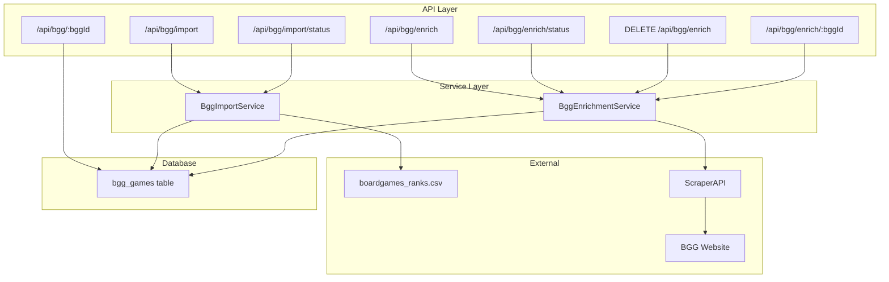

# Design Document: BGG Database Enrichment

## Overview

This feature adds two main capabilities to the BGG data infrastructure:

1. **CSV Import**: Import the complete `boardgames_ranks.csv` file (172k+ rows) into a PostgreSQL database table, replacing the current in-memory-only approach for this data.

2. **Game Enrichment**: Scrape additional metadata from BGG pages (alternate names, descriptions, designers, categories, etc.) and store it alongside the base game data.

Both processes run asynchronously in the background with status endpoints for monitoring progress.

## Architecture



## Components and Interfaces

### 1. Database Schema (Prisma)

```prisma
model BggGame {
  id              Int       @id @map("bgg_id")
  name            String
  yearPublished   Int?      @map("year_published")
  rank            Int?
  bayesAverage    Float?    @map("bayes_average")
  average         Float?
  usersRated      Int?      @map("users_rated")
  isExpansion     Boolean   @default(false) @map("is_expansion")
  
  // Category-specific ranks (nullable)
  abstractsRank       Int?  @map("abstracts_rank")
  cgsRank             Int?  @map("cgs_rank")
  childrensGamesRank  Int?  @map("childrensgames_rank")
  familyGamesRank     Int?  @map("familygames_rank")
  partyGamesRank      Int?  @map("partygames_rank")
  strategyGamesRank   Int?  @map("strategygames_rank")
  thematicRank        Int?  @map("thematic_rank")
  warGamesRank        Int?  @map("wargames_rank")
  
  // Enrichment fields
  scrapingDone    Boolean   @default(false) @map("scraping_done")
  enrichedAt      DateTime? @map("enriched_at")
  enrichmentData  Json?     @map("enrichment_data") @db.JsonB
  
  // Timestamps
  createdAt       DateTime  @default(now()) @map("created_at")
  updatedAt       DateTime  @updatedAt @map("updated_at")

  @@map("bgg_games")
}
```

### 2. BggImportService

Handles CSV import with background processing and progress tracking.

```typescript
interface ImportStatus {
  running: boolean;
  processed: number;
  total: number;
  errors: number;
  etaSeconds: number | null;  // Estimated seconds remaining, null if not running
  startedAt?: Date;
  completedAt?: Date;
}

class BggImportService {
  // Start import process (returns immediately)
  startImport(): { started: boolean; message: string };
  
  // Get current import status
  getStatus(): ImportStatus;
  
  // Internal: Process CSV file in batches
  private processImport(): Promise<void>;
  
  // Internal: Parse CSV row to database record
  private parseRow(row: CsvRow): Partial<BggGame>;
  
  // Internal: Calculate ETA based on elapsed time and progress
  private calculateEta(): number | null;
  
  // Internal: Format duration for logging (e.g., "5m 30s" or "2h 15m")
  private formatDuration(seconds: number): string;
}
```

### 3. BggEnrichmentService

Handles individual and bulk game enrichment with BGG page scraping.

```typescript
interface EnrichmentData {
  alternateNames: Array<{ name: string; language?: string }>;
  primaryName: string;
  description: string;
  shortDescription: string;
  slug: string;
  designers: string[];
  artists: string[];
  publishers: string[];
  categories: string[];
  mechanics: string[];
}

interface BulkEnrichmentStatus {
  running: boolean;
  processed: number;
  total: number;
  skipped: number;
  errors: number;
  bytesTransferred: number;  // Total bytes received from ScraperAPI
  etaSeconds: number | null; // Estimated seconds remaining, null if not running
  startedAt?: Date;
  completedAt?: Date;
  stopReason?: string;       // Reason for stopping (e.g., "Completed", "Credits exhausted", "Too many consecutive errors")
}

/**
 * Custom error class for ScraperAPI-specific errors
 */
class ScraperApiError extends Error {
  statusCode: number;
  isFatal: boolean;      // If true, stop bulk enrichment immediately
  shouldRetry: boolean;  // If true, retry after delay
}

class BggEnrichmentService {
  // Constants for error handling
  private static readonly MAX_CONSECUTIVE_ERRORS = 10;
  private static readonly RATE_LIMIT_DELAY_MS = 5000;
  private static readonly MAX_RETRIES = 3;
  
  // Enrich single game (synchronous)
  enrichGame(bggId: number, force?: boolean): Promise<EnrichmentData>;
  
  // Start bulk enrichment (returns immediately)
  startBulkEnrichment(): { started: boolean; message: string };
  
  // Stop bulk enrichment (graceful stop)
  stopBulkEnrichment(): { stopped: boolean; message: string; status: BulkEnrichmentStatus };
  
  // Get bulk enrichment status
  getBulkStatus(): BulkEnrichmentStatus;
  
  // Internal: Fetch and parse BGG page (returns HTML and byte size)
  // Throws ScraperApiError with appropriate flags for different HTTP status codes
  private fetchBggPage(bggId: number): Promise<{ html: string; bytes: number }>;
  
  // Internal: Fetch with retry logic for rate limiting (429)
  private fetchWithRetry(bggId: number): Promise<{ html: string; bytes: number }>;
  
  // Internal: Extract enrichment data from HTML
  private extractEnrichmentData(html: string): EnrichmentData;
  
  // Internal: Format bytes for logging (e.g., "1.5 MB")
  private formatBytes(bytes: number): string;
  
  // Internal: Calculate ETA based on elapsed time and progress
  private calculateEta(): number | null;
  
  // Internal: Format duration for logging (e.g., "5m 30s" or "2h 15m")
  private formatDuration(seconds: number): string;
  
  // Internal: Finish bulk enrichment and log summary
  private finishBulkEnrichment(reason: string): void;
}
```

### 4. API Routes

```typescript
// Import routes
POST   /api/bgg/import         // Start CSV import
GET    /api/bgg/import/status  // Get import status

// Enrichment routes  
POST   /api/bgg/enrich         // Start bulk enrichment
GET    /api/bgg/enrich/status  // Get bulk enrichment status
DELETE /api/bgg/enrich         // Stop bulk enrichment
POST   /api/bgg/enrich/:bggId  // Enrich single game

// Game data routes
GET    /api/bgg/:bggId         // Get game data by BGG ID
```

## Data Models

### EnrichmentData JSON Structure

The `enrichment_data` JSONB column stores:

```json
{
  "alternateNames": [
    { "name": "ブラス：バーミンガム", "language": "Japanese" },
    { "name": "工業革命：伯明翰", "language": "Chinese" }
  ],
  "primaryName": "Brass: Birmingham",
  "description": "<p>Full HTML description...</p>",
  "shortDescription": "Brief description text",
  "slug": "brass-birmingham",
  "designers": ["Gavan Brown", "Matt Tolman", "Martin Wallace"],
  "artists": ["Lina Cossette", "David Forest", "Damien Mammoliti"],
  "publishers": ["Roxley", "Crowd Games", "Funforge"],
  "categories": ["Economic", "Industry / Manufacturing", "Post-Napoleonic"],
  "mechanics": ["Hand Management", "Income", "Loans", "Market", "Network and Route Building"]
}
```

### CSV Row Mapping

| CSV Column | Database Column | Type |
|------------|-----------------|------|
| id | bgg_id (PK) | Int |
| name | name | String |
| yearpublished | year_published | Int? |
| rank | rank | Int? |
| bayesaverage | bayes_average | Float? |
| average | average | Float? |
| usersrated | users_rated | Int? |
| is_expansion | is_expansion | Boolean |
| abstracts_rank | abstracts_rank | Int? |
| cgs_rank | cgs_rank | Int? |
| childrensgames_rank | childrensgames_rank | Int? |
| familygames_rank | familygames_rank | Int? |
| partygames_rank | partygames_rank | Int? |
| strategygames_rank | strategygames_rank | Int? |
| thematic_rank | thematic_rank | Int? |
| wargames_rank | wargames_rank | Int? |


## Correctness Properties

*A property is a characteristic or behavior that should hold true across all valid executions of a system—essentially, a formal statement about what the system should do. Properties serve as the bridge between human-readable specifications and machine-verifiable correctness guarantees.*

### Property 1: CSV Row Parsing Completeness

*For any* valid CSV row from boardgames_ranks.csv, parsing the row SHALL produce a database record with all 16 columns correctly mapped to their corresponding fields with appropriate types (integers, floats, booleans, strings).

**Validates: Requirements 1.1**

### Property 2: Import Preserves Enrichment Data

*For any* BggGame record that has `scraping_done=true` and non-null `enrichment_data`, re-importing the CSV SHALL preserve the `scraping_done` flag, `enriched_at` timestamp, and `enrichment_data` content unchanged.

**Validates: Requirements 1.4**

### Property 3: Enrichment Data Extraction

*For any* valid BGG page HTML containing a GEEK.geekitemPreload JSON object, the extraction function SHALL successfully parse and return an EnrichmentData object with all available fields populated.

**Validates: Requirements 4.2, 4.3**

### Property 4: Enrichment Idempotency

*For any* BggGame record with `scraping_done=true`, calling the enrich endpoint without `force=true` SHALL NOT make any external API calls and SHALL return the existing enrichment data.

**Validates: Requirements 6.3**

### Property 5: Missing Fields Robustness

*For any* GEEK.geekitemPreload JSON object with missing optional fields (e.g., no designers, no alternate names), the extraction function SHALL return an EnrichmentData object with empty arrays/null values for missing fields without throwing errors.

**Validates: Requirements 7.1**

### Property 6: Malformed JSON Error Handling

*For any* HTML string that does not contain a valid GEEK.geekitemPreload JSON object, the extraction function SHALL throw a descriptive error rather than returning partial or corrupted data.

**Validates: Requirements 7.4**

### Property 7: HTML Sanitization

*For any* description field containing potentially dangerous HTML (script tags, event handlers, iframes), the sanitization function SHALL remove or neutralize these elements while preserving safe formatting tags.

**Validates: Requirements 7.5**

## Error Handling

### Import Errors

| Error Condition | Response | Recovery |
|-----------------|----------|----------|
| CSV file not found | Log error, set status to failed | Manual intervention required |
| CSV parse error (malformed row) | Log row, increment error count, continue | Skip bad rows, report in status |
| Database connection error | Log error, retry with backoff | Auto-retry up to 3 times |
| Import already running | Return HTTP 409 | Wait for current import to complete |

### Enrichment Errors

| Error Condition | Response | Recovery |
|-----------------|----------|----------|
| Game not found in database | Return HTTP 404 | Import CSV first |
| ScraperAPI failure | Return HTTP 503, log error | Retry later (rate limit) |
| ScraperAPI rate limit | Log, pause bulk enrichment | Auto-resume after delay |
| Invalid BGG page HTML | Log error, skip game | Mark as failed, continue bulk |
| Malformed GEEK.geekitemPreload | Log error, skip game | Mark as failed, continue bulk |
| Bulk enrichment already running | Return HTTP 409 | Wait for current to complete |

### Error Logging

All errors are logged with:
- Timestamp
- BGG ID (if applicable)
- Error type and message
- Stack trace (for unexpected errors)

## Testing Strategy

### Unit Tests

Unit tests cover specific examples and edge cases:

1. **CSV Parsing**
   - Parse valid row with all fields
   - Parse row with empty optional fields
   - Parse row with is_expansion=1 vs is_expansion=0

2. **Enrichment Data Extraction**
   - Extract from real BGG page HTML sample
   - Handle page with no alternate names
   - Handle page with no designers

3. **API Endpoints**
   - Import endpoint returns 202 and starts background process
   - Import status returns correct format
   - Enrich endpoint returns 404 for unknown game
   - Enrich endpoint returns 503 on ScraperAPI failure

### Property-Based Tests

Property tests validate universal properties across generated inputs:

1. **Property 1: CSV Row Parsing** - Generate random valid CSV rows, verify all fields parsed
2. **Property 2: Import Preserves Enrichment** - Generate games with enrichment, re-import, verify preserved
3. **Property 5: Missing Fields Robustness** - Generate JSON with random missing fields, verify no errors
4. **Property 6: Malformed JSON Error** - Generate invalid HTML/JSON, verify error thrown
5. **Property 7: HTML Sanitization** - Generate HTML with dangerous elements, verify sanitized

**Property Test Configuration:**
- Use `fast-check` library for property-based testing
- Minimum 5 iterations per property (DB operations are slow)
- Tag format: `Feature: 013-bgg-database-enrichment, Property N: {property_text}`

### Integration Tests

1. **Full Import Flow**
   - Start import, poll status, verify completion
   - Verify database contains expected row count

2. **Full Enrichment Flow** (with mocked ScraperAPI)
   - Import game, enrich it, verify enrichment data stored
   - Re-enrich without force, verify no API call made

## Implementation Notes

### Batch Processing for Import

To handle 172k+ rows efficiently:
- Read CSV in streaming mode (not loading entire file into memory)
- Process in batches of 1000 rows
- Use Prisma `createMany` with `skipDuplicates` for initial import
- Use raw SQL `ON CONFLICT` for upsert behavior preserving enrichment fields

### Rate Limiting for Enrichment

ScraperAPI has rate limits. For bulk enrichment:
- Process one game at a time
- Add configurable delay between requests (default: 1 second)
- Pause on rate limit errors, resume after delay
- Track progress in memory (survives individual failures, not server restarts)

### Background Process State

Both import and enrichment processes track state in memory:
- Simple approach: singleton service instances with state
- State is lost on server restart (acceptable for admin-only features)
- Status endpoints reflect current in-memory state

### Background Process Logging

Both import and bulk enrichment processes log progress summaries:
- Import: Log status update every 500 entries processed
- Enrichment: Log status update every 60 seconds (time-based to avoid log spam during slow operations)
- Log format: `[BggImport] Progress: 1500/172000 rows processed (0 errors) - ETA: 45m 30s`
- Log format: `[BggEnrichment] Progress: 500/5000 games enriched (10 skipped, 2 errors) - 125.4 MB transferred - ETA: 2h 15m`
- Log on completion with final summary including total data transferred and elapsed time
- Log on error with details

### ETA Calculation

Both services calculate estimated time remaining:
- Track `startedAt` timestamp when process begins
- Calculate rate: `processed / elapsedSeconds`
- Calculate remaining: `(total - processed) / rate`
- Return `null` when not running or no progress yet (avoid division by zero)
- Format for display: "Xm Ys" for < 1 hour, "Xh Ym" for >= 1 hour

```typescript
// ETA calculation helper
function calculateEta(processed: number, total: number, startedAt: Date): number | null {
  if (processed === 0) return null;
  const elapsedMs = Date.now() - startedAt.getTime();
  const elapsedSeconds = elapsedMs / 1000;
  const rate = processed / elapsedSeconds;
  const remaining = total - processed;
  return Math.ceil(remaining / rate);
}

// Duration formatting helper
function formatDuration(seconds: number): string {
  if (seconds < 60) return `${seconds}s`;
  if (seconds < 3600) {
    const mins = Math.floor(seconds / 60);
    const secs = seconds % 60;
    return `${mins}m ${secs}s`;
  }
  const hours = Math.floor(seconds / 3600);
  const mins = Math.floor((seconds % 3600) / 60);
  return `${hours}h ${mins}m`;
}
```

### ScraperAPI Data Transfer Tracking

The enrichment service tracks cumulative bytes received from ScraperAPI:
- Each successful fetch records `response.text().length` in bytes
- Running total maintained in `BulkEnrichmentStatus.bytesTransferred`
- Only successful responses are counted (errors don't add to total)
- Status endpoint returns current `bytesTransferred` value
- Final log includes human-readable format (e.g., "Total data transferred: 1.25 GB")

```typescript
// Byte formatting helper
function formatBytes(bytes: number): string {
  if (bytes < 1024) return `${bytes} B`;
  if (bytes < 1024 * 1024) return `${(bytes / 1024).toFixed(1)} KB`;
  if (bytes < 1024 * 1024 * 1024) return `${(bytes / (1024 * 1024)).toFixed(1)} MB`;
  return `${(bytes / (1024 * 1024 * 1024)).toFixed(2)} GB`;
}
```
