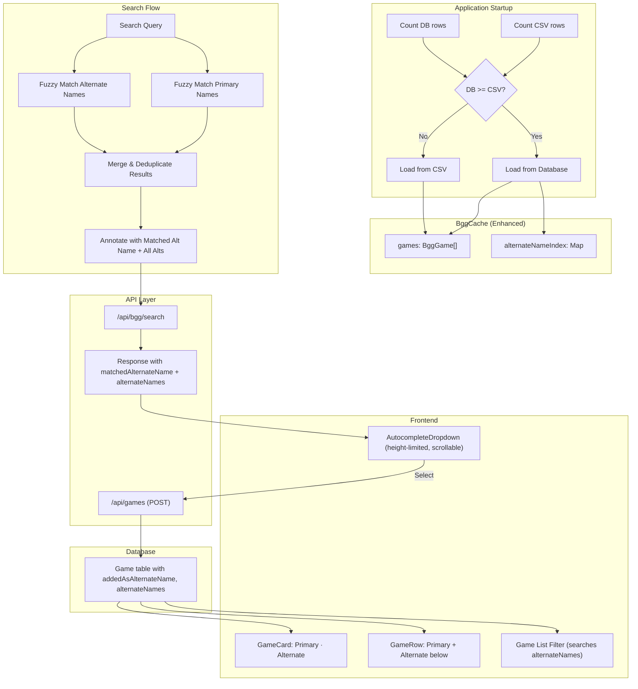
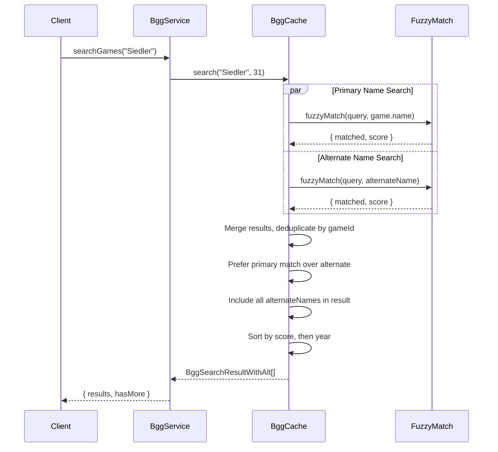
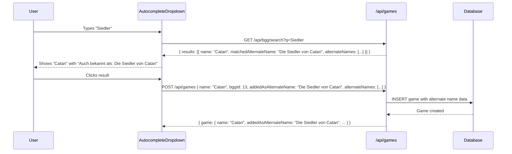

# Design Document: Alternate Names Search

## Overview

This feature enhances the BGG game search to use the database as the primary data source when it contains complete data, enables searching by alternate game names (translations), and stores alternate names with games for filtering and display. The system detects at startup whether the database has sufficient data, builds an in-memory index of alternate names, returns matched alternate names in search results, and persists alternate names when games are added to the list.

## Architecture



## Components and Interfaces

### 1. Enhanced BggCache

The existing `BggCache` class is extended to support database loading and alternate name indexing.

```typescript
interface BggGameWithAlternates extends BggGame {
  alternateNames: string[];  // All alternate names for this game
}

interface AlternateNameEntry {
  gameId: number;
  alternateName: string;      // Original (non-normalized) name
  normalizedName: string;     // Lowercase, trimmed for matching
}

class BggCache {
  private games: BggGameWithAlternates[] = [];
  private alternateNameIndex: Map<string, AlternateNameEntry[]> = new Map();
  private dataSource: 'csv' | 'database' = 'csv';
  
  async initialize(csvPath: string): Promise<void>;
  private countCsvRows(csvPath: string): Promise<number>;
  private countDbRows(): Promise<number>;
  private loadFromDatabase(): Promise<void>;
  private buildAlternateNameIndex(): void;
  search(query: string, maxResults?: number): BggSearchResultWithAlt[];
  getDataSource(): 'csv' | 'database';
}
```

### 2. Enhanced Search Result Type

```typescript
interface BggSearchResultWithAlt {
  id: number;
  name: string;
  yearPublished: number | null;
  rating: number | null;
  matchedAlternateName: string | null;  // The alternate name that matched, if any
  alternateNames: string[];              // All alternate names for this game
}
```

### 3. API Response Format

```typescript
// GET /api/bgg/search?q=siedler
{
  "results": [
    {
      "id": 13,
      "name": "Catan",
      "yearPublished": 1995,
      "rating": 7.1,
      "matchedAlternateName": "Die Siedler von Catan",
      "alternateNames": ["Die Siedler von Catan", "カタンの開拓者たち", "卡坦岛"]
    }
  ],
  "hasMore": false
}
```

### 4. Game Table Schema Extension

```prisma
model Game {
  id                    String   @id @default(uuid())
  name                  String   @unique
  ownerId               String?  @map("owner_id")
  bggId                 Int?     @map("bgg_id")
  yearPublished         Int?     @map("year_published")
  bggRating             Float?   @map("bgg_rating")
  addedAsAlternateName  String?  @map("added_as_alternate_name")
  alternateNames        Json     @default("[]") @map("alternate_names")
  createdAt             DateTime @default(now()) @map("created_at")
  updatedAt             DateTime @updatedAt @map("updated_at")
  // ... relations
}
```

### 5. Add Game Request/Response

```typescript
// POST /api/games
interface AddGameRequest {
  name: string;
  bggId?: number;
  yearPublished?: number;
  bggRating?: number;
  addedAsAlternateName?: string;  // New field
  alternateNames?: string[];       // New field
}

interface GameResponse {
  id: string;
  name: string;
  bggId: number | null;
  yearPublished: number | null;
  bggRating: number | null;
  addedAsAlternateName: string | null;  // New field
  alternateNames: string[];              // New field
  // ... other fields
}
```

### 6. Frontend Type Updates

```typescript
// frontend/src/types/index.ts
interface BggSearchResult {
  id: number;
  name: string;
  yearPublished: number | null;
  rating: number | null;
  matchedAlternateName?: string | null;  // New field
  alternateNames?: string[];              // New field
}

interface Game {
  id: string;
  name: string;
  bggId: number | null;
  yearPublished: number | null;
  bggRating: number | null;
  addedAsAlternateName: string | null;   // New field
  alternateNames: string[];               // New field
  // ... other fields
}
```

### 7. AutocompleteDropdown Enhancement

```tsx
// Display alternate name match below primary name
// Height-limited with scroll and fade indicator
<div 
  className="absolute z-50 w-full mt-1 bg-white border border-gray-300 rounded-lg shadow-lg overflow-hidden"
  role="listbox"
>
  <div className="relative">
    <div 
      className="overflow-y-auto"
      style={{ maxHeight: 'min(400px, 60vh)' }}  // Limit to viewport
    >
      {results.map((result) => (
        <button key={result.id} className="...">
          <div className="flex items-center gap-3">
            <LazyBggImage bggId={result.id} size="micro" alt={result.name} />
            <div className="flex-1 min-w-0">
              <div className="flex items-center justify-between">
                <span className="font-medium text-gray-900 truncate">{result.name}</span>
                {result.yearPublished && (
                  <span className="ml-2 text-sm text-gray-500">({result.yearPublished})</span>
                )}
              </div>
              {result.matchedAlternateName && (
                <div className="text-xs text-gray-500 truncate">
                  Auch bekannt als: {result.matchedAlternateName}
                </div>
              )}
            </div>
          </div>
        </button>
      ))}
    </div>
    {/* Fade indicator when scrollable */}
    {hasScrollableContent && (
      <div className="absolute bottom-0 left-0 right-0 h-8 bg-gradient-to-t from-white to-transparent pointer-events-none" />
    )}
  </div>
</div>
```

### 8. GameCard Enhancement (Mobile)

```tsx
// Inline format: "Primary · Alternate"
<h3 className="font-semibold text-gray-900 text-lg leading-tight flex-1 truncate">
  {game.name}
  {game.addedAsAlternateName && (
    <span className="font-normal text-gray-500 text-base">
      {' · '}{game.addedAsAlternateName}
    </span>
  )}
</h3>
```

### 9. GameRow Enhancement (Desktop)

```tsx
// Two-line format: Primary name, then alternate below
<div className="flex-1 min-w-0">
  <h3 className="font-semibold text-gray-900 truncate">{game.name}</h3>
  {game.addedAsAlternateName && (
    <div className="text-sm text-gray-500 truncate">
      {game.addedAsAlternateName}
    </div>
  )}
</div>
```

### 10. Game List Filtering Enhancement

```typescript
// frontend/src/utils/filtering.ts
export function filterGamesBySearch(games: Game[], query: string): Game[] {
  const normalizedQuery = query.toLowerCase().trim();
  if (!normalizedQuery) return games;
  
  return games.filter(game => {
    // Match primary name
    if (fuzzyMatch(game.name, normalizedQuery)) return true;
    
    // Match any alternate name
    if (game.alternateNames?.some(alt => fuzzyMatch(alt, normalizedQuery))) {
      return true;
    }
    
    return false;
  });
}
```

## Data Models

### Alternate Name Index Structure

```typescript
// Map structure: normalizedName -> entries with that name
Map<string, AlternateNameEntry[]>

// Example:
{
  "die siedler von catan": [{ gameId: 13, alternateName: "Die Siedler von Catan", normalizedName: "die siedler von catan" }],
  "カタンの開拓者たち": [{ gameId: 13, alternateName: "カタンの開拓者たち", normalizedName: "カタンの開拓者たち" }]
}
```

### Database Migration

```sql
-- Add alternate name columns to games table
ALTER TABLE games 
ADD COLUMN added_as_alternate_name VARCHAR(255) NULL,
ADD COLUMN alternate_names JSONB NOT NULL DEFAULT '[]';
```

## Search Algorithm

### Search Flow



### Scoring and Deduplication

1. **Primary name matches** get a bonus of +10 to their fuzzy score
2. **When same game matches both ways**, keep only the primary match (no alternate name shown)
3. **When same game matches multiple alternate names**, keep the highest-scoring alternate
4. **Final sort**: by score descending, then by year descending

```typescript
interface SearchMatch {
  game: BggGameWithAlternates;
  score: number;
  matchedAlternateName: string | null;
  isPrimaryMatch: boolean;
}

function mergeAndDeduplicate(
  primaryMatches: SearchMatch[],
  alternateMatches: SearchMatch[]
): SearchMatch[] {
  const byGameId = new Map<number, SearchMatch>();
  
  // Add primary matches first (they take precedence)
  for (const match of primaryMatches) {
    byGameId.set(match.game.id, { ...match, score: match.score + 10 });
  }
  
  // Add alternate matches only if game not already matched by primary
  for (const match of alternateMatches) {
    if (!byGameId.has(match.game.id)) {
      const existing = byGameId.get(match.game.id);
      if (!existing || match.score > existing.score) {
        byGameId.set(match.game.id, match);
      }
    }
  }
  
  return Array.from(byGameId.values());
}
```

## Add Game Flow



## Correctness Properties

### Property 1: Data Source Selection

*For any* CSV row count C and database row count D, the BggCache SHALL select database as the data source if and only if D >= C, otherwise it SHALL select CSV.

**Validates: Requirements 1.3, 1.4**

### Property 2: Alternate Name Extraction

*For any* BggGame record with enrichment_data containing an alternateNames array, loading from database SHALL extract all alternate names into the game's alternateNames field.

**Validates: Requirements 2.2**

### Property 3: Alternate Name Index Construction

*For any* game with alternate names loaded from the database, each alternate name SHALL be indexed and map back to the correct game ID.

**Validates: Requirements 2.4**

### Property 4: Alternate Name Normalization

*For any* alternate name string, the normalized version SHALL be lowercase and trimmed, enabling case-insensitive matching.

**Validates: Requirements 2.5**

### Property 5: Alternate Name Search Inclusion

*For any* search query that fuzzy-matches an alternate name of a game, that game SHALL appear in the search results.

**Validates: Requirements 3.1**

### Property 6: Primary Name Match Priority

*For any* game where both the primary name and an alternate name match a query, the result SHALL have matchedAlternateName set to null (primary match takes precedence).

**Validates: Requirements 3.3, 4.4**

### Property 7: Best Alternate Name Selection

*For any* game with multiple alternate names that match a query, the search result SHALL include only the alternate name with the highest fuzzy match score.

**Validates: Requirements 3.5**

### Property 8: Result Annotation Correctness

*For any* search result, matchedAlternateName SHALL be the exact (non-normalized) alternate name that matched when the match was via alternate name, or null when the match was via primary name.

**Validates: Requirements 4.1, 4.2, 5.4**

### Property 9: All Alternate Names Included

*For any* search result, the alternateNames array SHALL contain all alternate names for that game from the BggGame enrichment data.

**Validates: Requirements 4.5, 5.2**

### Property 10: Alternate Names Persistence

*For any* game added via BGG search with a matchedAlternateName, the Game record SHALL have addedAsAlternateName set to that value.

**Validates: Requirements 9.1, 9.3**

### Property 11: Game List Filter Includes Alternate Names

*For any* game in the list with alternateNames, filtering by a query that matches any alternate name SHALL include that game in the results.

**Validates: Requirements 10.1**

## Error Handling

| Error Condition | Response | Recovery |
|-----------------|----------|----------|
| Database connection fails during count | Log error, fall back to CSV | Use CSV as data source |
| Database query fails during load | Log error, fall back to CSV | Use CSV as data source |
| Enrichment data is null | Treat as empty alternate names | Continue with no alternates for that game |
| Enrichment data is malformed JSON | Log warning, treat as empty | Continue with no alternates for that game |
| alternateNames field missing | Treat as empty array | Continue with no alternates for that game |
| Alternate name is empty string | Skip that alternate name | Continue with other alternates |
| Game already exists (same bggId) | Return existing game | Do not create duplicate |

## Testing Strategy

### Unit Tests

1. **Data Source Selection**
   - Database has more rows than CSV → selects database
   - Database has fewer rows than CSV → selects CSV
   - Database has equal rows to CSV → selects database

2. **Alternate Name Extraction**
   - Game with multiple alternate names → all extracted
   - Game with null enrichment_data → empty alternates
   - Game with empty alternateNames array → empty alternates

3. **Search with Alternate Names**
   - Query matches alternate name → game in results with matchedAlternateName set
   - Query matches primary name → game in results with matchedAlternateName null
   - Query matches both → primary takes precedence
   - Result includes all alternateNames

4. **Add Game with Alternate Name**
   - Adding game with matchedAlternateName → stored in addedAsAlternateName
   - Adding game without matchedAlternateName → addedAsAlternateName is null
   - alternateNames array is stored correctly

5. **Game List Filtering**
   - Filter by primary name → game found
   - Filter by alternate name → game found
   - Filter by non-matching query → game not found

6. **Frontend Display**
   - GameCard with addedAsAlternateName → shows inline format
   - GameRow with addedAsAlternateName → shows two-line format
   - Game without addedAsAlternateName → shows only primary name

7. **Dropdown Height Limiting**
   - Many results → dropdown scrollable, not extending beyond viewport
   - Scrollable dropdown → shows fade gradient at bottom

### Property-Based Tests

1. **Property 1: Data Source Selection** - Generate random count pairs, verify correct source selected
2. **Property 4: Alternate Name Normalization** - Generate random strings, verify normalization is lowercase and trimmed
3. **Property 5: Alternate Name Search Inclusion** - Generate games with alternates, verify search finds them
4. **Property 6: Primary Name Match Priority** - Generate games matching both ways, verify primary wins
5. **Property 8: Result Annotation Correctness** - Generate search scenarios, verify annotation matches actual match type
6. **Property 11: Game List Filter Includes Alternate Names** - Generate games with alternates, verify filter finds them

**Property Test Configuration:**
- Use `fast-check` library for property-based testing
- Use `{ numRuns: 5 }` for database operations (slow)
- Use `{ numRuns: 10 }` for pure functions (fast)
- Tag format: `Feature: 014-alternate-names-search, Property N: {property_text}`

### Integration Tests

1. **Full Startup Flow**
   - Populate database with games, verify cache loads from database
   - Empty database, verify cache loads from CSV

2. **End-to-End Search and Add**
   - Search via API, verify response includes matchedAlternateName and alternateNames
   - Add game via API, verify alternate name data persisted
   - Fetch game list, verify alternate name data returned

3. **Frontend Integration**
   - Search dropdown renders alternate name when present
   - Game list displays alternate name in correct format per viewport
   - Game list filter finds games by alternate name
