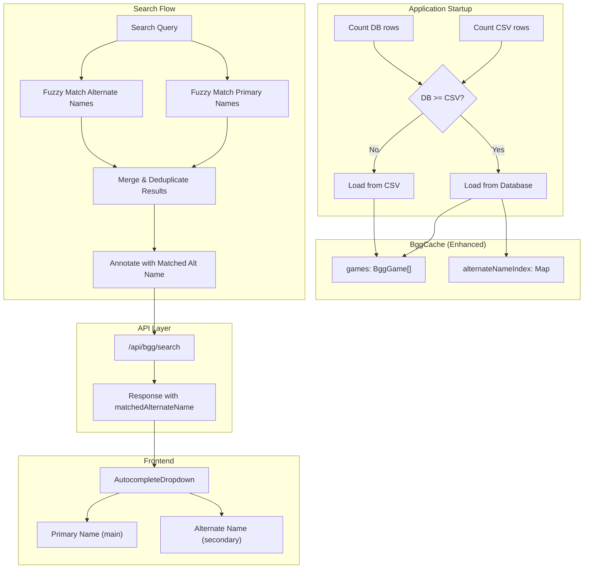
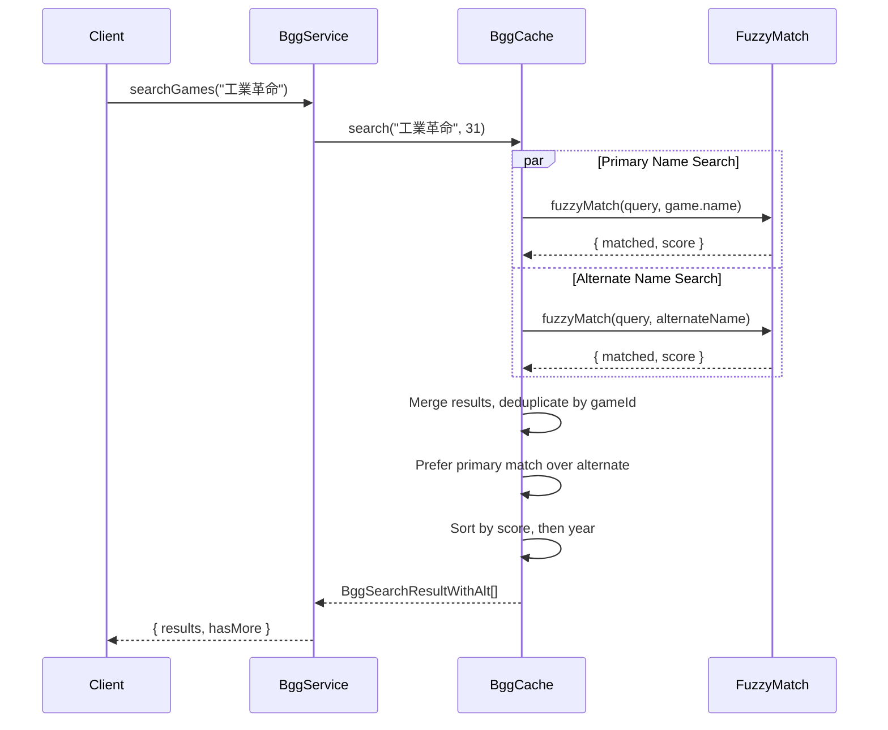

# Design Document: Alternate Names Search

## Overview

This feature enhances the BGG game search to use the database as the primary data source when it contains complete data, and enables searching by alternate game names (translations) stored in the enrichment data. The system detects at startup whether the database has sufficient data, builds an in-memory index of alternate names, and returns matched alternate names in search results for frontend display.

## Architecture



## Components and Interfaces

### 1. Enhanced BggCache

The existing `BggCache` class is extended to support database loading and alternate name indexing.

```typescript
interface BggGameWithAlternates extends BggGame {
  alternateNames: string[];  // Normalized alternate names for this game
}

interface AlternateNameEntry {
  gameId: number;
  alternateName: string;      // Original (non-normalized) name
  normalizedName: string;     // Lowercase, trimmed for matching
}

class BggCache {
  private games: BggGameWithAlternates[] = [];
  private alternateNameIndex: Map<string, AlternateNameEntry[]> = new Map();
  private dataSource: 'csv' | 'database' = 'csv';
  
  // Determine data source and initialize
  async initialize(csvPath: string): Promise<void>;
  
  // Count non-expansion rows in CSV
  private countCsvRows(csvPath: string): Promise<number>;
  
  // Count non-expansion rows in database
  private countDbRows(): Promise<number>;
  
  // Load games from database with enrichment data
  private loadFromDatabase(): Promise<void>;
  
  // Build alternate name index from loaded games
  private buildAlternateNameIndex(): void;
  
  // Search with alternate name support
  search(query: string, maxResults?: number): BggSearchResultWithAlt[];
  
  // Get data source for logging/debugging
  getDataSource(): 'csv' | 'database';
}
```

### 2. Enhanced Search Result Type

```typescript
interface BggSearchResultWithAlt {
  id: number;
  name: string;
  yearPublished: number | null;
  rating: number | null;
  matchedAlternateName: string | null;  // The alternate name that matched, if any
}
```

### 3. Enhanced BggService

```typescript
interface BggSearchResponse {
  results: BggSearchResultWithAlt[];
  hasMore: boolean;
}

class BggService {
  searchGames(query: string): BggSearchResponse;
}
```

### 4. API Response Format

The `/api/bgg/search` endpoint response is enhanced:

```typescript
// GET /api/bgg/search?q=brass
{
  "results": [
    {
      "id": 224517,
      "name": "Brass: Birmingham",
      "yearPublished": 2018,
      "rating": 8.6,
      "matchedAlternateName": null  // Matched primary name
    },
    {
      "id": 28720,
      "name": "Brass: Lancashire",
      "yearPublished": 2007,
      "rating": 8.1,
      "matchedAlternateName": "工業革命"  // Matched Chinese alternate name
    }
  ],
  "hasMore": false
}
```

### 5. Frontend Type Update

```typescript
// frontend/src/types/index.ts
interface BggSearchResult {
  id: number;
  name: string;
  yearPublished: number | null;
  rating: number | null;
  matchedAlternateName?: string | null;  // New optional field
}
```

### 6. AutocompleteDropdown Enhancement

```tsx
// Display alternate name match below primary name
<div className="flex items-center gap-3">
  <LazyBggImage bggId={result.id} size="micro" alt={result.name} />
  <div className="flex-1 min-w-0">
    <div className="flex items-center justify-between">
      <span className="font-medium text-gray-900 truncate">{result.name}</span>
      {result.yearPublished && (
        <span className="ml-2 text-sm text-gray-500">({result.yearPublished})</span>
      )}
    </div>
    {result.matchedAlternateName && (
      <div className="text-xs text-gray-500 truncate">
        Auch bekannt als: {result.matchedAlternateName}
      </div>
    )}
  </div>
</div>
```

## Data Models

### Alternate Name Index Structure

The alternate name index maps normalized name prefixes to game entries for efficient lookup:

```typescript
// Map structure: normalizedName -> entries with that name
Map<string, AlternateNameEntry[]>

// Example entries:
{
  "ブラス：バーミンガム": [{ gameId: 224517, alternateName: "ブラス：バーミンガム", normalizedName: "ブラス：バーミンガム" }],
  "工業革命：伯明翰": [{ gameId: 224517, alternateName: "工業革命：伯明翰", normalizedName: "工業革命：伯明翰" }],
  "brass birmingham": [{ gameId: 224517, alternateName: "Brass: Birmingham", normalizedName: "brass birmingham" }]
}
```

### Database Query for Loading

```sql
SELECT 
  bgg_id as id,
  name,
  year_published,
  rank,
  average as rating,
  enrichment_data
FROM bgg_games
WHERE is_expansion = false
ORDER BY year_published DESC NULLS LAST;
```

### Enrichment Data Structure (from spec 013)

```typescript
interface EnrichmentData {
  alternateNames: Array<{ name: string; language?: string }>;
  primaryName: string;
  description: string;
  // ... other fields not used for search
}
```

## Search Algorithm

### Search Flow



### Scoring and Deduplication

1. **Primary name matches** get a bonus of +10 to their fuzzy score
2. **When same game matches both ways**, keep only the primary match (no alternate name shown)
3. **When same game matches multiple alternate names**, keep the highest-scoring alternate
4. **Final sort**: by score descending, then by year descending

```typescript
interface SearchMatch {
  game: BggGameWithAlternates;
  score: number;
  matchedAlternateName: string | null;
  isPrimaryMatch: boolean;
}

function mergeAndDeduplicate(
  primaryMatches: SearchMatch[],
  alternateMatches: SearchMatch[]
): SearchMatch[] {
  const byGameId = new Map<number, SearchMatch>();
  
  // Add primary matches first (they take precedence)
  for (const match of primaryMatches) {
    byGameId.set(match.game.id, { ...match, score: match.score + 10 });
  }
  
  // Add alternate matches only if game not already matched by primary
  for (const match of alternateMatches) {
    if (!byGameId.has(match.game.id)) {
      const existing = byGameId.get(match.game.id);
      if (!existing || match.score > existing.score) {
        byGameId.set(match.game.id, match);
      }
    }
  }
  
  return Array.from(byGameId.values());
}
```

## Correctness Properties

*A property is a characteristic or behavior that should hold true across all valid executions of a system—essentially, a formal statement about what the system should do. Properties serve as the bridge between human-readable specifications and machine-verifiable correctness guarantees.*

### Property 1: Data Source Selection

*For any* CSV row count C and database row count D, the BggCache SHALL select database as the data source if and only if D >= C, otherwise it SHALL select CSV.

**Validates: Requirements 1.3, 1.4**

### Property 2: Alternate Name Extraction

*For any* BggGame record with enrichment_data containing an alternateNames array, loading from database SHALL extract all alternate names into the game's alternateNames field.

**Validates: Requirements 2.2**

### Property 3: Alternate Name Index Construction

*For any* game with alternate names loaded from the database, each alternate name SHALL be indexed and map back to the correct game ID.

**Validates: Requirements 2.4**

### Property 4: Alternate Name Normalization

*For any* alternate name string, the normalized version SHALL be lowercase and trimmed, enabling case-insensitive matching.

**Validates: Requirements 2.5**

### Property 5: Alternate Name Search Inclusion

*For any* search query that fuzzy-matches an alternate name of a game, that game SHALL appear in the search results.

**Validates: Requirements 3.1**

### Property 6: Primary Name Match Priority

*For any* game where both the primary name and an alternate name match a query, the result SHALL have matchedAlternateName set to null (primary match takes precedence).

**Validates: Requirements 3.3, 4.4**

### Property 7: Best Alternate Name Selection

*For any* game with multiple alternate names that match a query, the search result SHALL include only the alternate name with the highest fuzzy match score.

**Validates: Requirements 3.5**

### Property 8: Result Annotation Correctness

*For any* search result, matchedAlternateName SHALL be the exact (non-normalized) alternate name that matched when the match was via alternate name, or null when the match was via primary name.

**Validates: Requirements 4.1, 4.2, 5.3**

## Error Handling

| Error Condition | Response | Recovery |
|-----------------|----------|----------|
| Database connection fails during count | Log error, fall back to CSV | Use CSV as data source |
| Database query fails during load | Log error, fall back to CSV | Use CSV as data source |
| Enrichment data is null | Treat as empty alternate names | Continue with no alternates for that game |
| Enrichment data is malformed JSON | Log warning, treat as empty | Continue with no alternates for that game |
| alternateNames field missing | Treat as empty array | Continue with no alternates for that game |
| Alternate name is empty string | Skip that alternate name | Continue with other alternates |

## Testing Strategy

### Unit Tests

Unit tests cover specific examples and edge cases:

1. **Data Source Selection**
   - Database has more rows than CSV → selects database
   - Database has fewer rows than CSV → selects CSV
   - Database has equal rows to CSV → selects database

2. **Alternate Name Extraction**
   - Game with multiple alternate names → all extracted
   - Game with null enrichment_data → empty alternates
   - Game with empty alternateNames array → empty alternates

3. **Search with Alternate Names**
   - Query matches alternate name → game in results with matchedAlternateName set
   - Query matches primary name → game in results with matchedAlternateName null
   - Query matches both → primary takes precedence

4. **Frontend Display**
   - Result with matchedAlternateName → displays secondary text
   - Result without matchedAlternateName → no secondary text

### Property-Based Tests

Property tests validate universal properties across generated inputs:

1. **Property 1: Data Source Selection** - Generate random count pairs, verify correct source selected
2. **Property 4: Alternate Name Normalization** - Generate random strings, verify normalization is lowercase and trimmed
3. **Property 5: Alternate Name Search Inclusion** - Generate games with alternates, verify search finds them
4. **Property 6: Primary Name Match Priority** - Generate games matching both ways, verify primary wins
5. **Property 8: Result Annotation Correctness** - Generate search scenarios, verify annotation matches actual match type

**Property Test Configuration:**
- Use `fast-check` library for property-based testing
- Use `{ numRuns: 5 }` for database operations (slow)
- Use `{ numRuns: 10 }` for pure functions (fast)
- Tag format: `Feature: 014-alternate-names-search, Property N: {property_text}`

### Integration Tests

1. **Full Startup Flow**
   - Populate database with games, verify cache loads from database
   - Empty database, verify cache loads from CSV

2. **End-to-End Search**
   - Search via API, verify response includes matchedAlternateName field
   - Frontend renders alternate name when present
```

