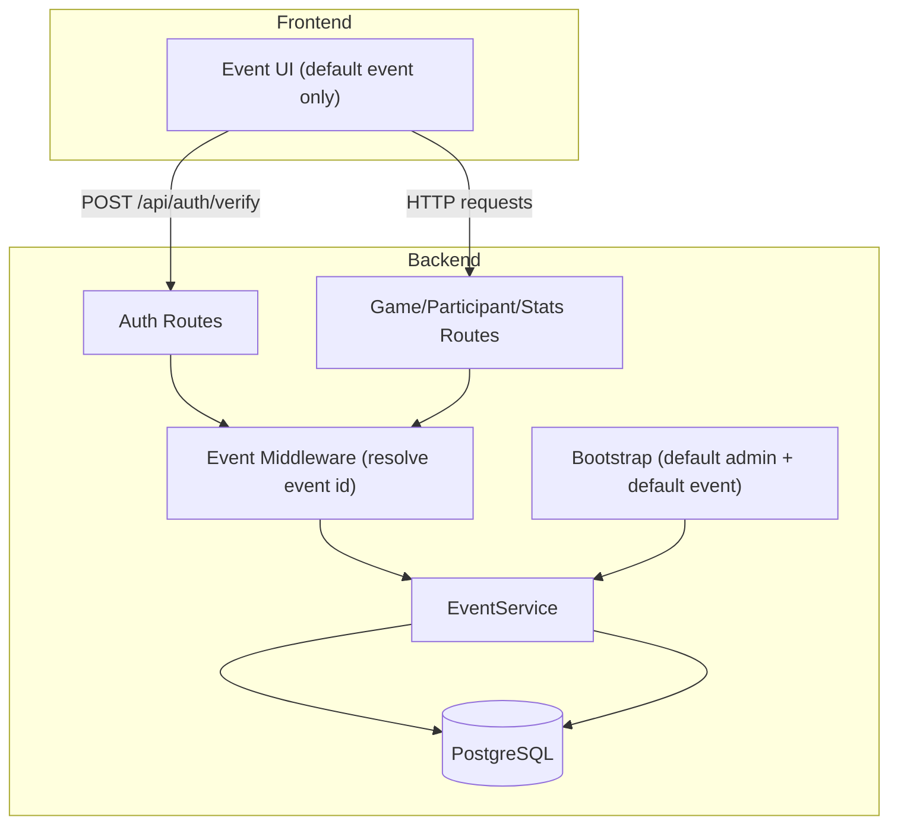
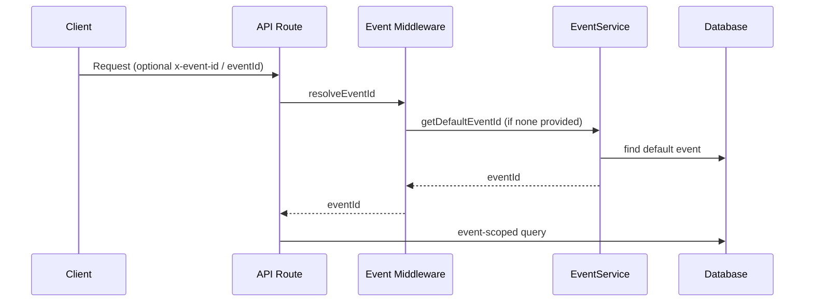

# Design Document: Multi-Event Support (Current State)

## Overview

This design documents the currently implemented multi-event foundation. It introduces an `Event` entity, associates existing data with events, and resolves event scope on each request. The frontend continues to operate against the default event implicitly.

**Key Design Decisions:**

1. **Event-scoped data without breaking existing flows**: `eventId` is nullable for backward compatibility and is backfilled at startup to the default event.
2. **Default event as the implicit scope**: When clients do not supply an event id, the API uses the default event.
3. **Event password per event**: Event access is controlled by a per-event password hash, verified on `/api/auth/verify`.

## Architecture



### Event Resolution Flow



## Components and Interfaces

### EventService

Key responsibilities:
- Ensure a default event exists.
- Hash and verify event passwords.
- Resolve the default event id.
- Backfill existing records to the default event.

```typescript
// api/src/services/event.service.ts
class EventService {
  ensureDefaultEvent(ownerAccountId: string): Promise<string>;
  getDefaultEventId(): Promise<string>;
  verifyEventPassword(eventId: string, password: string): Promise<boolean>;
  backfillDefaultEvent(eventId: string): Promise<void>;
}
```

### Event Middleware

Resolves the event id from request headers/query, or uses the default event.

```typescript
// api/src/middleware/event.middleware.ts
export async function resolveEventId(req: Request): Promise<string>;
```

### Data Model

- `Event` is the parent for `User`, `Game`, and `ActivityEvent`.
- Event-scoped uniqueness is enforced for users and games by `(eventId, name)`.

## Limitations (Current State)

- No event creation/editing endpoints are documented here.
- No event selection or switching UI is documented here.
- Frontend requests rely on the default event unless an event id is supplied manually.

