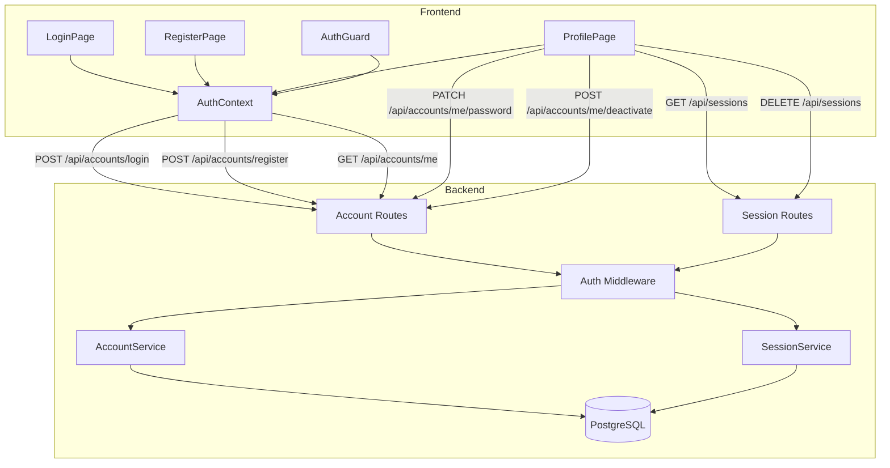
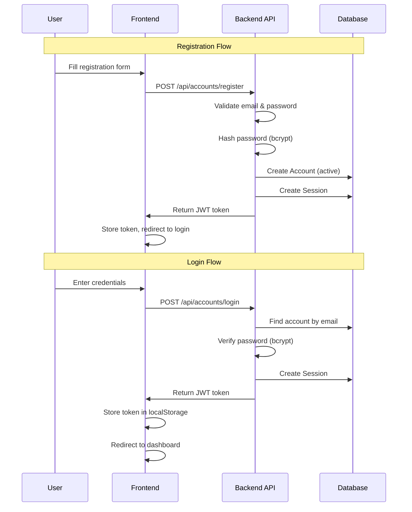
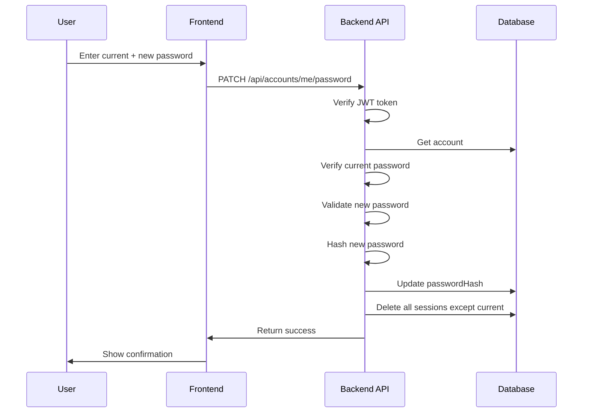
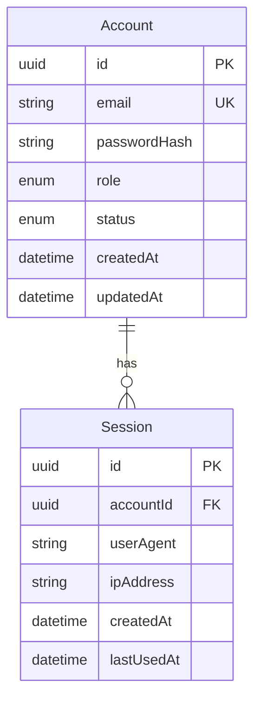

# Design Document: Account Management

## Overview

This design describes the implementation of account management for the Brettspieltreff.app platform. The system enables event managers to register accounts, manage their profiles, change passwords, and control their account lifecycle. This feature introduces a new authentication layer separate from the existing event-level password system.

**Key Design Decisions:**

1. **Separate Account and User entities**: The existing `User` model represents event attendees (players/bringers). The new `Account` model represents event managers who can create and manage events. This separation allows attendees to participate without requiring full account registration.

2. **JWT-based session management**: Sessions are tracked via JWT tokens with a `Session` table for "log out all devices" functionality. This provides stateless authentication while enabling session invalidation.

3. **Immediate account activation**: Accounts are created in "active" state without email verification (email flows deferred to spec 021-email-system).

4. **bcrypt for password hashing**: Industry-standard password hashing with configurable cost factor.

## Architecture



### Authentication Flow



### Password Change Flow



## Components and Interfaces

### Backend Components

#### AccountService (New)

Service for account management operations.

```typescript
// api/src/services/account.service.ts

interface CreateAccountInput {
  email: string;
  password: string;
}

interface AccountResponse {
  id: string;
  email: string;
  role: 'account_owner' | 'admin';
  status: 'active' | 'deactivated';
  createdAt: Date;
}

class AccountService {
  // Register a new account
  async register(input: CreateAccountInput): Promise<AccountResponse>;
  
  // Authenticate and return account if valid
  async authenticate(email: string, password: string): Promise<AccountResponse>;
  
  // Get account by ID
  async getById(id: string): Promise<AccountResponse | null>;
  
  // Change password (validates current password first)
  async changePassword(accountId: string, currentPassword: string, newPassword: string): Promise<void>;
  
  // Deactivate account (requires password confirmation)
  async deactivate(accountId: string, password: string): Promise<void>;
  
  // Promote account to admin (admin only)
  async promoteToAdmin(accountId: string, promoterId: string): Promise<AccountResponse>;
  
  // Validate password meets requirements
  private validatePassword(password: string): void;
  
  // Hash password using bcrypt
  private hashPassword(password: string): Promise<string>;
  
  // Verify password against hash
  private verifyPassword(password: string, hash: string): Promise<boolean>;
}
```

#### SessionService (New)

Service for managing authentication sessions.

```typescript
// api/src/services/session.service.ts

interface Session {
  id: string;
  accountId: string;
  createdAt: Date;
  lastUsedAt: Date;
  userAgent?: string;
  ipAddress?: string;
}

interface TokenPayload {
  accountId: string;
  sessionId: string;
}

class SessionService {
  // Create a new session and return JWT token
  async createSession(accountId: string, userAgent?: string, ipAddress?: string): Promise<string>;
  
  // Validate JWT token and return payload
  async validateToken(token: string): Promise<TokenPayload | null>;
  
  // Get all sessions for an account
  async getSessionsForAccount(accountId: string): Promise<Session[]>;
  
  // Delete a specific session
  async deleteSession(sessionId: string): Promise<void>;
  
  // Delete all sessions for an account (logout all devices)
  async deleteAllSessions(accountId: string): Promise<void>;
  
  // Delete all sessions except one (for password change)
  async deleteAllSessionsExcept(accountId: string, exceptSessionId: string): Promise<void>;
}
```

#### Auth Middleware (New)

Express middleware for protecting routes.

```typescript
// api/src/middleware/auth.middleware.ts

interface AuthenticatedRequest extends Request {
  account: AccountResponse;
  sessionId: string;
}

// Middleware that requires valid JWT token
function requireAuth(req: Request, res: Response, next: NextFunction): void;

// Middleware that requires admin role
function requireAdmin(req: Request, res: Response, next: NextFunction): void;
```

### API Routes

#### Account Routes (New)

```typescript
// api/src/routes/account.routes.ts

// POST /api/accounts/register
// Creates a new account
// Request: { email: string, password: string }
// Response: { account: AccountResponse, message: string }
// Errors: 400 (validation), 409 (email exists)

// POST /api/accounts/login
// Authenticates and returns JWT token
// Request: { email: string, password: string }
// Response: { token: string, account: AccountResponse }
// Errors: 401 (invalid credentials), 403 (account deactivated)

// GET /api/accounts/me
// Returns current account profile (requires auth)
// Response: { account: AccountResponse }

// PATCH /api/accounts/me/password
// Changes password (requires auth)
// Request: { currentPassword: string, newPassword: string }
// Response: { success: true, message: string }
// Errors: 400 (validation), 401 (wrong current password)

// POST /api/accounts/me/deactivate
// Deactivates account (requires auth)
// Request: { password: string }
// Response: { success: true, message: string }
// Errors: 401 (wrong password)

// POST /api/accounts/:id/promote
// Promotes account to admin (requires admin auth)
// Response: { account: AccountResponse }
// Errors: 403 (not admin), 404 (account not found)
```

#### Session Routes (New)

```typescript
// api/src/routes/session.routes.ts

// GET /api/sessions
// Returns all active sessions for current account (requires auth)
// Response: { sessions: Session[] }

// DELETE /api/sessions
// Logs out all devices (requires auth)
// Response: { success: true, message: string }

// DELETE /api/sessions/:id
// Logs out specific session (requires auth)
// Response: { success: true }
// Errors: 404 (session not found)
```

### Frontend Components

#### AuthContext (New)

React context for authentication state management.

```typescript
// frontend/src/contexts/AuthContext.tsx

interface AuthContextValue {
  account: AccountResponse | null;
  isAuthenticated: boolean;
  isLoading: boolean;
  login: (email: string, password: string) => Promise<void>;
  register: (email: string, password: string) => Promise<void>;
  logout: () => void;
  refreshAccount: () => Promise<void>;
}

function AuthProvider({ children }: { children: React.ReactNode }): JSX.Element;
function useAuth(): AuthContextValue;
```

#### LoginPage (New)

```typescript
// frontend/src/pages/LoginPage.tsx

// Full-screen login form with:
// - Email input
// - Password input
// - Submit button
// - Link to registration
// - Error display
// - Loading state
```

#### RegisterPage (New)

```typescript
// frontend/src/pages/RegisterPage.tsx

// Full-screen registration form with:
// - Email input
// - Password input
// - Password confirmation input
// - Password requirements display
// - Submit button
// - Link to login
// - Error display
// - Loading state
```

#### ProfilePage (New)

```typescript
// frontend/src/pages/ProfilePage.tsx

// Profile management page with:
// - Account info display (email, created date, status)
// - Password change form
// - Active sessions list with logout buttons
// - "Log out all devices" button
// - Account deactivation section
```

#### AccountAuthGuard (New)

```typescript
// frontend/src/components/AccountAuthGuard.tsx

// Wrapper component that:
// - Checks for valid JWT token
// - Redirects to login if not authenticated
// - Shows loading state while checking
// - Renders children if authenticated
```

## Data Models

### Database Schema



### Prisma Schema Addition

```prisma
// Addition to api/prisma/schema.prisma

enum AccountRole {
  account_owner
  admin
}

enum AccountStatus {
  active
  deactivated
}

model Account {
  id           String        @id @default(uuid())
  email        String        @unique
  passwordHash String        @map("password_hash")
  role         AccountRole   @default(account_owner)
  status       AccountStatus @default(active)
  createdAt    DateTime      @default(now()) @map("created_at")
  updatedAt    DateTime      @updatedAt @map("updated_at")
  sessions     Session[]

  @@map("accounts")
}

model Session {
  id         String   @id @default(uuid())
  accountId  String   @map("account_id")
  userAgent  String?  @map("user_agent")
  ipAddress  String?  @map("ip_address")
  createdAt  DateTime @default(now()) @map("created_at")
  lastUsedAt DateTime @default(now()) @map("last_used_at")
  account    Account  @relation(fields: [accountId], references: [id], onDelete: Cascade)

  @@index([accountId])
  @@map("sessions")
}
```

### TypeScript Types

```typescript
// api/src/types/account.ts

export type AccountRole = 'account_owner' | 'admin';
export type AccountStatus = 'active' | 'deactivated';

export interface Account {
  id: string;
  email: string;
  role: AccountRole;
  status: AccountStatus;
  createdAt: Date;
  updatedAt: Date;
}

export interface Session {
  id: string;
  accountId: string;
  userAgent?: string;
  ipAddress?: string;
  createdAt: Date;
  lastUsedAt: Date;
}
```

```typescript
// frontend/src/types/account.ts

export interface Account {
  id: string;
  email: string;
  role: 'account_owner' | 'admin';
  status: 'active' | 'deactivated';
  createdAt: string;
}

export interface Session {
  id: string;
  createdAt: string;
  lastUsedAt: string;
  userAgent?: string;
  ipAddress?: string;
  isCurrent: boolean;
}
```

## Correctness Properties

### Property 1: Password Validation

*For any* password string, the password SHALL be accepted if and only if it has at least 8 characters AND contains at least one letter AND contains at least one number.

**Validates: Requirements 1.3, 2.2**

### Property 2: Email Uniqueness

*For any* registration attempt with an email address, if an account with that email already exists (regardless of status), the registration SHALL fail with an appropriate error.

**Validates: Requirement 1.2**

### Property 3: Password Hash Security

*For any* password, the stored hash SHALL NOT be equal to the original password, AND verifying the correct password against the hash SHALL return true, AND verifying any different password against the hash SHALL return false.

**Validates: Non-functional requirement (bcrypt hashing)**

### Property 4: Session Invalidation on Password Change

*For any* successful password change operation, all sessions for that account except the current session SHALL be deleted.

**Validates: Requirement 2.3**

### Property 5: Deactivated Account Login Prevention

*For any* account with status "deactivated", any login attempt SHALL fail with an appropriate error, regardless of whether the password is correct.

**Validates: Requirement 4.3**

### Property 6: Role Promotion Authorization

*For any* account promotion request, the operation SHALL succeed if and only if the requesting account has the "admin" role.

**Validates: Requirement 5.3**

### Property 7: New Account Default Values

*For any* newly registered account, the role SHALL be "account_owner" AND the status SHALL be "active".

**Validates: Requirements 1.4, 5.2**

## Error Handling

### Backend Error Handling

| Error Scenario | HTTP Status | Error Code | German Message |
|----------------|-------------|------------|----------------|
| Email already exists | 409 | EMAIL_EXISTS | Diese E-Mail-Adresse ist bereits registriert. |
| Invalid email format | 400 | INVALID_EMAIL | Bitte eine gültige E-Mail-Adresse eingeben. |
| Password too short | 400 | PASSWORD_TOO_SHORT | Das Passwort muss mindestens 8 Zeichen lang sein. |
| Password missing letter | 400 | PASSWORD_MISSING_LETTER | Das Passwort muss mindestens einen Buchstaben enthalten. |
| Password missing number | 400 | PASSWORD_MISSING_NUMBER | Das Passwort muss mindestens eine Zahl enthalten. |
| Invalid credentials | 401 | INVALID_CREDENTIALS | E-Mail oder Passwort ist falsch. |
| Account deactivated | 403 | ACCOUNT_DEACTIVATED | Dieses Konto wurde deaktiviert. |
| Wrong current password | 401 | WRONG_PASSWORD | Das aktuelle Passwort ist falsch. |
| Invalid/expired token | 401 | INVALID_TOKEN | Sitzung abgelaufen. Bitte erneut anmelden. |
| Not authorized (not admin) | 403 | NOT_AUTHORIZED | Keine Berechtigung für diese Aktion. |
| Account not found | 404 | ACCOUNT_NOT_FOUND | Konto nicht gefunden. |
| Session not found | 404 | SESSION_NOT_FOUND | Sitzung nicht gefunden. |

### Frontend Error Handling

| Error Scenario | Handling Strategy |
|----------------|-------------------|
| Network error | Show "Verbindungsfehler. Bitte erneut versuchen." |
| Token expired | Clear token, redirect to login with message |
| Validation error | Display field-specific error messages |
| Server error (5xx) | Show "Ein Fehler ist aufgetreten. Bitte später erneut versuchen." |

## Security Considerations

### Libraries

- **Password Hashing**: `bcryptjs` (pure JS, no native dependencies, 7M+ weekly downloads)
- **JWT**: `jsonwebtoken` (de facto Node.js standard, 20M+ weekly downloads)

### Implementation Details

1. **Password Storage**: All passwords hashed with bcryptjs (cost factor 12)
2. **JWT Tokens**: 
   - Signed with HS256 algorithm using jsonwebtoken
   - Contains accountId and sessionId
   - Expires after 7 days
   - Secret stored in environment variable (JWT_SECRET)
3. **Session Tracking**: Sessions stored in database for invalidation capability
4. **HTTPS Only**: All account operations require HTTPS (enforced at infrastructure level)
5. **Rate Limiting**: Consider adding rate limiting for login/register endpoints (future enhancement)

## Testing Strategy

### Unit Tests

1. **AccountService Tests** (api/src/services/__tests__/account.service.test.ts)
   - Registration with valid/invalid data
   - Authentication success/failure
   - Password change flow
   - Account deactivation

2. **SessionService Tests** (api/src/services/__tests__/session.service.test.ts)
   - Session creation
   - Token validation
   - Session deletion (single and all)

3. **Password Validation Tests** (api/src/services/__tests__/account.validation.test.ts)
   - Various password combinations

### Property-Based Tests

1. **Password Validation Property** (api/src/services/__tests__/account.service.property.test.ts)
   - **Property 1**: Password acceptance criteria

2. **Password Hash Property** (api/src/services/__tests__/account.service.property.test.ts)
   - **Property 3**: Hash security properties

3. **Role Authorization Property** (api/src/services/__tests__/account.service.property.test.ts)
   - **Property 6**: Admin-only promotion

### Integration Tests

1. **Account Routes Integration** (api/src/__tests__/account.integration.test.ts)
   - Full registration → login → profile flow
   - Password change with session invalidation
   - Account deactivation

### Test Configuration

- Property-based tests: 5-10 iterations (database operations)
- Backend tests: Jest with `--runInBand` flag
- Frontend tests: Vitest
