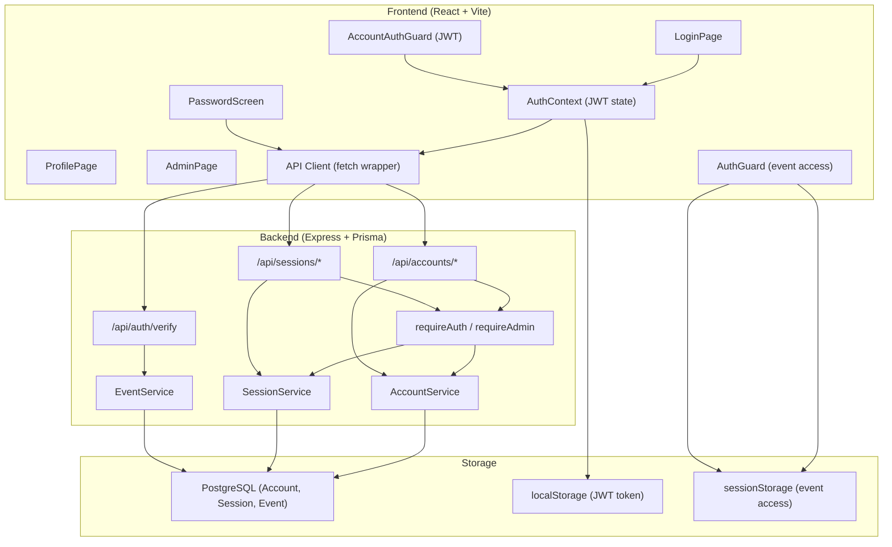
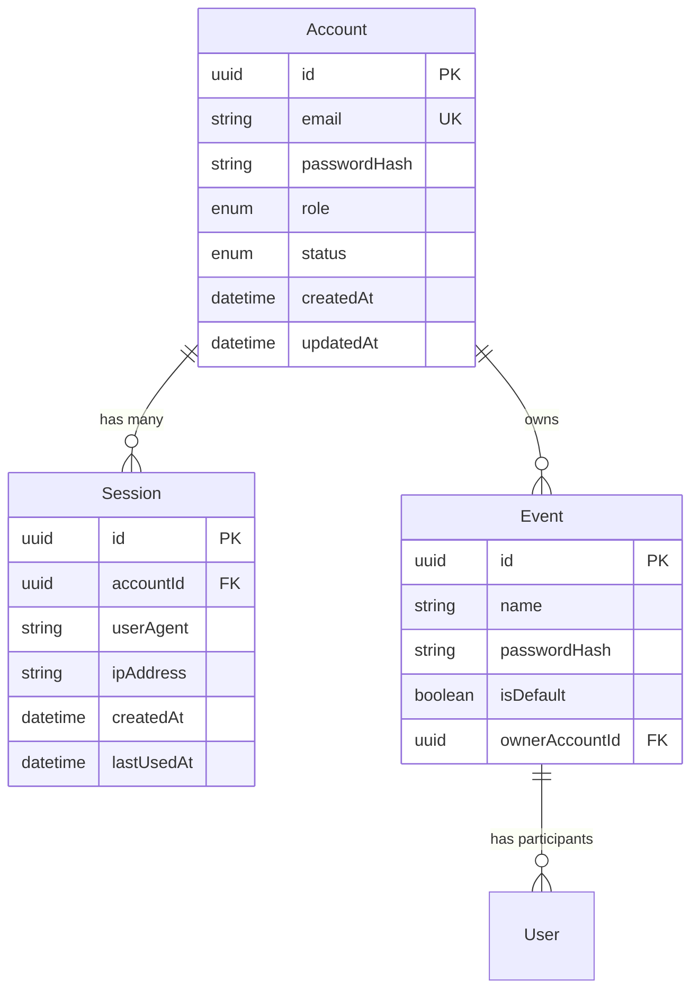

# Design: Authentication System

## Overview

The authentication system serves two distinct audiences with separate auth flows:

1. **Account owners/admins** authenticate via email + password, receiving a JWT stored in `localStorage`. Sessions are tracked server-side in a `Session` table, enabling multi-device logout and session management.
2. **Event attendees** authenticate via a shared event password (per-event), with access state stored in `sessionStorage` on the client. No account is required — attendees select or create a participant name after entering the password.

The system uses the existing Express + Prisma + React stack. Backend routes are protected by middleware (`requireAuth`, `requireAdmin`), and frontend routes are guarded by `AccountAuthGuard` (JWT-based) and `AuthGuard` (event password-based).

## Architecture




## Components and Interfaces

### Backend Components

#### AccountService (`api/src/services/account.service.ts`)
Handles account registration, authentication, password management, and role/status changes.

- `register(input: CreateAccountInput): Promise<AccountResponse>` — validates email/password, hashes password with bcrypt (cost 12), creates account
- `authenticate(email: string, password: string): Promise<AccountResponse>` — verifies credentials, checks deactivated status
- `changePassword(accountId, currentPassword, newPassword): Promise<void>` — validates current password, updates hash
- `deactivate(accountId, password): Promise<void>` — deactivates account (prevents admin self-deactivation)
- `getById(id): Promise<AccountResponse | null>` — lookup by ID
- `verifyPassword(password, hash): Promise<boolean>` — bcrypt compare (constant-time)

#### SessionService (`api/src/services/session.service.ts`)
Manages JWT token lifecycle and server-side session records.

- `createSession(accountId, userAgent?, ipAddress?): Promise<string>` — creates DB session record, signs JWT with `{ accountId, sessionId }`, 7-day expiry
- `validateToken(token): Promise<TokenPayload | null>` — verifies JWT signature + expiry, checks session exists in DB, updates `lastUsedAt`
- `getSessionsForAccount(accountId): Promise<Session[]>` — lists all sessions
- `deleteSession(sessionId, accountId): Promise<void>` — deletes single session (ownership check)
- `deleteAllSessions(accountId): Promise<void>` — logout all devices
- `deleteAllSessionsExcept(accountId, exceptSessionId): Promise<void>` — used on password change

#### AuthService (`api/src/services/auth.service.ts`)
Handles event password verification.

- `verifyPassword(password): boolean` — compares against `EVENT_PASSWORD` env var (legacy single-event)

#### EventService (`api/src/services/event.service.ts`)
Handles per-event password verification for slug-based access.

- `verifyEventPassword(eventId, password): Promise<boolean>` — compares against event's `passwordHash`

#### Auth Middleware (`api/src/middleware/auth.middleware.ts`)

- `requireAuth(req, res, next)` — extracts Bearer token, validates via SessionService, attaches `account` and `sessionId` to request. Returns 401/403 on failure.
- `requireAdmin(req, res, next)` — checks `account.role === 'admin'`. Returns 403 if not admin.
- `resolveOptionalAccount(req)` — non-blocking account resolution for routes that optionally use account context.

### Frontend Components

#### AuthContext (`frontend/src/contexts/AuthContext.tsx`)
React context providing account authentication state and actions.

- `account: Account | null` — current logged-in account
- `isAuthenticated: boolean` — derived from account presence
- `login(email, password)` — calls `/api/accounts/login`, stores JWT in `localStorage`
- `register(email, password)` — calls `/api/accounts/register` (no auto-login)
- `logout()` — removes JWT from `localStorage`, clears account state
- `refreshAccount()` — validates stored token via `/api/accounts/me`

#### AuthGuard (`frontend/src/components/AuthGuard.tsx`)
Protects event routes. Checks `sessionStorage` for event access state. Shows `PasswordScreen` if not authenticated.

#### AccountAuthGuard (`frontend/src/components/AccountAuthGuard.tsx`)
Protects account routes (`/profile`, `/admin`). Redirects to `/login` if no valid JWT. Shows loading spinner during token validation.

#### PasswordScreen (`frontend/src/components/PasswordScreen.tsx`)
Full-screen password entry form for event access. Calls `/api/auth/verify` and stores success in `sessionStorage`.

### API Routes

| Method | Path | Auth | Description |
|--------|------|------|-------------|
| `POST` | `/api/accounts/register` | None | Create account |
| `POST` | `/api/accounts/login` | None | Login, returns JWT |
| `GET` | `/api/accounts/me` | JWT | Get current account |
| `PATCH` | `/api/accounts/me/password` | JWT | Change password (invalidates other sessions) |
| `POST` | `/api/accounts/me/deactivate` | JWT | Deactivate own account |
| `GET` | `/api/sessions` | JWT | List sessions (with `isCurrent` flag) |
| `DELETE` | `/api/sessions` | JWT | Logout all devices |
| `DELETE` | `/api/sessions/:id` | JWT | Logout specific session |
| `POST` | `/api/auth/verify` | None | Verify event password |

### Route Protection (Frontend)

| Route | Guard | Requirement |
|-------|-------|-------------|
| `/login` | None | 1.1 |
| `/register` | None | — |
| `/profile` | `AccountAuthGuard` | 6.1 |
| `/admin` | `AccountAuthGuard` + admin role check | 6.2 |
| `/{slug}` or `/` | `AuthGuard` (event password) | 5.1, 5.4, 6.3 |

## Data Models

### Account (Prisma)

```prisma
model Account {
  id           String        @id @default(uuid())
  email        String        @unique
  passwordHash String        @map("password_hash")
  role         AccountRole   @default(account_owner)
  status       AccountStatus @default(active)
  createdAt    DateTime      @default(now()) @map("created_at")
  updatedAt    DateTime      @updatedAt @map("updated_at")
  sessions     Session[]
  events       Event[]
}

enum AccountRole {
  account_owner
  admin
}

enum AccountStatus {
  active
  deactivated
}
```

### Session (Prisma)

```prisma
model Session {
  id         String   @id @default(uuid())
  accountId  String   @map("account_id")
  userAgent  String?  @map("user_agent")
  ipAddress  String?  @map("ip_address")
  createdAt  DateTime @default(now()) @map("created_at")
  lastUsedAt DateTime @default(now()) @map("last_used_at")
  account    Account  @relation(fields: [accountId], references: [id], onDelete: Cascade)
}
```

### Event (relevant fields)

```prisma
model Event {
  id             String   @id @default(uuid())
  name           String
  passwordHash   String   @map("password_hash")
  isDefault      Boolean  @default(false) @map("is_default")
  ownerAccountId String   @map("owner_account_id")
  ownerAccount   Account  @relation(fields: [ownerAccountId], references: [id], onDelete: Cascade)
}
```

### Token Payload (JWT)

```typescript
interface TokenPayload {
  accountId: string;
  sessionId: string;
  iat: number;  // issued at (added by jsonwebtoken)
  exp: number;  // expires at (7 days from iat)
}
```

### Frontend Storage

| Key | Storage | Purpose |
|-----|---------|---------|
| `auth_token` | `localStorage` | JWT for account auth |
| `boardgame_event_auth` | `sessionStorage` | Event access flag |




## Correctness Properties

*A property is a characteristic or behavior that should hold true across all valid executions of a system — essentially, a formal statement about what the system should do. Properties serve as the bridge between human-readable specifications and machine-verifiable correctness guarantees.*

### Property 1: JWT expiry is 7 days from issuance

*For any* successfully created session token, the decoded JWT's `exp` claim minus its `iat` claim should equal 604800 seconds (7 days).

**Validates: Requirements 3.2**

### Property 2: Login creates a session record

*For any* valid account credentials, after a successful login call, a new Session record should exist in the database with the matching `accountId`, and the total session count for that account should have increased by one.

**Validates: Requirements 3.4**

### Property 3: Logout-all removes all sessions

*For any* account with one or more active sessions, calling `deleteAllSessions` should result in zero sessions remaining for that account in the database.

**Validates: Requirements 4.2**

### Property 4: Password change invalidates other sessions

*For any* account with multiple active sessions, changing the password should delete all sessions except the current session. The current session should remain valid, and all other sessions should no longer exist.

**Validates: Requirements 4.4**

### Property 5: Event access isolation

*For any* two distinct events with different passwords, authenticating to one event should not grant access to the other. The event access state stored per-event key should be independent.

**Validates: Requirements 5.3**

### Property 6: Non-admin accounts are rejected from admin endpoints

*For any* authenticated account where `role !== 'admin'`, requests to admin-protected endpoints should receive a 403 Forbidden response.

**Validates: Requirements 6.2**

## Error Handling

### Backend Error Strategy

All errors use a consistent JSON response format:

```json
{
  "error": "ERROR_CODE",
  "message": "Human-readable message (German)"
}
```

Error codes and messages are centralized in `api/src/types/account.ts` (`AccountErrorCodes`, `AccountErrorMessages`).

| Scenario | HTTP Status | Error Code | Message |
|----------|-------------|------------|---------|
| Missing email/password | 400 | `MISSING_FIELDS` | E-Mail und Passwort sind erforderlich. |
| Invalid email format | 400 | `INVALID_EMAIL` | Bitte eine gültige E-Mail-Adresse eingeben. |
| Password too short (<8) | 400 | `PASSWORD_TOO_SHORT` | Das Passwort muss mindestens 8 Zeichen lang sein. |
| Password missing letter | 400 | `PASSWORD_MISSING_LETTER` | Das Passwort muss mindestens einen Buchstaben enthalten. |
| Password missing number | 400 | `PASSWORD_MISSING_NUMBER` | Das Passwort muss mindestens eine Zahl enthalten. |
| Wrong credentials | 401 | `INVALID_CREDENTIALS` | E-Mail oder Passwort ist falsch. |
| Invalid/expired token | 401 | `INVALID_TOKEN` | Sitzung abgelaufen. Bitte erneut anmelden. |
| Account deactivated | 403 | `ACCOUNT_DEACTIVATED` | Dieses Konto wurde deaktiviert. |
| Not authorized (role) | 403 | `NOT_AUTHORIZED` | Keine Berechtigung für diese Aktion. |
| Account not found | 404 | `ACCOUNT_NOT_FOUND` | Konto nicht gefunden. |
| Session not found | 404 | `SESSION_NOT_FOUND` | Sitzung nicht gefunden. |
| Email already exists | 409 | `EMAIL_EXISTS` | Diese E-Mail-Adresse ist bereits registriert. |
| Admin self-deactivation | 403 | `SELF_DEACTIVATION` | Administratoren können ihr eigenes Konto nicht deaktivieren. |

### Frontend Error Handling

- `ApiError` class wraps all API errors with `code` and `message` fields
- `AuthContext` exposes an `error` state and `clearError()` method
- Login/register pages display error messages from the API response
- Token validation failures silently clear the token (no error shown to user)
- Event password failures show inline error on the `PasswordScreen`

### Security Considerations

- Passwords hashed with bcrypt (cost factor 12) — constant-time comparison built into bcrypt
- Failed login does not reveal whether the email exists (same error for wrong email and wrong password)
- JWT secret configured via `JWT_SECRET` environment variable
- Deactivated accounts are rejected at the middleware level, not just at login
- Session ownership is verified before deletion (prevents cross-account session manipulation)

## Testing Strategy

### Unit Tests (Jest for API, Vitest for Frontend)

Focus on specific examples and edge cases:

- Login with valid credentials returns token and account
- Login with wrong password returns 401
- Login with deactivated account returns 403
- Registration with duplicate email returns 409
- Password validation rejects short passwords, missing letters, missing numbers
- Token validation rejects expired tokens
- Token validation rejects tokens for deleted sessions
- Admin middleware rejects non-admin accounts
- Session deletion verifies ownership
- Frontend AuthContext updates state on login/logout
- AccountAuthGuard redirects unauthenticated users

### Property-Based Tests (fast-check)

Each property test references a design property and uses `fast-check` for input generation.

Per workspace guidelines:
- Use `{ numRuns: 3 }` for DB operations (slow, same logic regardless of input)
- Use `{ numRuns: 5-10 }` for pure validation functions
- Prefer example-based tests for binary outcomes (auth checks with 2-3 roles)

Property tests to implement:

1. **Feature: authentication-system, Property 1: JWT expiry is 7 days** — Generate random account IDs, create sessions, decode tokens, verify `exp - iat === 604800`. `numRuns: 3` (DB operation).
2. **Feature: authentication-system, Property 2: Login creates session record** — Generate random valid credentials, login, verify session count increased. `numRuns: 3` (DB operation).
3. **Feature: authentication-system, Property 3: Logout-all removes all sessions** — Create account with N sessions (N generated), call deleteAllSessions, verify count is 0. `numRuns: 3` (DB operation).
4. **Feature: authentication-system, Property 4: Password change invalidates other sessions** — Create account with multiple sessions, change password from one session, verify only that session remains. `numRuns: 3` (DB operation).
5. **Feature: authentication-system, Property 5: Event access isolation** — Generate two event keys, authenticate one, verify the other remains unauthenticated. `numRuns: 5` (pure, no I/O — sessionStorage mock).
6. **Feature: authentication-system, Property 6: Non-admin rejected from admin endpoints** — Use `fc.constantFrom('account_owner')` for role, verify 403. Per workspace guidelines, this is better as an example-based test since there are only 2 roles. Convert to `it.each(['account_owner'])`.

### Test File Locations

| Test | Location |
|------|----------|
| AccountService unit tests | `api/src/services/__tests__/account.service.test.ts` |
| SessionService unit tests | `api/src/services/__tests__/session.service.test.ts` |
| Auth middleware unit tests | `api/src/middleware/__tests__/auth.middleware.test.ts` |
| Session property tests | `api/src/services/__tests__/session.service.property.test.ts` |
| AuthContext unit tests | `frontend/src/contexts/__tests__/AuthContext.test.tsx` |
| AuthGuard unit tests | `frontend/src/components/__tests__/AuthGuard.test.tsx` |
| Event access property tests | `frontend/src/components/__tests__/AuthGuard.property.test.ts` |
