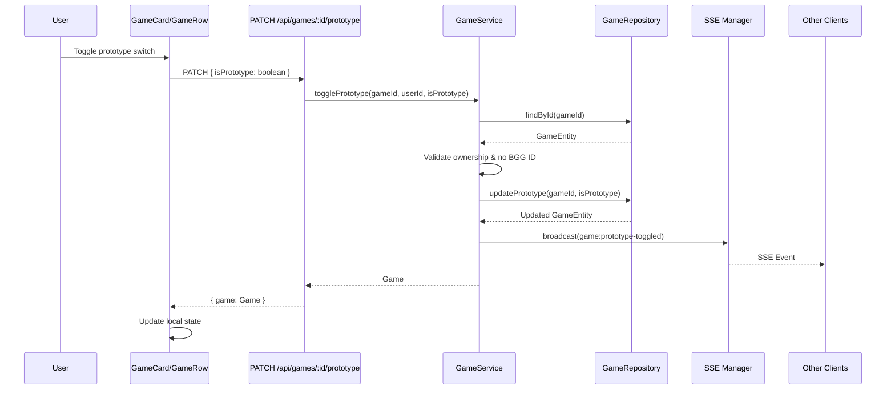

# Design Document: Prototype Toggle

## Overview

This feature adds the ability for game owners to toggle the prototype status of their non-BGG games after initial creation. The implementation spans the API layer (new PATCH endpoint), real-time synchronization (SSE events), and frontend UI components (mobile actions menu and desktop toggle switch).

The design follows the existing patterns in the codebase:
- Repository → Service → Route pattern for API
- SSE broadcast for real-time updates
- Responsive UI with separate mobile (GameCard) and desktop (GameRow) implementations

## Architecture



## Components and Interfaces

### API Layer

#### New Route: `PATCH /api/games/:id/prototype`

```typescript
// Request
interface TogglePrototypeRequest {
  isPrototype: boolean;
}

// Response (success)
interface GameResponse {
  game: Game;
}

// Response (error)
interface ErrorResponse {
  error: {
    code: 'VALIDATION_ERROR' | 'FORBIDDEN' | 'GAME_NOT_FOUND' | 'INTERNAL_ERROR';
    message: string;
  };
}
```

#### GameService Extension

```typescript
class GameService {
  // Existing methods...
  
  /**
   * Toggle prototype status for a game
   * @param gameId - The game's unique identifier
   * @param userId - The user requesting the change (must be owner)
   * @param isPrototype - The new prototype status
   * @returns The updated game
   * @throws Error if not owner, game has BGG ID, or game not found
   */
  async togglePrototype(gameId: string, userId: string, isPrototype: boolean): Promise<Game>;
}
```

#### GameRepository Extension

```typescript
class GameRepository {
  // Existing methods...
  
  /**
   * Update the prototype status of a game
   * @param gameId - The game's unique identifier
   * @param isPrototype - The new prototype status
   * @returns The updated game entity
   */
  async updatePrototype(gameId: string, isPrototype: boolean): Promise<GameEntity>;
}
```

### SSE Event

```typescript
// New event type
interface PrototypeToggledEvent extends BaseGameEvent {
  type: 'game:prototype-toggled';
  isPrototype: boolean;
}
```

### Frontend Components

#### PrototypeToggle Component (New)

A reusable toggle switch component for prototype status:

```typescript
interface PrototypeToggleProps {
  gameId: string;
  isPrototype: boolean;
  onToggle: (gameId: string, isPrototype: boolean) => Promise<void>;
  disabled?: boolean;
}
```

#### MobileActionsMenu Component (New)

A dropdown menu for additional actions on mobile:

```typescript
interface MobileActionsMenuProps {
  game: Game;
  currentUserId: string;
  onTogglePrototype: (gameId: string, isPrototype: boolean) => Promise<void>;
}
```

#### GameCard Modifications

- Add `onTogglePrototype` prop
- Conditionally render MobileActionsMenu when user is owner and game has no BGG ID

#### GameRow Modifications

- Add `onTogglePrototype` prop
- Conditionally render PrototypeToggle when user is owner and game has no BGG ID

### API Client Extension

```typescript
// frontend/src/api/games.ts
export async function togglePrototype(
  gameId: string, 
  isPrototype: boolean, 
  userId: string
): Promise<Game>;
```

## Data Models

### Existing Models (No Changes Required)

The `Game` model already has the `isPrototype` field:

```prisma
model Game {
  id                    String   @id @default(uuid())
  name                  String   @unique
  ownerId               String?  @map("owner_id")
  bggId                 Int?     @map("bgg_id")
  isPrototype           Boolean  @default(false) @map("is_prototype")
  // ... other fields
}
```

### SSE Event Types Extension

```typescript
// api/src/types/sse.ts - Add to SSEEventType union
export type SSEEventType =
  | 'game:created'
  | 'game:bringer-added'
  | 'game:bringer-removed'
  | 'game:player-added'
  | 'game:player-removed'
  | 'game:deleted'
  | 'game:prototype-toggled';  // NEW

// New event interface
export interface PrototypeToggledEvent extends BaseGameEvent {
  type: 'game:prototype-toggled';
  isPrototype: boolean;
}

// Update GameEvent union
export type GameEvent =
  | GameCreatedEvent
  | BringerAddedEvent
  | BringerRemovedEvent
  | PlayerAddedEvent
  | PlayerRemovedEvent
  | GameDeletedEvent
  | PrototypeToggledEvent;  // NEW
```


## Correctness Properties

*A property is a characteristic or behavior that should hold true across all valid executions of a system—essentially, a formal statement about what the system should do. Properties serve as the bridge between human-readable specifications and machine-verifiable correctness guarantees.*

### Property 1: Prototype Toggle Round-Trip

*For any* game owned by a user with no BGG ID, toggling the prototype status to a value `v` and then reading the game back SHALL return a game with `isPrototype === v`.

**Validates: Requirements 1.1**

### Property 2: Mobile Actions Menu Visibility

*For any* game and current user, the mobile actions menu ("..." button) SHALL be visible if and only if:
- The current user is the owner of the game, AND
- The game has no BGG ID (`bggId === null`)

**Validates: Requirements 2.1, 2.6**

### Property 3: Desktop Prototype Toggle Visibility

*For any* game and current user, the desktop prototype toggle switch SHALL be visible if and only if:
- The current user is the owner of the game, AND
- The game has no BGG ID (`bggId === null`)

**Validates: Requirements 3.1, 3.5**

## Error Handling

### API Error Responses

| Scenario | HTTP Status | Error Code | Message (German) |
|----------|-------------|------------|------------------|
| Game not found | 404 | `GAME_NOT_FOUND` | "Spiel nicht gefunden." |
| User is not owner | 403 | `FORBIDDEN` | "Du bist nicht berechtigt, dieses Spiel zu bearbeiten." |
| Game has BGG ID | 400 | `VALIDATION_ERROR` | "Nur Spiele ohne BGG-Eintrag können als Prototyp markiert werden." |
| Invalid request body | 400 | `VALIDATION_ERROR` | "Ungültige Anfrage." |
| Server error | 500 | `INTERNAL_ERROR` | "Ein Fehler ist aufgetreten." |

### Frontend Error Handling

1. **API Failure**: Display toast notification with error message, revert toggle to previous state
2. **Network Error**: Display generic error toast "Verbindungsfehler. Bitte erneut versuchen."
3. **Optimistic Update Rollback**: If API fails after optimistic UI update, revert the toggle state

## Testing Strategy

### Unit Tests

Unit tests focus on specific examples and edge cases:

1. **API Route Tests** (`api/src/routes/__tests__/game.routes.test.ts`)
   - Test 403 response when non-owner attempts toggle
   - Test 400 response when game has BGG ID
   - Test 404 response when game doesn't exist
   - Test successful toggle returns updated game

2. **Service Tests** (`api/src/services/__tests__/game.service.test.ts`)
   - Test ownership validation logic
   - Test BGG ID validation logic
   - Test SSE event broadcast on successful toggle

3. **Frontend Component Tests**
   - Test MobileActionsMenu renders toggle switch
   - Test PrototypeToggle calls API on click
   - Test error notification on API failure
   - Test SSE event updates game state

### Property-Based Tests

Property tests verify universal properties across generated inputs. Per project guidelines, use `numRuns: 3-5` for DB operations.

1. **Property 1: Prototype Toggle Round-Trip** (`api/src/routes/__tests__/game.routes.property.test.ts`)
   - Generate random games owned by test user with no BGG ID
   - Toggle prototype status to random boolean
   - Verify returned game has correct isPrototype value
   - **Tag**: Feature: prototype-toggle, Property 1: Prototype Toggle Round-Trip
   - **numRuns**: 3 (DB operation)

2. **Property 2: Mobile Actions Menu Visibility** (`frontend/src/components/__tests__/GameCard.property.test.ts`)
   - Generate random games with varying ownership and BGG ID presence
   - Render GameCard with generated game
   - Verify actions menu visibility matches ownership AND no-BGG-ID condition
   - **Tag**: Feature: prototype-toggle, Property 2: Mobile Actions Menu Visibility
   - **numRuns**: 5 (UI rendering, benefits from variety)

3. **Property 3: Desktop Prototype Toggle Visibility** (`frontend/src/components/__tests__/GameRow.property.test.ts`)
   - Generate random games with varying ownership and BGG ID presence
   - Render GameRow with generated game
   - Verify toggle visibility matches ownership AND no-BGG-ID condition
   - **Tag**: Feature: prototype-toggle, Property 3: Desktop Prototype Toggle Visibility
   - **numRuns**: 5 (UI rendering, benefits from variety)

### Test Configuration

- Backend tests: Jest with `--runInBand` flag
- Frontend tests: Vitest
- Property tests: fast-check library
- Each property test references its design document property via comment tag
