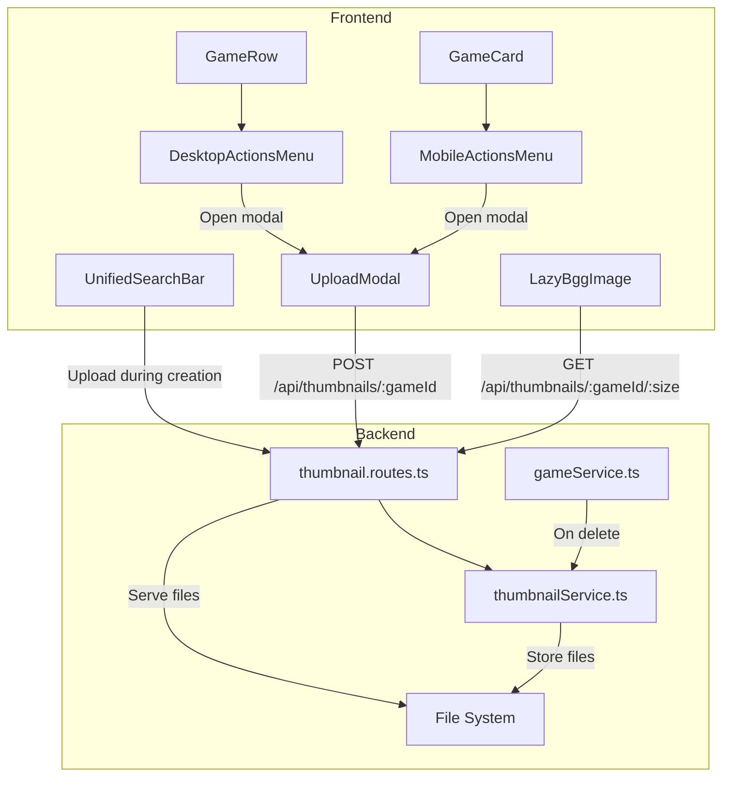

# Design Document: Custom Thumbnail Upload

## Overview

This feature adds the ability for users to upload custom thumbnail images for manually added games (non-BGG games) and prototype games. The system stores uploaded images on the server, automatically generates two thumbnail sizes matching BGG dimensions (64x64 micro and 200x200 square200), and cleans up thumbnails when games are deleted.

The implementation follows existing patterns in the codebase:
- Backend service pattern similar to `bggImageService.ts`
- API routes pattern similar to `bgg.routes.ts`
- Frontend component patterns from `MobileActionsMenu.tsx` and modal guidelines

## Architecture



## Components and Interfaces

### Backend Components

#### ThumbnailService (`api/src/services/thumbnailService.ts`)

```typescript
interface ThumbnailService {
  // Store a thumbnail for a game, generating both sizes
  storeThumbnail(gameId: string, imageBuffer: Buffer): Promise<void>;
  
  // Get path to a thumbnail file, or null if not exists
  getThumbnailPath(gameId: string, size: ImageSize): string | null;
  
  // Delete thumbnails for a game
  deleteThumbnails(gameId: string): Promise<void>;
  
  // Check if a game has custom thumbnails
  hasThumbnail(gameId: string): boolean;
}
```

#### Thumbnail Routes (`api/src/routes/thumbnail.routes.ts`)

```typescript
// POST /api/thumbnails/:gameId - Upload thumbnail
// GET /api/thumbnails/:gameId/:size - Get thumbnail image
// DELETE /api/thumbnails/:gameId - Delete thumbnail (admin only)
```

### Frontend Components

#### UploadModal (`frontend/src/components/ThumbnailUploadModal.tsx`)

Props:
```typescript
interface ThumbnailUploadModalProps {
  gameId: string;
  gameName: string;
  isOpen: boolean;
  onClose: () => void;
  onSuccess: () => void;
}
```

#### DesktopActionsMenu (`frontend/src/components/DesktopActionsMenu.tsx`)

A new "..." menu component for desktop game rows, similar to MobileActionsMenu.

Props:
```typescript
interface DesktopActionsMenuProps {
  game: Game;
  currentUserId: string;
  onTogglePrototype: (gameId: string, isPrototype: boolean) => Promise<void>;
  onUploadThumbnail: (gameId: string) => void;
}
```

#### Updated MobileActionsMenu

Add thumbnail upload option to existing menu.

### API Client Extension

```typescript
// Add to frontend/src/api/client.ts
export const thumbnailsApi = {
  upload: (gameId: string, file: File, userId: string): Promise<{ success: boolean }>;
  getUrl: (gameId: string, size: ImageSize): string;
};
```

## Data Models

### File Storage Structure

```
/app/cache/custom-thumbnails/
├── {gameId}-micro.jpg
├── {gameId}-square200.jpg
└── ...
```

### SSE Event Type

```typescript
// Add to api/src/types/sse.ts and frontend/src/types/sse.ts
interface ThumbnailUploadedEvent extends BaseGameEvent {
  type: 'game:thumbnail-uploaded';
  /** Timestamp for cache-busting */
  timestamp: number;
}
```

### Configuration Extension

```typescript
// Add to api/src/config/index.ts
customThumbnails: {
  cacheDir: process.env.CUSTOM_THUMBNAIL_DIR || '/app/cache/custom-thumbnails',
  maxFileSize: 5 * 1024 * 1024, // 5 MB
  allowedMimeTypes: ['image/jpeg', 'image/png', 'image/webp', 'image/gif'],
}
```

## Correctness Properties

*A property is a characteristic or behavior that should hold true across all valid executions of a system—essentially, a formal statement about what the system should do. Properties serve as the bridge between human-readable specifications and machine-verifiable correctness guarantees.*

### Property 1: Upload and Storage Correctness

*For any* valid image file (JPEG, PNG, WebP, GIF) under 5 MB uploaded for a custom game, the service shall store both micro (64x64) and square200 (200x200) JPEG files in the custom thumbnails directory with filenames matching the pattern `{gameId}-{size}.jpg`.

**Validates: Requirements 1.1, 1.4, 1.5, 2.1, 2.2**

### Property 2: File Size Validation

*For any* file larger than 5 MB, the upload shall be rejected with an appropriate error message, and no files shall be stored.

**Validates: Requirements 1.2**

### Property 3: MIME Type Validation

*For any* file with a MIME type not in the allowed list (image/jpeg, image/png, image/webp, image/gif), the upload shall be rejected with an appropriate error message, and no files shall be stored.

**Validates: Requirements 1.3**

### Property 4: BGG Game Rejection

*For any* game that has a BGG ID, thumbnail upload attempts shall be rejected with an appropriate error message.

**Validates: Requirements 1.6**

### Property 5: Retrieval Correctness

*For any* game with custom thumbnails, requesting a thumbnail with a specific size (micro or square200) shall return the corresponding file from the custom thumbnails directory.

**Validates: Requirements 2.3, 2.4**

### Property 6: Cleanup on Deletion

*For any* custom game (no BGG ID) with custom thumbnails that is deleted, both the micro and square200 thumbnail files shall be removed from the file system.

**Validates: Requirements 3.1, 3.3**

### Property 7: Menu Visibility

*For any* game displayed in the UI, the thumbnail upload menu option shall only be visible when the current user is the owner AND the game has no BGG ID.

**Validates: Requirements 5.2, 6.2**

### Property 8: Thumbnail Replacement

*For any* game that already has custom thumbnails, uploading a new thumbnail shall replace the existing files (not create duplicates).

**Validates: Requirements 5.5**

### Property 9: Display Integration

*For any* custom game with custom thumbnails, the thumbnail shall be displayed using the same LazyBggImage component with identical zoom and lazy loading behavior as BGG thumbnails.

**Validates: Requirements 8.1**

### Property 10: SSE Broadcast on Upload

*For any* successful thumbnail upload, the system shall broadcast a `game:thumbnail-uploaded` SSE event containing the gameId, userId, and a timestamp for cache-busting.

**Validates: Requirements 9.1, 9.2**

### Property 11: Cache-Busting Correctness

*For any* thumbnail update received via SSE, the frontend shall append the timestamp as a query parameter to the thumbnail URL, ensuring the browser fetches the new image instead of serving a cached version.

**Validates: Requirements 9.3, 9.4**

## Error Handling

### Upload Errors

| Error Condition | HTTP Status | Error Code | German Message |
|-----------------|-------------|------------|----------------|
| File too large (>5 MB) | 400 | FILE_TOO_LARGE | Datei zu groß. Maximal 5 MB erlaubt. |
| Invalid file type | 400 | INVALID_FILE_TYPE | Ungültiger Dateityp. Erlaubt: JPEG, PNG, WebP, GIF. |
| Game has BGG ID | 400 | BGG_GAME | Nur Spiele ohne BGG-Eintrag können ein Bild haben. |
| Game not found | 404 | GAME_NOT_FOUND | Spiel nicht gefunden. |
| Not game owner | 403 | FORBIDDEN | Du bist nicht berechtigt, dieses Spiel zu bearbeiten. |
| Image processing failed | 500 | PROCESSING_ERROR | Bildverarbeitung fehlgeschlagen. |

### Retrieval Errors

| Error Condition | HTTP Status | Error Code | German Message |
|-----------------|-------------|------------|----------------|
| Thumbnail not found | 404 | THUMBNAIL_NOT_FOUND | Bild nicht gefunden. |
| Invalid size parameter | 400 | INVALID_SIZE | Ungültige Bildgröße. Muss "micro" oder "square200" sein. |

### Cleanup Error Handling

- Thumbnail deletion failures during game deletion are logged but do not prevent game deletion
- Orphaned thumbnails may be cleaned up by a future maintenance task

## Testing Strategy

### Unit Tests

Unit tests focus on specific examples and edge cases:

1. **ThumbnailService unit tests**
   - Test file naming convention with specific game IDs
   - Test directory creation on first upload
   - Test error handling for missing files

2. **Upload validation tests**
   - Test exact 5 MB boundary (5 MB should pass, 5 MB + 1 byte should fail)
   - Test each allowed MIME type individually
   - Test rejection of common non-image types (text/plain, application/pdf)

3. **API route tests**
   - Test authentication/authorization flows
   - Test error response formats

### Property-Based Tests

Property tests validate universal properties across many generated inputs using fast-check:

1. **Upload correctness property** (Property 1)
   - Generate random valid image buffers
   - Verify both output files exist with correct names and JPEG format

2. **File size validation property** (Property 2)
   - Generate files of various sizes around the 5 MB boundary
   - Verify correct acceptance/rejection

3. **Cleanup property** (Property 6)
   - Generate games with thumbnails, delete them
   - Verify thumbnail files are removed

### Integration Tests

1. **End-to-end upload flow**
   - Upload thumbnail via API
   - Retrieve thumbnail via API
   - Verify image content

2. **Game deletion cleanup**
   - Create game with thumbnail
   - Delete game
   - Verify thumbnails are removed

### Test Configuration

- Property tests: minimum 10 iterations (image processing is slow)
- Use `{ numRuns: 5 }` for tests involving file I/O
- Tag format: **Feature: 023-custom-thumbnail-upload, Property {number}: {property_text}**

