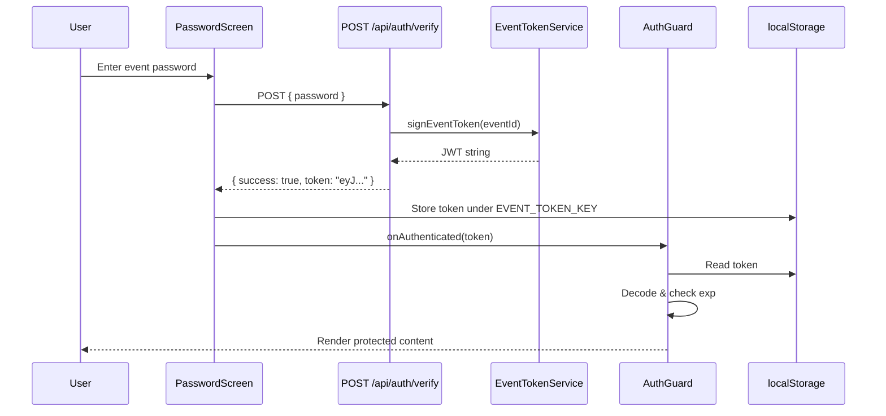
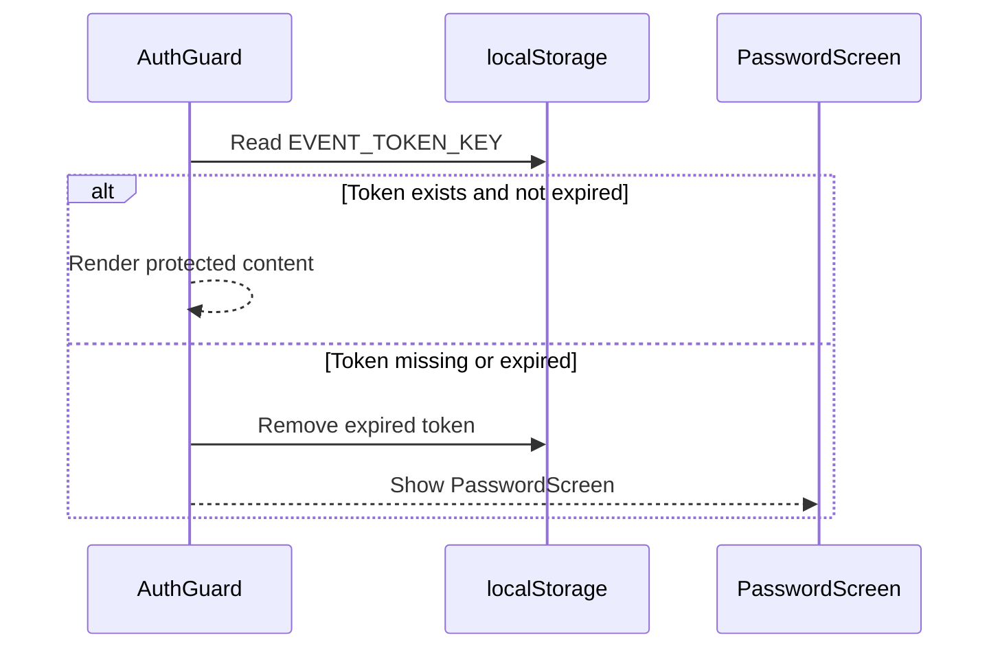

# Design Document: Event Auth JWT

## Overview

Replace the plain `sessionStorage` flag with a proper JWT-based event authentication flow. On successful event password verification, the server issues a signed JWT containing the `eventId`. The frontend stores this token in `localStorage` and attaches it to API requests. The backend provides middleware to validate event tokens on protected routes.

This is separate from the existing account authentication system (spec 017). Account auth uses session-backed JWTs with `accountId`/`sessionId` claims. Event auth uses stateless JWTs with an `eventId` claim — no database session tracking needed since the event token simply proves the user knows the event password.

## Architecture



For subsequent visits / PWA restarts:



## Components and Interfaces

### Backend

#### EventTokenService (`api/src/services/event-token.service.ts`)

A lightweight stateless service for signing and verifying event JWTs. Separate from `SessionService` which handles account session-backed tokens.

```typescript
interface EventTokenPayload {
  eventId: string;
  type: 'event';  // Distinguishes from account tokens
}

class EventTokenService {
  sign(eventId: string): string;
  verify(token: string): EventTokenPayload | null;
}
```

- `sign()`: Creates a JWT with `{ eventId, type: 'event' }` claims, signed with `JWT_SECRET`, expiring per `EVENT_TOKEN_EXPIRY` config (default `'7d'`).
- `verify()`: Verifies signature and expiry. Returns decoded payload or `null` on failure. Checks `type === 'event'` to prevent account tokens from being used as event tokens.

#### Updated Auth Verify Route (`api/src/routes/auth.routes.ts`)

The existing `POST /api/auth/verify` endpoint is modified to return a token on success:

```typescript
// Current response:  { success: true }
// New response:      { success: true, token: "eyJ..." }
// Error responses remain unchanged
```

#### Event Auth Middleware (`api/src/middleware/event-auth.middleware.ts`)

```typescript
function requireEventAuth(req: Request, res: Response, next: NextFunction): void;
```

- Extracts `Bearer` token from `Authorization` header
- Calls `EventTokenService.verify()`
- On success: attaches `eventId` to `req` and calls `next()`
- On failure: returns `401 { error: 'INVALID_EVENT_TOKEN', message: '...' }`

Note: This middleware is created but not applied to existing routes in this spec. It provides the infrastructure for future route protection. The current routes are already gated by the frontend AuthGuard.

#### Config Addition (`api/src/config/index.ts`)

```typescript
eventToken: {
  expiresIn: process.env.EVENT_TOKEN_EXPIRY || '7d',
}
```

### Frontend

#### Updated API Client (`frontend/src/api/client.ts`)

- Add `EVENT_TOKEN_KEY = 'boardgame_event_token'` constant
- Add `getEventToken()`, `setEventToken(token)`, `removeEventToken()` helpers
- Update `AuthVerifyResponse` type to include optional `token` field
- Update `fetchApi` to attach event token as a fallback when no account token is present

```typescript
// Token priority in fetchApi:
// 1. Account token (if includeAuth=true and account token exists)
// 2. Event token (always attached if present and no account token)
```

#### Updated AuthGuard (`frontend/src/components/AuthGuard.tsx`)

- Switch from `sessionStorage` to `localStorage`
- Store the JWT string instead of `'true'`
- On init: read token, decode (without verification — just parse the payload), check `exp` against `Date.now()`
- If expired or missing: show PasswordScreen
- Export updated `clearAuthentication()` that removes the event token
- Export updated `isEventAuthenticated()` that checks token presence and expiry

#### Updated PasswordScreen (`frontend/src/components/PasswordScreen.tsx`)

- On successful verify response, pass `response.token` to `onAuthenticated` callback
- The callback signature changes from `() => void` to `(token: string) => void`

#### Updated Types (`frontend/src/types/index.ts`)

```typescript
export interface AuthVerifyResponse {
  success: boolean;
  message?: string;
  token?: string;  // New: JWT token on success
}
```

## Data Models

### Event Token JWT Claims

```json
{
  "eventId": "uuid-string",
  "type": "event",
  "iat": 1234567890,
  "exp": 1235172690
}
```

- `eventId`: The UUID of the event the password was verified against
- `type`: Literal `"event"` — prevents cross-use with account tokens
- `iat`: Issued-at timestamp (set automatically by `jsonwebtoken`)
- `exp`: Expiration timestamp (set by `expiresIn` config)

### localStorage Keys

| Key | Value | Purpose |
|-----|-------|---------|
| `boardgame_event_token` | JWT string | Event authentication token |
| `auth_token` | JWT string | Account authentication token (existing, unchanged) |
| `boardgame_event_participant_id` | UUID string | Selected participant (existing, unchanged) |


## Correctness Properties

*A property is a characteristic or behavior that should hold true across all valid executions of a system — essentially, a formal statement about what the system should do. Properties serve as the bridge between human-readable specifications and machine-verifiable correctness guarantees.*

### Property 1: EventTokenService round-trip

*For any* valid eventId string, signing it with `EventTokenService.sign(eventId)` and then verifying the resulting token with `EventTokenService.verify(token)` should return a payload where `payload.eventId === eventId` and `payload.type === 'event'`.

**Validates: Requirements 1.2**

### Property 2: Token expiry matches configuration

*For any* eventId, the token produced by `EventTokenService.sign(eventId)` should contain an `exp` claim that is approximately equal to `iat` plus the configured `EVENT_TOKEN_EXPIRY` duration (default 7 days), within a tolerance of 2 seconds.

**Validates: Requirements 2.3**

### Property 3: Valid event token passes middleware

*For any* valid event token (produced by `EventTokenService.sign()`), when presented in an `Authorization: Bearer <token>` header, the `requireEventAuth` middleware should call `next()` and attach the correct `eventId` to the request object.

**Validates: Requirements 3.2**

### Property 4: Malformed tokens rejected by middleware

*For any* arbitrary string that is not a valid JWT signed with the correct secret, the `requireEventAuth` middleware should return a 401 response and not call `next()`.

**Validates: Requirements 3.4**

### Property 5: Valid token renders protected content

*For any* non-expired JWT string stored in `localStorage` under `EVENT_TOKEN_KEY`, the AuthGuard component should render its children and not render the PasswordScreen.

**Validates: Requirements 4.3**

### Property 6: Expired token triggers re-authentication

*For any* expired JWT string stored in `localStorage` under `EVENT_TOKEN_KEY`, the AuthGuard component should remove the token from `localStorage` and render the PasswordScreen.

**Validates: Requirements 5.2**

### Property 7: clearAuthentication removes token

*For any* JWT string stored in `localStorage` under `EVENT_TOKEN_KEY`, calling `clearAuthentication()` should result in `localStorage.getItem(EVENT_TOKEN_KEY)` returning `null`.

**Validates: Requirements 4.5**

### Property 8: Verify endpoint backward compatibility

*For any* valid event password, the response from `POST /api/auth/verify` should contain both a `success: true` boolean field and a `token` string field that is a decodable JWT.

**Validates: Requirements 1.1, 7.1, 7.2**

## Error Handling

| Scenario | Component | Behavior |
|----------|-----------|----------|
| Invalid password | Auth Verify Route | 401 `{ success: false, message: "Falsches Passwort" }` (unchanged) |
| Missing password | Auth Verify Route | 400 `{ success: false, message: "Bitte Passwort eingeben." }` (unchanged) |
| Expired event token | Event Auth Middleware | 401 `{ error: "INVALID_EVENT_TOKEN", message: "Event token expired" }` |
| Malformed/tampered token | Event Auth Middleware | 401 `{ error: "INVALID_EVENT_TOKEN", message: "Invalid event token" }` |
| Missing Authorization header | Event Auth Middleware | 401 `{ error: "INVALID_EVENT_TOKEN", message: "Event token required" }` |
| Account token used as event token | EventTokenService.verify() | Returns `null` (type claim mismatch) |
| localStorage unavailable | AuthGuard / token helpers | Catch error, treat as unauthenticated, log warning |
| JWT_SECRET not configured | EventTokenService | Uses default dev secret (same as account auth — existing behavior) |

## Testing Strategy

### Property-Based Tests (fast-check)

Each correctness property maps to a single property-based test. Use the `fast-check` library already present in the project.

- Minimum 3-5 iterations per property test (per workspace rules — DB operations are slow, pure functions can use more)
- Each test tagged with: `Feature: event-auth-jwt, Property {N}: {title}`
- Backend properties (1-4, 8): `api/src/services/__tests__/event-token.service.property.test.ts` and `api/src/middleware/__tests__/event-auth.middleware.property.test.ts`
- Frontend properties (5-7): `frontend/src/components/__tests__/AuthGuard.property.test.ts`

| Property | Type | numRuns | Rationale |
|----------|------|---------|-----------|
| 1: Round-trip | Pure function | 10 | Fast, benefits from UUID variety |
| 2: Expiry config | Pure function | 5 | Checking timing, moderate variety needed |
| 3: Valid token middleware | Integration | 5 | Middleware with mock req/res |
| 4: Malformed rejection | Pure function | 10 | Benefits from random string variety |
| 5: Valid token renders | Component | 5 | React render with mock localStorage |
| 6: Expired token | Component | 5 | React render with mock localStorage |
| 7: clearAuthentication | Pure function | 10 | Fast localStorage operation |
| 8: Endpoint response | Integration | 3 | DB-backed endpoint test |

### Unit Tests (example-based)

- Edge cases from prework: empty password (1.4), expired token (3.3), missing auth header (3.5), no token in storage (4.4)
- Config defaults: EVENT_TOKEN_EXPIRY default (2.1, 2.2)
- Integration: PasswordScreen stores token on success (4.1), AuthGuard reads token on init (4.2), 401 response clears token (5.3), API client attaches header (6.1, 6.2)

### Test File Locations

| File | Tests |
|------|-------|
| `api/src/services/__tests__/event-token.service.test.ts` | Unit tests for sign/verify |
| `api/src/services/__tests__/event-token.service.property.test.ts` | Properties 1, 2 |
| `api/src/middleware/__tests__/event-auth.middleware.test.ts` | Unit tests for middleware |
| `api/src/middleware/__tests__/event-auth.middleware.property.test.ts` | Properties 3, 4 |
| `api/src/routes/__tests__/auth.routes.test.ts` | Integration tests for verify endpoint, Property 8 |
| `frontend/src/components/__tests__/AuthGuard.test.tsx` | Unit tests for AuthGuard |
| `frontend/src/components/__tests__/AuthGuard.property.test.ts` | Properties 5, 6, 7 |
